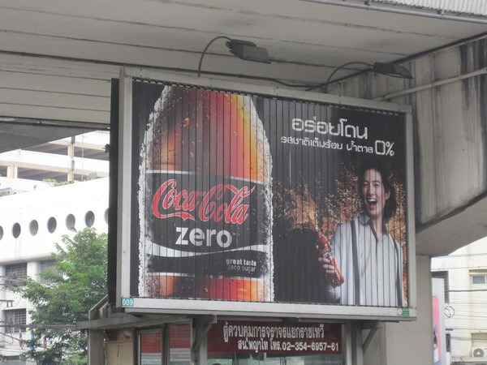

Several times on my health journey I have changed my opinion on a nutrition topic. Part of the freedom I have as an individual is that I am not accountable to clients or some brand. I'll embrace an idea, test it, use it as long as it suits me and then discard it when I need to. The one idea I have changed my opinion on the most has been diet colas.

### My Boring History With Diet Colas (High School to 2012) - Skip This Section if You Like

In high school, I switched from regular Coke to Diet Coke. No calories! In college, I fell for the _aspartame is an evil toxic compound_ argument and went back to regular cola. By the time college ended, I was a coffee drinker and rarely drank cola. Then during the dot-com era, I started drinking Coke again. Then I got all healthy again, I stopped drinking all colas. That was until Coke came out with a Splenda version of Diet Coke and eventually Coke Zero. Coke Zero held my attention for a few years, then I became concerned not so much for the aspartame, but the benzoate compounds. I even wrote a break-up post with Coke Zero titled [Yes, It’s Over, Call It A Day, Sorry That It Had To End This Way](/2008/09/yes-its-over-call-it-a-day-sorry-that-it-had-to-end-this-way/). That break up lasted until I found myself in the blaring heat of Thailand. Even after that trip, I would continue to drink maybe 1-2 cans of Coke Zero a month.  _Coke Zero in Bangkok_

### Headaches, Diet Cola Safety and Krieger

Why was I still drinking the occasional diet cola? Two reasons. One, I believed that diet colas could help on those mornings when I had a really bad headache that coffee and tea couldn't eliminate. Two, I believed that the sugar from regular cola posed a worse risk than the artificial sweeteners from diet cola. Some will gasp at that statement, but there is a lot of hysteria when it comes to the dangers of diet colas. If it were 1% as bad as its critics claim, people would be dropping like flies. People drink a lot of diet cola and have for a few decades. I don't see these people having worse health outcomes. There are some alarmists that treat drinking diet cola as if were like riding a motorcycle in the rain without a helmet. Really? The first level headed examination of this topic that I heard was when James Krieger of _Weightology_ appeared on the Bulletproof Exec podcast #15. I've listened to the show twice and I feel Krieger made the case that health risks from diet cola are way overblown. There are some people who get headaches or feel lousy from drinking diet colas. They should stop. James has a series of articles on the topic for paid members of his site for which I am not. By the summer of 2012, I was still medicating with Coke Zero whenever I got an extreme headache. Then I noticed that my headaches would go away at the same rate regardless of if I drank a cola or not. So I stopped drinking diet colas. Later I discovered that lowering my coffee intake would be more effective in [reducing headache frequency](/2012/11/hunting-headaches-a-favorable-trend/).

### Why Am I Fearing Sugar?

Going all the way back to high school, the underlying assumption has been that sugar is full of health risks. Why else would anyone initially embrace diet cola? Last year I played with the idea that sugar may have gotten an undeserved bad reputation. Although I am still not convinced sugar is 100% innocent, I am no longer with the majority that believes it is evil. I cover my thoughts more in the post [Why Ice Cream is Better Than Protein Powder](/2012/07/why-ice-cream-is-better-than-protein-powder/). The safety debate that I read about concerning sugar has to do with real sugar versus the corn syrups. Some say they are equal, whereas others have written about the dangers of the corn syrup variety. I honestly don't know the truth, but last year when I made an effort to only eat clean ice cream (no corn syrups or carrageenan), my skin quality improved. So I started drinking the occasional Mexican Coke, which uses regular sugar and I feel fine. It also tastes a lot better than corn syrup Coke or any of the diet cola offerings.

### My Current Opinion

I am not convinced that any cola is healthy, yet I think I am fine with regular or diet. Since I drink so few colas, the best option for me now is Mexican Coke. Once again I am rejecting diet colas, but not because I believe they are dangerous. Diet colas don't help my headaches, they don't taste as good as real colas and I no longer fear small amounts of sugar. It is likely my opinion on this topic will change again. For the record, I still think the best option is no cola, but sometimes I really crave the taste of Coke.

---

## Comments

### Janice
*January 28 at 2013 at 6:16 PM*

Just had to say that I really like/appreciate this post. Like any "bad" thing we indulge in once in a while why should soda be any different? And to choose the non-diet for taste makes perfect sense. Same reason I would eat full fat, decadent, delicious ice cream over fro-yo! 

I am not a soda drinker and never really was. Many years ago I would have it occasionally but in the last 10 years or so I'd say almost never.  Until I recently "indulged" in some diet coke. I soon found myself wanting diet coke and coke zero after that and made excuses to get it. I questioned whether it had some addictive quality. So for me it will need to be a very rare indulgence indeed! But perhaps the next time it will be the real sugar option!

---

### Anemone
*January 28 at 2013 at 9:50 PM*

You can really go around in circles on this sort of thing. :)

I drank a lot of diet Coke in grad school, 3-4 cans a day, and I found after a while that if I didn't eat at the same time I felt terrible. I can't remember what the symptoms were (hunger?, shakiness?) but it was consistent with what I was hearing about aspartame, so I switched to the sugar version. I have no idea what kind of sweetener they use here in Canada, whether it's real sugar or not, but didn't really care. It just seemed a lot easier on my system. I continued to drink real pop on and off until a few years ago, when I cut caffeine out again to lower my resting heart rate. (Plus the new Coke tastes terrible. I was drinking Safeway brand at the end, and they don't have it where I am now.) I'm not back on the pop, but I do get into chocolate now and then, so so much for my RHR. But I prefer plant food to SSRIs when I'm down, so so what?

At any rate, another reason for me to stay away from the artificial sweeteners is that they can ferment in the large intestine, and I already have enough problems with carbs as it is without adding anymore.

I started eating ice cream last summer after you posted about it, and haven't had any problems, but I've been eating the premium coconut milk/whole-expensive-sweetener-whose-name-I-can't-remember kind, so refined sugar is not a problem there.

---

### Brian
*January 29 at 2013 at 12:36 AM*

Coke Zero converted me from regular Coke because it tastes so much more like regular than Diet Coke.

---

### RareArtists
*January 29 at 2013 at 8:44 AM*

No question, I feel my best when eating a super clean diet of pastured meats, veg &amp; lacto fermented goodness, but I have always struggled with the nagging desire for fine desserts.  

As long as my diet is solid and I'm getting in enough movement, then I find that eating the occasional dairy dessert does not set me in a tailspin.....I go for full-fat organic ice cream or flan or pot de creme, etc.  The tough part for me is limiting the intake to only once or twice a week.

As for soda consumption, if you're done with the idea of trying to get headache relief from the coca leave or other compounds in Coke, I have a suggestion for you.  Although I don't drink much alcohol, I am a huge fan of Amaro (Italian for "bitter")  The Italians drink the herbal liqueur as a digestif after meals, but personally, I don't limit my intake to after meals only.  And I never get a buzz from it....unless I drink many cocktails in one sitting

One of the most commonly available is Ramazzotti.... if you mix one shot of Ramazzotti w/ with some mineral water, lemon and ice.  Now, that is a delicious beverage.  

Its quite similar to coca cola, maybe with a nod towards a not-so-sweet root beer, but its so much more nuanced.  
 
Ramazzotti is a digestif amaro invented by Ausano Ramazzotti in 1815 in Milan. It is made of a secret blend of 33 herbs and roots, and uses no artificial color.

There are hundreds of Amari out there (Amari is the plural for Amaro)....some are really beautifully weird.  Some have strong notes of cinnamon (Averna), some artichoke-y cough medicine (Cynar), but many of them are a secret mix of herbs that you can't quite put your finger on.  Amaro Sibilia is a gorgeous one to try later on...

I really love playing around with these cocktails at home while (or after) cooking a big meal.  In my opinion, the taste and overall experience is so much more rewarding than drinking a mexican coke.  Not to mention, I find that drinking a amaro cocktail does indeed aid in digestion after a huge meal.

Ramazzotti is usually around $19.99 a bottle, but you can find it for less.  It will last you for a few months if you're just having the occasional 'soda.'

If you get into it, then you'll find yourself experimenting....adding a slash of citrus, here, sometimes a splash of gin there, etc. etc.  Its a lot of fun.... just like the joys of espresso, so goes amaro - La Dolce Vita

---

### David
*January 29 at 2013 at 1:08 PM*

where do you get Mexican coke?

---

### MAS
*January 29 at 2013 at 2:59 PM*

@Anemone - Welcome to Team Ice Cream!  

@RareArtists - At this time, I can not handle any alcohol. It get an instant headache, even with water kefir, which only has trace levels. Bitters does sound like a fun hobby. I wish I could find an alcohol that didn't make me feel terrible. 

@David - Costco or if in Seattle, Grocery Outlet.

---

### Charles
*January 30 at 2013 at 7:25 PM*

http://myoptimalhealthresource.blogspot.com/2013/01/soft-drink-consumption-increases-risk.html

http://ajcn.nutrition.org/content/95/5/1190

---

### MAS
*January 30 at 2013 at 8:20 PM*

@Charles - Normally I ignore the PubMed links, but 43% is a huge number for that large of a sample size. Thanks for sharing.

---

### charles
*February 8 at 2013 at 11:57 PM*

http://english.inserm.fr/press-area/diet-drinks-associated-with-increased-risk-of-type-ii-diabetes

https://www.yahoo.com/beauty/tagged/health

---

