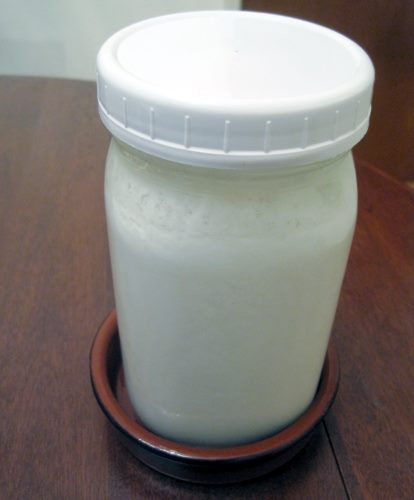

I've got three health items on my mind today.

### Is Dairy Kefir Anabolic?

About a month ago I started making dairy kefir again. I stopped making kefir a year ago when I started getting a reaction to water kefir. Then I learned about the high level of histamines, which may have been triggering some of my headaches. I started [The Low Histamine Diet](/2012/05/the-low-histamine-diet/) last May and did it for over a month. Seems I didn't post a follow-up. The results were that greatly reducing histamine levels did not help with my headaches. I forgot all about kefir. Then a friend of mine started making kefir. He offered grains to me. My initial thought was the headaches I got from kefir, but that was water kefir. I never had an issue with dairy kefir, so I started making the dairy ferment once again. And I am loving it. My kefir tastes great and I'm even mixing in a little half-and-half to get a thicker texture. The interesting thing I've noticed in the last month is that I may have gained some muscle. This was unexpected, as my workouts have not been that intense recently. I've often read how milk is anabolic, but I haven't really drunk much since I was a child. Kefir should be equally anabolic. Who knows? I'll keep drinking it. 

### Caffeine Might Be Making Me Jittery

It appears I am going to have to really cut back on caffeine again. My plan was to survive on a lower level until spring and then do a longer detox. Even though I'm consuming half the caffeine I did prior to my [October 2012 detox](https://ineedcoffee.com/a-month-without-coffee/), I am finding myself feeling jittery. I've never felt jittery on caffeine before. The good news is cutting back on caffeine should be much easier than the last time.

### Unsure about Trigger Point Therapy

In the post [Help Me Fix My Neck and Shoulders](/2012/12/help-me-fix-my-neck-and-shoulders/), one of the ideas in the comments was Trigger Point Therapy. I am new to this topic, so I got a few books from the library. The books showed me where I could apply pressure to relieve tightness in my neck and shoulders. Although my neck and shoulders weren't in terrible shape, I had been interested in loosening up that area to provide more free movement.  _The Trigger Point Therapy Workbook: Your Self-Treatment Guide for Pain Relief, Second Edition by Clair Davies_ Using the books, I was able to locate the points, apply pressure, and feel what felt like knots loosening up. So at first, it appears this stuff was working. The problem I experienced was the tightness kept returning and it felt like it was getting worse. The more time I spent doing Trigger Point Therapy, the better I felt in the short term, but the tighter I felt later. This is when I thought about Dr. John Sarno and my battle with back pain. I posted on Dr. Sarno in [The Psychology of Back Pain](/2011/02/the-psychology-of-back-pain/).

> Dr. John Sarno specializes in patients that deal with chronic back pain. He believes that stress is the major cause of back pain. When we go through periods of chronic stress, the brain uses a diversion tactic to protect us emotionally. That diversion is to manifest REAL PHYSICAL pain, often in the lower back region. **The pain is real. It is not in our head. The roots however are psychological.**

One of the recommendations Dr. Sarno tells his patients is to stop all forms of treatment because that treatment is validating the physical manifestation of the pain. It does nothing to address its roots. When I began to suspect that Trigger Point Therapy was making my neck worse in the same manner, I stopped it. Within a few days, my neck felt better on its own. Not perfect, but back where I started. I can see where Trigger Point Therapy might help with injuries.

### Last Words

So I'm loving the dairy kefir, cutting back on caffeine, and stopping the Trigger Point Therapy. Love to hear your thoughts.

---

## Comments

### Pauline
*January 24 at 2013 at 9:42 AM*

Reaction like feeling jittery to caffeine, I have found the orange juice (not from concentrate) with a pinch of salt, does the trick makes me feel very calm.  i also take the B5 pantothenic acid as soon as I feel a reaction to too much coffee, it calms virtually immediately.  I find I need about 500 mg of magnesium (I take in 2 x 250mg doses).  This is also part of the calming of our nervous system picture.  If I don't take the magnesium I get restless or aching legs and occasional twitching in muscles, so that is an indication that my body needs it.   I take the orange juice with coffee twice a day.  B5s I take depending on my body's reaction or if I have had too much coffee (say 3 in the day, 2 is better).  Magnesium i take after supper and before bed in 2 doses, it makes my sleep deeper.

---

### Pauline
*January 24 at 2013 at 9:53 AM*

I think if you walk or exercise, you may need more magnesium as you body needs it on to replace what is used up.  If you are stressed and generally find your nervous system is very sensitive we look to find ways to give back additional support.  Caffeine, I think also uses up magnesium and is a diuretic so makes our bodies work harder.  Our adrenals need the support and the potassium, magnesium &amp; pinch of salt in orange juice gives us just that together with the B5 vitamins which are called the stress/calming vitamins.

---

### Anemone
*January 24 at 2013 at 2:58 PM*

"One of recommendations Dr. Sarno tells his patients is to stop all forms of treatment, because that treatment is validating the physical manifestation of the pain. It does nothing to address its roots."

Wow. I've never come across that before. I need to read Sarno. Thanks.

---

### MAS
*January 24 at 2013 at 4:38 PM*

@Pauline - I've been taking B5 daily and my magnesium levels have no changed. I'm not a fan of OJ, but I'm willing to try it. Will get some later today. 

@Anemone - When I had bad back pain, I often got deep tissue massages. When I stopped getting the massages, my body over time, stopped getting back pain.

---

### Stephan
*January 24 at 2013 at 5:57 PM*

MAS,

I have used the trigger point therapy for my knot in my right glute with some success. Just like you, I am also experiencing the argument you have made about the therapy's short-term benefit. After applying the pressure to the trigger point, you feel wonderful and pain-free for a few hours. However, the next day my pain seems to be back again and doesn't seem to have changed - it's really weird!

Do you or others have suggestions about therapies that may yield my glute painless in the long-term?

Cheers

---

### Branden
*January 24 at 2013 at 8:22 PM*

I came across your post because of the mention of kefir but I do have a background in Trigger Point Therapy. I've been a massage therapist for the past 10 years and have found good results from working on trigger points.

If you are interested in giving trigger point work another chance, a resource that I recommend is https://www.painscience.com/

The book you mentioned is okay, but it is rather dated compared to the research available on trigger points today. The website above has a lot of articles on the pros and cons of trigger points, when they are appropriate and where they are lacking.

---

### MAS
*January 25 at 2013 at 1:53 AM*

@Brandon - After reading that long article on Save Yourself, the walk away conclusion I got was that finding Trigger points is not as easy as the books state and even finding them doesn't mean it works. 

Your site looks really cool. I'm going to listen to one of your shows.

---

### Frances
*January 25 at 2013 at 5:57 AM*

I read about the trigger point therapy book that you listed above. Very desperate for relief, I purchased the book last weekend. This was after I saw the astonishing number of reviews in Amazon.  While you're right, the pain/tightness comes back but the moments that I finally gained some relief was worth it enough to do it again the next day.  For years i've suffered with chronic neck and shoulder pain. My take away regarding the book is that it is actually possible to be without pain so I just massage those trigger points everyday in addition to constantly staying aware of when I shrug  or lift my shoulders. I'm learning to relax that which I think helps. Immediate gratification is what the trigger points massage brings and I keep going. 

Without your original article on "Help me Fix my Back", I would have never learned that one book could supply so much relief. 

Thanks so much, 
Frances

---

### MAS
*January 25 at 2013 at 6:14 AM*

@Frances - Good to hear. 

I still need to do a full post on all the ideas from the comments of that post. I got sidetracked with some other projects.

---

### Pauline
*January 25 at 2013 at 2:10 PM*

Another thought I had on the jittery-ness effect, it could be low blood sugar, often caffeine causes a spike (we feel energised from adrenaline surge) and then it causes a drop in energy.  I don't know if this would be in response to a sudden rise in insulin release and then the rebound lowering effect of blood sugar.  Dr Peat recommends drinking coffee only with a meal, and I tend to try do this - with both lunch and breakfast.

---

### MAS
*January 25 at 2013 at 3:02 PM*

@Pauline - That would be interesting if you were right. I've never had low blood sugar issues before and I've been consuming coffee on an empty stomach for 2 decades. Also my "jittery feeling" often happens hours from any caffeine. 

I suppose the test for this would be to consume a quick fix food to see it the symptoms go away?

http://voices.yahoo.com/quick-fix-foods-hypoglycemia-3762924.html

---

### Pauline
*January 25 at 2013 at 4:01 PM*

Low blood sugar is an event that can happen quite some time after, so 2-3 hours later could fit into that picture.  My partner who often goes for a very long walk, experiences that if he has not eaten enough before the walk and then we fix it with something to eat straight away.  Or if he has had eaten or drunk something before walking that causes an unusual spike and then the blood sugar goes too low during or after the walk.  It would be interesting to monitor the timing of your meals and caffeine and walking, and see if they interact.  Or in my case if i have too much of a good time the night before I may need to eat something on waking because my blood sugar is low or I feel tired.

---

### thomas
*January 26 at 2013 at 2:57 AM*

http://thechive.com/2013/01/24/going-to-the-gym-is-a-great-opportunity-to-see-truly-bizarre-st-30-photos/

---

### Branden
*January 26 at 2013 at 3:20 AM*

Yes, trigger point work can be tough to figure out without previous experience. They work great on acute pain such as waking up with a "kink" in the neck. When a client comes in with those kind of pains, trigger points can feel like magic. But for other pain issues, it really depends.

It can be helpful to go in to see a massage therapist with a background in trigger point therapy (most will have an idea of what they are but many aren't very experienced in how to treat them) or possibly a physical trainer. Once a person experiences exactly what different trigger points feel like and how to treat them, then it makes self-treatment a whole lot clearer. But again, it really depends on the issue as to whether or not focus on trigger points will make much of a difference.

---

### StuartG
*January 27 at 2013 at 5:42 PM*

Just a quick thought for your consideration Michael......Do you think that perhaps the increase in muscle that you have observed is due to the relaxation in intensity of your workouts, rather than the anabolic "effects" of the kefir? 
   Maybe as ectomorphs we really ought to consider the long term anabolic effects of intensity cycling, or maybe just stopping short of absolute failure in sets, as a few in the HIT community have advocated, especially as you have recently progressed a bit with your volume slightly..

---

### MAS
*January 27 at 2013 at 5:59 PM*

@StuartG - It could be, but I began reducing intensity and increasing volume back in October during my caffeine detox. I didn't see any muscle gains until shortly after the kefir a month ago. So many variables. Maybe it is the combo of kefir + more volume?

---

### Txomin
*January 28 at 2013 at 3:17 AM*

+1 on the milk kefir. I too have experienced muscle gains. Also, I found milk kefir is the easiest foodstuff to control overall calories. When slimming, I make less kefir. When bulking, I make more kefir. This way I don't need to count calories which works for me. Last, and in my case, I have developed a mild lactose intolerance with old age. Kefir circumvents the problem completely.

Jitters (and similar) are common following long-term dependencies of any kind. They will go away once you find the right amount of coffee your (now caffeine-damaged) body is able to handle. Continue experimenting. As I said before, coffee is a drug that does not need be completely eliminated. Moderate consumption, even after years of abuse, is possible for most people.

---

### MAS
*January 28 at 2013 at 3:08 PM*

@Txomin  - Thank you for your guidance on my caffeine related issues. If it hadn't been for you, I don't think I would have gotten this far.

---

### Txomin
*January 29 at 2013 at 3:10 AM*

We are helping each other, my friend.

---

