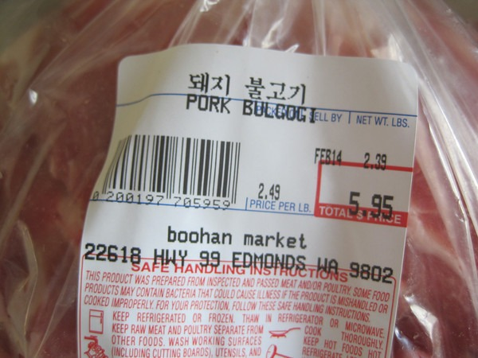
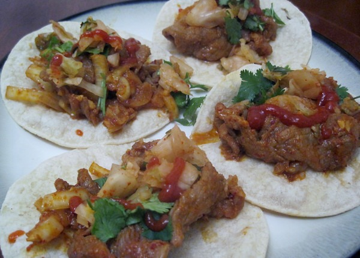

I was reading the book The Knockoff Economy: How Imitation Sparks Innovation, which had the history of Korean tacos in the Los Angeles area. My mind started to wander. I didn't care about the economic lesson. I just wanted to eat those tacos. :) So I put the book down and drove to the nearest Korean grocery store.

### Gluten-Free?

For those that are strictly gluten-free, Korean food can present a problem. [Bulgogi](https://en.wikipedia.org/wiki/Bulgogi) is the thinly sliced marinated meat used for grilling and fast cooking. It can be beef, pork, or chicken.

The problem comes in the marinade. If the meat is spicy, then it likely has been marinaded in gochujang or red chili paste. I've been to almost every Asian market in Seattle, including four Korean grocery stores. I've looked at every single brand of gochujang. They all have gluten in them. This means you need to make your own gochujang if you wish your dining experience to be gluten-free. I seriously doubt those food trucks are hand-making gluten-free gochujang. Have no fear, I have made my own gochujang without gluten. See [Making Gluten-Free Korean Chili Paste (Gochujang)](/2012/10/making-gluten-free-korean-chili-paste-gochujang/) for the recipe. You'll need it to continue. If gluten doesn't bother you, buy any brand. You'll save some time.

In addition to gochujang, most restaurant and food cart marinades will use soy sauce, which also has wheat. Making your own will allow you to swap out the soy sauce for Gluten Free Tamari.

_Homemade Gluten-Free Gochujang_

### Heading to the Korean Grocery Store

I'm no expert in Korean cooking, so I decided the best place to get the bulgogi would be from a Korean grocery store. They are more likely to have paper-thin sliced meat than your average grocery store. I also trust their butchers are selecting the cuts that work best for what their customers are cooking. If you don't have access to a Korean grocery store, the post _Bulgogi: Korean Fire Meat_ (DEC 2020: link dead) has a good discussion on the best cuts for the beef variety. For pork, you can use the shoulder. Just have the butcher slice it thin.

_Pork Bulgogi - Perfectly sliced_

### Marinade

Here is what I used for my marinade. I had about 2.5 pounds of pork. Adjust accordingly.

-   1/2 cup of Gluten-Free Tamari
-   2 Tablespoons of gochujang (red chili paste)
-   1 medium-sized onion chopped
-   2 Tablespoons of ginger finely chopped or grated
-   3 cloves of garlic finely chopped or grated
-   2 Tablespoons of sesame oil\*
-   0.5 - 1 Tablespoon of Korean red chili powder
-   toasted sesame seeds (optional)

 _\* Yeah, I know seed oils are evil, but the taste of sesame oil is so unique and important to Korean cuisine. If you know a way to get that awesome flavor with a healthier fat, please leave a comment below._ 

After mixing the bulgogi in the marinade, I put it into the refrigerator for a few hours, but I'm guessing an hour would be fine as well.

### Cook It and Serve

For the taco, I used the broiler to heat up some corn tortillas. Keep an eye on them, so they don't burn. The meat will only need 1-2 minutes per side on a grill or medium-hot on the stove. Place the meat on the taco and then add your toppings. I used cilantro, [kimchi](/2012/08/kimchi-2-0/), and Sriracha sauce. You could use sliced cucumbers or lettuce as well.

_Gluten-Free Korean Bulgogi Tacos_ 

As you can see from the photos above, I didn't use tiny food truck portions on the meat. 8-)

---

## Comments

### chuck
*February 12 at 2013 at 3:16 PM*

i love bulgogi.  you have inspired me, thx.

---

### MAS
*February 12 at 2013 at 4:17 PM*

@Chuck - Excellent. I'm going to do beef next. I also should add that the bulgogi made for excellent leftovers.

---

