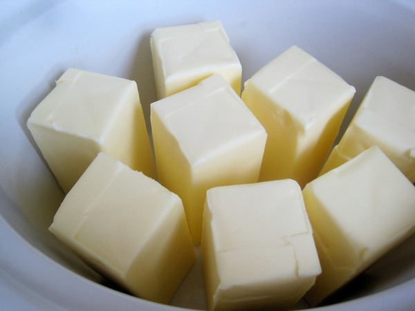
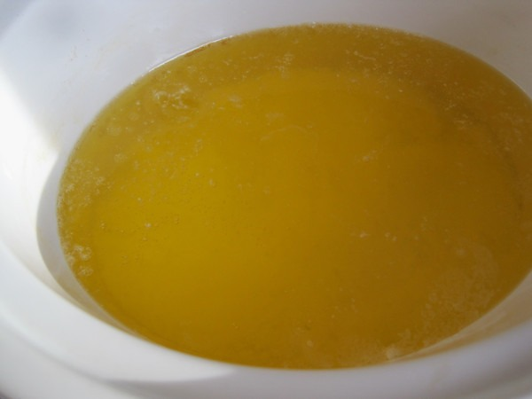
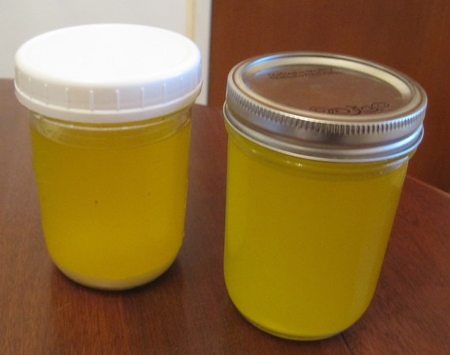
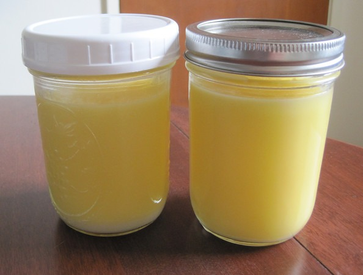

For my latest batch of ghee or clarified butter, depending upon where you draw the line, I put away the saucepan and plugged in the slow cooker. I loaded up the slow cooker with 2 pounds of unsalted butter and put it on low with the lid off.   Once the milk solids separate and it develops a dark yellow color, filter and jar. I used cheese cloth, which didn't remove all the milk solids. I also tried a coffee filter, but that didn't allow the ghee through at all. I also experimented with a gold mesh tea filter, which did a fine job. On other websites, you will see times for making ghee in a slow cooker range from 2 to 8 hours. Mine was closer to 8 hours.   Two pounds of butter made 2 pint jars full of ghee.

---

## Comments

### Nick
*February 6 at 2013 at 7:27 PM*

So why Ghee over butter?  Is it just the milk intolerance? I can't seem to find any other benefit. For high heat, I use coconut oil.

I use Kerrygold butter, and I love it.

---

### MAS
*February 6 at 2013 at 7:33 PM*

@Nick - Ghee is good for cooking things that require higher heat where you want a butter flavor. Lots of Indian cooking uses ghee. I even use it for eggs. I like coconut oil too, but not all the time.

---

### Stephan
*February 6 at 2013 at 7:34 PM*

MAS,

doing your ghee in a slow cooker sounds like a fun idea. But it's seems it's a long way to get this 'sacred butter elixir'. 

When I do mine in a regular pot at a low heat it turns out just perfect after being really careful to remove all milk solids with a spoon for a duration from 20-30 min. No filters used as not required. You can meditate while getting rid of the milk solids... :)

Just my two cents...Keep it up!

---

### MAS
*February 6 at 2013 at 7:36 PM*

@Stephan - Good point. Not sure which way is optimal. I have a 2nd slow cooker that operates a little warmer. I'm going to use it next time, to see if it improves my result. I also got a great idea on Facebook to explore making spiced ghee.

---

### Melissa
*February 6 at 2013 at 9:06 PM*

Ooo a useful post instead of a post about drama ;) I should try this. I already do so much with the crock pot- they are so useful.

---

### Txomin
*February 7 at 2013 at 12:15 AM*

Try oil filters. I had some bias against them for unknown reasons but they have turned out to be excellent for many things including, to my surprise, straining broth.

---

### Dinis
*February 7 at 2013 at 12:28 AM*

Oh, intriguing! I've been making mine on a pan on the stove. Any advantage on using the slow cooker?

---

### MAS
*February 7 at 2013 at 1:08 AM*

@Txomin - Something like this?
http://www.amazon.com/Norpro-2-Inch-Stainless-Detachable-Strainer/dp/B00004UE6N/

I also might try using a reusable coffee filter. I think they are more porous than the paper ones. 

http://butterbeliever.com/how-to-make-ghee-in-a-crock-pot/

@Dinis - They one advantage I had yesterday was I left the house and did errands while the ghee did its magic. Not sure which way is better, I suppose it depends on how much time you have.

---

### Daniel
*February 7 at 2013 at 4:11 AM*

&gt; I also might try using a reusable coffee filter. I think they are more porous than the paper ones. 

Quite likely, since a french coffee press works pretty well for me.

---

### Txomin
*February 7 at 2013 at 6:39 AM*

I have not used those so I can't say.

I meant disposable cooking oil filters. They are usually made of some cloth-like material that makes them tougher than the usual coffee-paper ones (they don't rip and are slightly more porous). Their intended purpose is to remove impurities from oil after frying, etc.

---

### Padraic
*February 7 at 2013 at 7:10 AM*

Is there any use for the skimmed off milk proteins, or do you just discard them altogether?

How far does a pint of ghee go? Or rather, how much do you lose with the "refining" process?

---

### Dan
*February 7 at 2013 at 12:31 PM*

I tried cheesecloth and coffee filters too. Now i just filter through a paper towel, sitting in a metal strainer. Filters out the milk solids perfectly and quickly! Try a paper towel, the mesh size is perfect. Works in the drip coffee maker too, if you run out of filters... An old camp trick.

---

### MAS
*February 7 at 2013 at 3:48 PM*

@Padraic - I discard the skimmed milk proteins. Not sure about loss. I don't think there was much, but I wasn't really paying attention. Each of those pint jars represents 4 sticks of butter. 

Heading off to weigh ghee....

I'm back.

Start: 453 grams butter
End: 333 grams ghee

---

### Padraic
*February 7 at 2013 at 10:33 PM*

Huh, I always assumed you lost roughly half of your mass in the process. I'm not sure why I thought that, now that I really think about it. Not a bad yield, thanks for the info!

---

### George
*February 8 at 2013 at 2:39 PM*

What is the expected shelf life of the ghee? Just wondering how much to make in a batch.

---

### MAS
*February 8 at 2013 at 3:36 PM*

@George - Not sure. There is a debate on how long here:
http://chowhound.chow.com/topics/599314

I'll easily go through mine in the next 6 months.

---

### Geoff
*February 8 at 2013 at 4:09 PM*

8 hours in the slow cooker seems like it has interesting potential for infusing the ghee with flavor.  Garlic, perhaps?  Or cinnamon?

---

### kellydreams2011
*February 8 at 2013 at 4:56 PM*

I want to try this, but am wondering about a few things:

1. Why did you use unsalted butter? Does that matter? I can not retain salt and have been advised by doctors to salt everything, including fruit. My BP is so low, if I don't get enough salt, I stay dizzy and lightheaded.

2. It doesn't make sense to me how, once it divides, you would put it through a strainer of some sort. Wouldn't that merge it back together again? 

3.  Are the milk proteins what floats to the surface?  Would it work to use a turkey baster to skim that off and dispose of it?

Sorry if I sound like a total tard with my questions.  I am so new to this, but have read lots of good things about gee and really want to add this stuff to our diets.

Thanks for your help!

---

### Angie
*February 8 at 2013 at 7:29 PM*

1. I feed the milk solids from making ghee to our backyard chickens. Probably a dog or cat would enjoy them too.

2. MAS, what slow cooker are you using? That is, do you have one you like? My old one broke and the reviews are all over the place on the Internet, especially in regards to toxic leaching from the liners (both stainless steel and glazed ceramic) and that newer models get too hot. I use it primarily for making ghee and bone broth.

Thanks!

---

### MAS
*February 8 at 2013 at 8:40 PM*

@All - I am not an expert in ghee. I just followed some ideas I got from other sites - including the idea of using unsalted butter. I'll continue to make it and tweak the process a little each time. If I learn something new, I'll update this page. 

The purpose of this post was to show how simple it is to make ghee. Even if you completley screw it up, you are only out a few dollars. Give it a try. No need to buy ghee at the store if you have butter, a slow cooker and and some filter. 

@Angie - I have 2 ghetto crock pots. Someday I'll get a nice one, but not until the 2 I have fall completely apart. I have not researched newer models.

---

### Txomin
*February 10 at 2013 at 6:03 AM*

@kellydreams2011

1. You can use salted butter (I do). The result is nearly the same as the milk solids absorb most of the salt (keep this in mind if you are using these later on as they can be extremely salty). Other than this, use a deeper pan or pot than with unsalted butter because the salted butter will froth when it boils.

2. No, the milk solids stay in the filter.

3. If you let it sit for 15 minutes, the solids go to the bottom. You can spoon it off if you prefer but it is messier than the filter option and, keep in mind, if milk solids remain, the clarified butter won't be properly clarified and will get burned when used.

---

### kellydreams2011
*February 10 at 2013 at 1:42 PM*

Txomin - thank you so much for your kind and helpful comments!  I want to try this soon!

---

