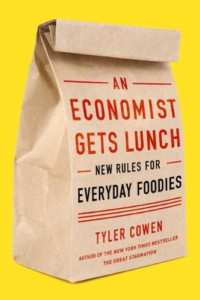
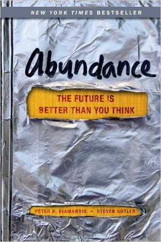
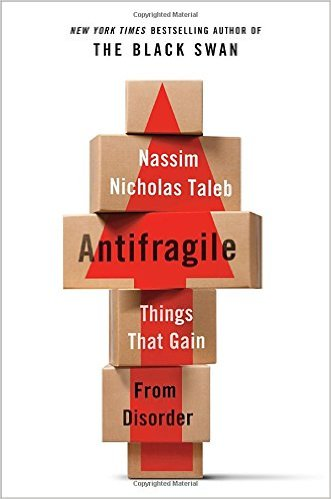

Most best-of lists for a given year are published in late December or early January. Not this one. I needed more time to finish reading the books that were published at the end of the year. Here are my top 5 books for 2012.

### #1 An Economist Gets Lunch: New Rules for Everyday Foodies

Author Tyler Cowen mixed two of my greatest interests, which are food and economics into my favorite book of the year. It covers all aspects of food from sourcing to cooking through the eyes of an economist who loves food. I love the first review on Amazon that calls this book "_Moneyball_" for the food enthusiast  That is this book at its core. Using economic principles, he guides us in making better food choices at restaurants, in the kitchen, and while traveling.

If you can't get to the book, at least check out the _Econ Talk_ podcast interview: [Cowen on Food](https://www.econtalk.org/cowen-on-food/).

 _An Economist Gets Lunch: New Rules for Everyday Foodies by Tyler Cowen_

### #2 Abundance: The Future Is Better Than You Think

Enough with the doom and gloom. This book is a healthy dose of why we should be very optimistic about the future. Author Peter H. Diamandis covers a wide range of emerging technologies, where they are heading, and how society will benefit. I found this book more convincing than the similarly themed book [The Rational Optimist](/2011/04/the-rational-optimist-how-prosperity-evolves/) which I read in 2011.

Back in 2008, I blogged that I was a [Short Term Bear, Long Term Bull](/2008/11/short-term-bear-long-term-bull/). I still am. Advancements in health care and energy are coming that will radically increase productivity and wealth. Even if this book ends up being overly optimistic, you quickly realize that only a few of the predictions need to materialize for society to reap huge rewards.

I know I am going to get a comment about my short term bearish outlook. That is based on the current financial environment of fraud, bad accounting, deficits, and bad monetary policy. There are also demographic reasons why we are a few years away from true recovery. But don't despair, another "_Roaring 20s_" is coming, but we aren't there yet.

 _Abundance: The Future Is Better Than You Think by Peter H. Diamandis_

### #3 Antifragile: Things That Gain from Disorder

My guess is half the readers of this blog have already read the latest book by Nassim Taleb and the other half plan to. So this book really needs no introduction. With the exception of his [approach to exercise](/2013/01/what-taleb-got-wrong-in-antifragile/), I loved this book which mixed philosophy and economics.

 _Antifragile: Things That Gain from Disorder by Nassim Nicholas Taleb_

### #4 The 4-Hour Chef: The Simple Path to Cooking Like a Pro, Learning Anything, and Living the Good Life

I liked _The 4-Hour Chef_ far more than I expected. This is the best book Tim Ferriss has written. In fact, this might be the best-edited book I've ever read. The book is full color with extremely tight writing and beautiful layouts. Even though I've been cooking longer than Ferriss, I had been looking for ways to accelerate my learning in the kitchen. This book was exactly what I was looking for.

Ferriss has created a brilliant guide to learning how to get up to speed quickly in the kitchen. The first half of this book was perfect. The second half was a mixed bag of interesting to weird lessons that were far less relevant to core cooking. The first half of this book will pay for itself many times over.

 _The 4-Hour Chef: The Simple Path to Cooking Like a Pro, Learning Anything, and Living the Good Life by Timothy Ferriss_

### #5 The Art of Fermentation: An In-Depth Exploration of Essential Concepts and Processes from Around the World

As someone who has been making [ferments](/tag/fermentation/) for a few years now, I got some great ideas from Sandor Katz's monster textbook that was released in May. If you are comfortable with fermenting and looking to learn more, get this book. However, if you are a beginner and need more guidance, I'd recommend starting with his [Fermentation Workshop DVD](/2011/10/the-fermentation-workshop-dvd-is-outstanding/). As much as I liked The Art of Fermentation, I think it might be overwhelming to someone just getting started.

 _The Art of Fermentation: An In-Depth Exploration of Essential Concepts and Processes from Around the World by Sandor Ellix Katz_

What were your favorite books of 2012?

---

## Comments

### Anemone
*February 19 at 2013 at 3:38 PM*

"The Great Disruption: Why the climate crisis will bring on the end of shopping and the birth of a new world" by Paul Gilding, former head of Greenpeace and current consultant to businesses wanting to shift to sustainability. Very positive outlook, very optimistic. I read it twice through then recommended it to someone - something I don't normally do. I guess it came out in 2011, but I only came across it last February.

---

### mike
*February 24 at 2015 at 10:32 PM*

Love the site!  When I read your list of interests in the About section, I saw that I share every single one and thought "this is gonna be great."  And it is!  Keep up the great, intelligent posts.  I think you're the only person I've ever seen mention Ray Peat, a man who seems to really know his stuff, or at least care enough to keep digging.

Cheers,
Mike
Virginia Beach, VA

---

### MAS
*February 24 at 2015 at 10:36 PM*

@Mike - Thanks. A few of the sites that talked about Ray Peat a couple of years ago have either disappeared or stopped updating.

---

