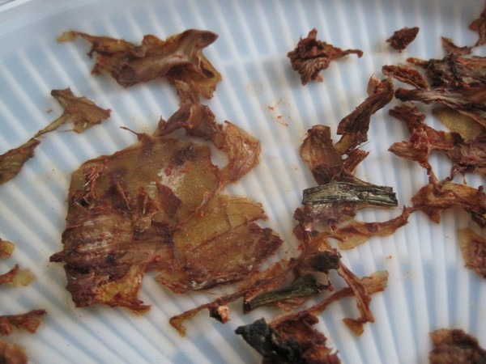
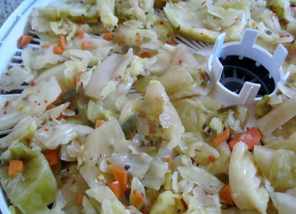
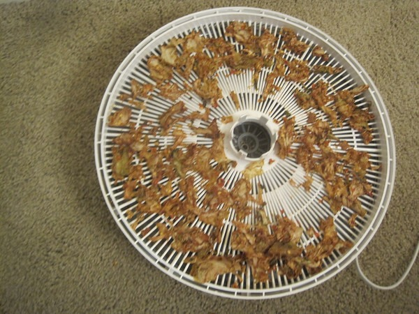

Sunday morning a friend of mine posted a photo of Kimchi Chips now being sold at Trader Joe's. Instead of strolling over the one mile to the store to try them out, I pulled out my food dehydrator and proceeded to make my own. I was able to convert an entire tray of [kimchi](/2012/08/kimchi-2-0/) into a handle of kimchi chips in a mere 10 hours. :o

_If you decide to make kimchi chips, don't use that liner. The dried kimchi sticks to it._

They tasted amazing, but 10 hours for a handle of chips? And that isn't counting the 6 days it took me to ferment the kimchi. I decided to try it once more using [Cortido sauerkraut](/2011/06/cortido-sauerkraut-recipe/). I packed the tray and another 10 hours later, I had 2 handfuls of cortido chips. The flavor was intense and crispy, but **10 hours for 2 handfuls of chips**? And the cortido ferment took almost 3 weeks.

_Getting ready to start the dehydrator. If I were to do this again, I would do a special ferment only using larger pieces of cabbage and no carrots._

_The end result shows just how little the yield is from dehydrating fermented veggies. But they tasted great! ;)_ 

Making my own kimchi or cortido chips was an interesting experiment. Tasted great, but too impractical to make at home. I'll be heading to Trader Joe's later today to try their version. Commenter _[jtoPDX](/2013/03/why-my-kimchi-is-awesome/#comment-17757)_ likes them.

---

## Comments

### dhammy
*March 5 at 2013 at 8:32 PM*

I saw these at Trader Joes just this past weekend while there.   But I did not buy them.  Looking at the ingredients it didn't look like they were even fermented and thus do not qualify truly as kimchi in my book.

Making your own is ambitious!  Do you think some of the nice bacteria survive in the dried versions?  I'm dubious.

---

### MAS
*March 5 at 2013 at 9:05 PM*

@Dhammy - No I doubt any of the probiotic benefit survived 10 hours at 145 degrees. To me that isn't a concern since I have so much kimchi. I just jarred another 12 pounds this week.

---

