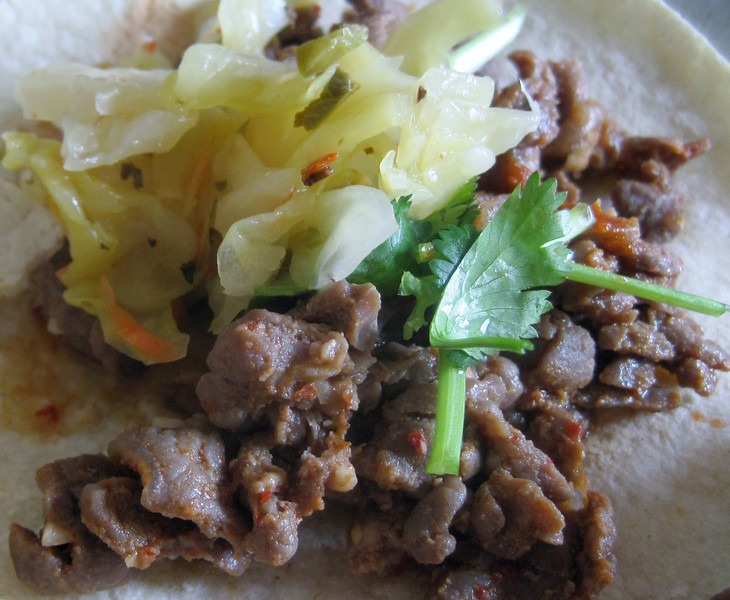

Call this super fusion. Korea meets Mexico meets El Salvador. I took the recipe I posted for [Gluten Free Korean Bulgogi Tacos](/2013/02/gluten-free-korean-bulgogi-tacos/) and made one change. Instead of topping with kimchi, I used my [Cortido Sauerkraut](/2011/06/cortido-sauerkraut-recipe/). It was even better.

_Beef bulgogi tacos with cilantro, Sriracha and Cortido sauerkraut._