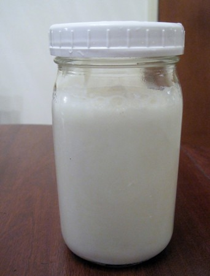

I started making dairy kefir again in December and I'm [loving it](/2013/01/kefir-caffeine-and-trigger-point-therapy/). Not only do I like the taste, but I'm no longer buying containers of yogurt, which means I'm saving money. And unlike the crap kefir products sold at _Whole Fools_ and other grocery stores, I don't use low-fat milk. Full-fat dairy for me! Just be sure NOT to buy ultra-pasteurized. Regular pasteurized or raw is what the kefir grains want. Once you've acquired some kefir grains, you'll need a jar and a [non-metal strainer](http://www.ebay.com/sch/i.html?_trksid=p5197.m570.l1313&_nkw=kefir+strainer&_sacat=0&_from=R40). Unlike yogurt which requires a temperature range of 105°F to 112°F, kefir ferments just fine at room temperature. Making dairy kefir is super easy if you have good grains. Here are the basic instructions on how it is done.

### #1 Add Grains To Empty Jar

I don't measure anything. I've used between 50 grams and 100 grams. It all works. 

### #2 Add Milk, Cover, and Wait

Fill the jar with milk. Don't use ultra-pasteurized. Cover with a lid, but not too tight, and then wait 1-3 days. The ferment is finished when the kefir is as thick as you like. Ferments will go faster in a warm kitchen and slower when it is cold. If your kitchen is too cold, then sitting the jar on a heating pad set on low might jump-start the ferment. 

### #3 Filter and Jar

Once the kefir is ready, grab your non-metal filter and separate. Jar the kefir and place it in the refrigerator. As for the grains, start your next ferment. If you don't need to start the next ferment, place the grains in a jar with a small amount of milk, cover, and place in the frig.  

### #4 Drink

I like drinking kefir plain or as a smoothie with blended blueberries.

### Troubleshooting and Sourcing

If you are having trouble with your kefir, check out this [FAQ](http://www.yemoos.com/faqmgrains101.html). The basic rule I use for ferments that are slow is to increase the temperature. A heating pad can kick start ferments in cold kitchens. As for sourcing, I got my most recent grains locally. These grains are growing about 10% in size with every ferment, which means I've been able to give grains away to friends here in Seattle. If you aren't a Seattle friend, have no fear, it looks like Amazon is selling grains. The link below is from _Lifetime Kefir_, which has good reviews Kefir Grains - Living Probiotic Enriched

---

## Comments

### charles
*March 1 at 2013 at 9:21 PM*

This should be available at Whole Foods - my wife and I have purchased it in NJ and NY

http://www.redwoodhill.com/goat-kefir/

Traditional Plain Kefir
Ingredients
Grade A Pasteurized Whole Goat Milk and Flourish® live active cultures L. bulgaricus, L. acidophilus, L. casei, L. rhamnosus, L. lactis, L. diacetylactis, S. thermophilus, L. cremoris, Leuconostoc cremoris and B. bifidum.

Nutrition Facts
Serving size 8 fl. oz. (240 mL), calories 140, calories from fat 70, total fat 8g (12% of daily value), saturated fat 5g (25% dv), trans fat 0g, cholesterol 30 mg (10% dv), sodium 125mg (5% dv), total carbohydrate 10g (3% dv), dietary fiber 0g, sugars 5g, protein 8g, vitamin A 6%, Vitamin C 0%, Calcium 35%, Iron 4%.

---

### MAS
*March 1 at 2013 at 10:49 PM*

@Chalres - Go to know. Every time I've seen kefir in the stores, it was always been low-fat. Once someone has tried this product and know they like it, then I advise making your own.

---

### garymar
*March 1 at 2013 at 11:56 PM*

I don't even strain it. Just skim some off the top and place that in the fridge with some milk for next time. I already have a yogurt maker, so I set it to 28 degrees and can make 1 liter in 11-12 hours. 

When you leave it for very long, the curds and whey separate entirely and it's quite sharp. I like to stop it when there's barely visible separation, less than a centimeter at the bottom. It continues to ferment in the fridge afterwards.

---

### MAS
*March 2 at 2013 at 12:24 AM*

@Garymar - I am going to try that next. The other thing I am now trying is the secondary counter ferment using a tight lid (without the grains).

---

### Dan
*March 2 at 2013 at 9:23 AM*

Try raw milk. I purchase mine at West Seattle Produce Market. Also, you do not need to use a non-metal strainer. Regular ones work fine. You still get more grains than you can handle. I put my extra grains in my morning smoothie. Another good source of grains is kefirlady.com. I've bought grains from her for years when I stopped kefir making for a while and didn't save any grains.

Like you, I usually drink it straight but a few things I like to do is use vanilla pods from PCC, half of one, cut in small pieces and put into a coffee grinder, then pour into your finished kefir before putting in the fridge. Add a packet of stevia too. Another thing that works is raw cocoa powder and stevia or grind up dried banana chips from your dehydrator.

I find kefir helps with sleep. The extra calcium or something. Who knows.

---

### MAS
*March 4 at 2013 at 1:33 AM*

@Dan - Great ideas. I'm thinking a drop of vanilla extract would work as well.

---

### Richard
*March 6 at 2013 at 6:52 PM*

MAS

Thanks for the great tip on making this with "ghetto pasteurized" milk. Lowers my costs by a factor of 5! I did a batch with 1/2 cup raw milk (I figure the added bacteria can only help) and the rest regular whole milk and the taste was just great. My only concern is the homogenization. Perhaps I can find a middle ground using pasteurized cream top.

Here's a tip for you, in case I didn't already pass along. The WF markets here have a fresh OJ squeezer in the fruit sections (super fun to watch. I get a quart, which lasts about a week). Each morning when I have my 12oz glass of kefir, I then place 4-6 oz OJ right in the glass after finished and stir it around to collect the kefir that sticks to the glass. Nice creamy instant Orange Julius. Then when the quart of kefir is done, I add in 6oz of OJ, shake it all around and I have a bit more creamy version of the same thing.

Give it a try.

---

### Richard
*March 6 at 2013 at 6:56 PM*

Oh, BTW, I set mine to ferment on top of the refrigerator in order to capture the bit of warmth from the compressor that gets sunk into the exterior shell of the fridge. Makes it just a bit more sour at 30 hours than when I let it ferment in a dark closest for 40 hours.

---

### MAS
*March 7 at 2013 at 12:55 AM*

@Richard - Interesting trick. Almost makes me wish I liked the taste of oranges. It is the one healthy food that I avoid.  

I've started experimenting with secondary ferments, where you remove the grains and then seal it tight and place it on the counter. It is suppose to get a little fizzy. Still playing around with it.

---

### Sam
*March 8 at 2013 at 7:33 AM*

I have been making kefir from grains that I got from a friend. I use pasteurized milk. I get great kefir everyday. My question is that my grains are not growing. They have remained the same or may have even shrunk about 5% in the 30 days since I began using them. what could I be doing wrong?

---

### MAS
*March 8 at 2013 at 3:18 PM*

@Sam - I am not an expert, but I would try applying heat. Place the jar over a heating pad. Refresh the milk a few times.

---

### Itala
*July 2 at 2013 at 6:47 AM*

Hi Michael!

I'm a newbie to kefir and kefir making :) but I've been reading about all the awesome, undeniable benefits and I would love to jump on board. If you still have some kefir grains to spare I would love some. Thanks!

---

### Sam
*July 2 at 2013 at 8:11 AM*

Here is a follow up - I changed my milk source, and now the grains are growing. Do you think pesticide residue or anti biotic residue in milk can stop the growth of grains, while still making kefir. Just want to know your thoughts.

---

### MAS
*July 2 at 2013 at 1:41 PM*

@Itala - If you live in Seattle, I should have some soon. Otherwise I would just mail order some from Amazon. Use one with a guarantee. They will do a better job shipping them than me.

@Sam - Sometimes grains just need to be woken up. They may lay there like a coma for a few passes and then suddenly start growing. It is also getting warmer, which makes it easier for them to grow. So it may look like one brand of milk was better, but it could just be the grains are now wide awake.

---

### Warren
*December 8 at 2013 at 6:08 AM*

MAS - thank you for the start. I have been getting some great results. So far no change in my digestion, I'll keep you in the loop.

---

### Kathryn
*May 6 at 2014 at 3:24 PM*

Hi Mas! Thanks for the tutorial! I would like to start making kefir, and would love to not buy from Amazon; any chance you live near Beacon Hill and have extra grains to share?

---

### MAS
*May 6 at 2014 at 4:07 PM*

@Kathryn - About 6 months ago I stopped making kefir, because I was gaining weight too fast. I didn't store my grains properly, so they passed on. 

If you use Facebook, check in with this group for a lead. 
[link removed]

---

### Robert
*September 1 at 2014 at 7:58 PM*

Where can you get the Flourish® ?

---

### Ana
*October 28 at 2014 at 7:03 PM*

Hi, Michael!

Just relocated to Seattle 3 weeks ago and I miss my swiss Kefir and smoothies. If you are able to share some culture with me, I would greatly appreciate it! Thanks a ton.

---

### MAS
*October 28 at 2014 at 11:52 PM*

@Ana -  I took a break from kefir and my culture died. Check out the Seattle WAPF group on Facebook for leads.

[link removed]

---

### Robert
*October 29 at 2014 at 10:58 PM*

Where can I get kefir grains in raw goats milk?

---

### MAS
*October 30 at 2014 at 1:25 AM*

@All - I don't know where to get grains.

---

