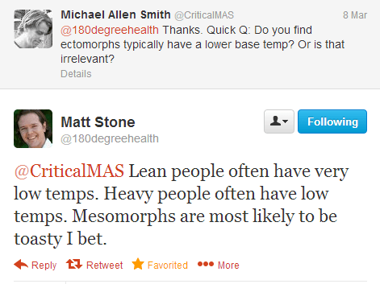

A few days ago I mentioned that I was starting the ["Turn Up the Heat"](/2013/03/diet-recovery-2-and-the-turn-up-the-heat-experiment/) experiment, which is my attempt to increase my body temperature. Read the previous post for the background on where I got the idea and why it could be beneficial. This post is about listing ideas on why my body temperature is lower than average and how I will try to fix it. Before proceeding with the plan to increase my body temperature, I wanted to examine the reasons why it might have gotten low in the first place. Here are the reasons from most likely to least likely.

### #1 Drink Too Much Liquid

I have consumed a ridiculous amount of water for more than 20 years. During [Army Basic Training](/2008/04/military-mas/), drill sergeants would order us to drink a full canteen of water almost every hour. They didn't want any recruit to get heat exhaustion in the hot Georgia sun. After leaving the military, I fell victim to the health advice that we need to drink massive amounts of water. And I did. This I learned from Matt Stone can lower metabolism. During college, I listened to a radio show by Dr. Dean Edell. A caller was concerned about the diuretic effect of coffee. The good doctor's advice was to relax and drink more water. And I did. Then during my fling with microbrewery beers, I chased every pint of ale with a pint of water - to avoid dehydration or something like that. By 2009, I had stopped drinking beer and thanks to Art De Vany was drinking a lot less water. But I still drank a lot of coffee and tea. I also was likely still drinking too much water, especially in the morning. For more information on over-hydration read Matt Stone's post [How Much Water Should YOU Drink?](https://web.archive.org/web/20131023125611/http://180degreehealth.com/2012/02/how-much-water-should-you-drink). Also, listen to [Episode 6: Matt Stone/180 Degree Health - The Bobby Pickles Podcast](http://youtu.be/EAqjTY1zzFo?t=29m) from minutes 29 to 32.

### #2 Excess PUFA

Up until I found the Paleo diet, like most people I was consuming veggie oil, which is loaded with unhealthy PUFA. I've since ditched those unhealthy fats for coconut oil and butter. However, for the past few years I've been eating lots of almonds, almond butter, and sunflower seeds. For the longest time, I tried justifying [eating almonds](/2012/04/food-reward-test-almonds-vs-almond-butter/). They provided me with a high level of satiety, which helped me sleep better. But nuts and seeds are still loaded with Omega 6 fats, which are bad for metabolism. About two weeks ago, I stopped eating nuts and seeds. To replace calories, I've started eating more cheese. It is the only other food that even comes close to providing the same level of satiety. The good news is cheese has saturated fat, which is metabolically boosting.

### #3 Ectomorph (the lanky body type)

The third possibility is that my body type is more of a factor in lower temperatures than what I eat or drink. I reached out to Matt Stone on Twitter with that question.  Those are the most likely reasons for having a lower temperature. Reasons that don't apply to me are yo-yo dieting, carb restriction, or excessive exercise. I've never counted calories or carbs. And although I've done experiments with low carb, I've always cycled in higher carb days, plus my cold hands have been around a long time before I ever restricted carbs. As for exercise, I pride myself on [not having broken a sweat exercising](/2012/09/less-exercise-equals-more-fat-loss-of-course-it-does/) since leaving sunny San Diego in 2007.

### How I Plan to "Turn Up the Heat"

1.  Drink LESS water, tea, and coffee.
2.  Eat less chicken and pork (PUFA). Eat more beef and lamb (Saturated Fat).
3.  More cheese. No Nuts/Seeds. ([Diet Recovery 2](/2013/03/diet-recovery-2-and-the-turn-up-the-heat-experiment/) lists cheese as the #1 warming food)
4.  Cook stews with less liquid or use coconut milk.
5.  Since I'll be eating more red meat, continue with the weekly [beef bone broth](/2011/04/homemade-beef-broth/). Also, supplement with [gelatin](/2012/05/gelatin-supplementation-and-deep-sleep/).
6.  Eat more salt. (see [Brian's comment](/2013/03/diet-recovery-2-and-the-turn-up-the-heat-experiment/#comment-18124) for ideas)
7.  More calm time. If higher body temps cause calmness, then the opposite is likely true. Relax to warm up. See [this story](http://www.todayifoundout.com/index.php/2011/07/tibetan-monks-can-raise-the-temperature-of-their-skin-through-meditation/) on monks meditating to increase their temperature.
8.  More carbs. Not a problem for me. I regularly consume rice and potatoes. Wheat is still evil.
9.  **Eat carbs upon waking.** This will be a huge change for me.
10.  Eat popcorn for a salty snack.

If you have additional tips, please leave a comment.

---

## Comments

### Stephan
*March 15 at 2013 at 9:05 PM*

As for point #9: that has also made the difference for me. Eating anything at all (be it carbs or not) for breakfast has been really helpful. 

My suggestion: try a warm, dinner-like dish for breakfast. Beef stew with rice has helped me quite a lot in that regard. 

However, I have found that I am more hungry throughout the day if I have breakfast. 

Anyone experienced that as well?

---

### MAS
*March 16 at 2013 at 12:16 AM*

@Stephan - Me too. The earlier I eat in the day, the more I end up eating later. So for this experiment that kind of makes sense.

---

### A
*March 16 at 2013 at 6:31 PM*

Take some kelp supplements.  It helps with my low body temperature and is very fast acting. I can feel my feet and hands getting warmer about 30 minutes after taking it.

---

### MAS
*March 16 at 2013 at 6:40 PM*

@A - I have an Iceland kelp supplement that I take right before sleeping. Because I'm asleep, I haven't noticed an increase in body temp. I'll start taking it in the morning. What kind of dose do you take?

---

### A
*March 16 at 2013 at 9:14 PM*

I take one 150 mcg tablet around noon and another around 7pm. 

I use the Now brand, and it's been by far the best; in my experience. 

Just for some background, I have one 24 hour fast every week. I've been doing this for a year. Now, I'm working on 16/8 fasts for 6 days and still one 24 hour fast per week. 

I like experimenting to see what helps my body the most. I used to eat every 3 hours and 6 meals a day for years. I feel better on this schedule.

---

### Barbara
*March 17 at 2013 at 4:54 AM*

I'm looking forward to the follow-up on this one as my extremties are indeed usually cold! I wonder what will work best!

As for the "calm time" and the meditation, you'll probably be surprised to find out that meditation is similar to drinking alcohol or taking drugs. You've probably noticed that the more alcohol you drink, the warmer you are? The thing about meditation, however, is that once you finish the meditation session, your body temperature immediately goes down and you begin to shiver.

Short term meditation will raise body temp only a very little bit. Long term meditation will raise body temperature more... and will stimulate the dorso lateral pre-frontal cortex (the space where you hold time)... similar to how you loose your sense of time when you drink lots of alcohol or do drugs.

Icelandic Kelp pills. I'm going to look those up!

---

### Richard
*March 17 at 2013 at 5:36 PM*

MAS

Not sure why you want to focus on body temperature rather than on resolving your cold hands &amp; feet problem, regardless of your individual temp (which varies, individually).

Three weeks ago when I began the all kefir &amp; milk thing, I still had cold hands &amp; feet even on my hypo meds (armour). Three or so days in, I began forgetting to take my meds because my symptoms resolved--and Im doing this at a significant caloric deficit which makes it even more interesting and sorta counters Stone's advice in the matter.

Still have no idea what my body temp is because I don't care because my hands and feet are toasty, I feel better than I have in years, am dropping a half pound per day on about 1300 cal of raw milk kefir (20oz per day) and raw milk (50oz per day) and experience little hunger. When I do get hungry, it's very gentle, not that nauseating knawing kind.

---

### MAS
*March 17 at 2013 at 5:54 PM*

@Richard - Like yourself, I like a good experiment. I agree with Matt on so many other issues (exercise, food neurosis, etc) that I figured I give his protocol a try. It will either increase my body temp or it won't. I need to know if it is possible and if it is possible, will I have fewer headaches, better sleep and warmer hands. 

His over-hydration theory lines up with our mentor Art De Vany, which is what really made me look into this deeper.

---

### Richard
*March 17 at 2013 at 6:02 PM*

Gotcha. No worries.

Incidentally, on this diet I haven't had a drop of water water in 3 weeks. Just a bit of komucha now &amp; then in addition to the milk and kefir. No thirst ever at all.

Interesting when you consider that milk is only about 15% more water than say a roast beef, yet in eating the latter you will need something to wash it down and will likely end up with far more water net than just drinking the milk.

---

### MAS
*March 17 at 2013 at 6:06 PM*

@Richard - Low water is likely the secret sauce of the protocol. 

In the book, Matt discusses how symptoms like fatigue, skin quality and headaches actually get worse at first. So far that 100% true for me.

---

### Anemone
*March 17 at 2013 at 6:48 PM*

Just because people who are under stress may have lower body temperatures doesn't mean it's always a sign of stress. I'm a mesomorph and I've always had a lower body temperature (about 1°C/2°F lower than average). It's possible that people with average body types (even mix of all three axes) are the ones with higher body temperature. Who knows? Also, I don't have cold hands and feet (or at least they don't feel cold to me). I tend to eat my largest meal earlier in the day (though it depends on the day) and if I have a big enough breakfast (including red meat), I don't eat anything more during the day. Of course I'm eating my entire day's worth of food for that breakfast.

So most of this doesn't really make any sense to me.

On the other hand, I'm curious about the drinking-too-much-water thing, and will monitor myself.

---

### Pauline
*March 20 at 2013 at 5:11 PM*

Will be interested to know what your breakfast carbs will consist of.  I have been following bits and pieces from Dr Peat. The orange juice with salt was fantastically calming.  But i discovered on researching even the non-concentrate orange juices have additives which I think I am intolerant too.  So I squeeze fresh orange and add pinch of salt.  I am also interested in finding what is my sweet point in terms of hydration.  Body temperatures and metabolism are interesting factors that I have read on and off about over the years but open to learning more.

---

### MAS
*March 20 at 2013 at 6:29 PM*

@Pauline - I bought a rice cooker, so I make the rice the day before. I mix the rice with kimchi and eat as soon as I wake up. 

OJ is likely cooling since it is liquid. Other fruit is mostly water, which is cooling. Matt likes grains, but not me. That leaves starches like rice or potatoes. Rice is easiest to prepare and works well with kimchi, so it wins for me.

---

### Pauline
*March 20 at 2013 at 8:26 PM*

The orange juice I have with breakfast (after coffee with milk and sugar) on rising.  I usually make a breakfast of bacon/egg (no other carbs).  I have been logging my temps today and it has been 35.9 early then 36.2 mid afternoon and this evening 36.4 - so all in the low range.  Interesting.

---

### Jay
*March 21 at 2013 at 9:02 AM*

Could the issue with water consumption be around the nutrients we are losing through sweat, urination and other bodily fluids. What if, a lesser reduction in water, could be obtained with a greater level of hydration of you added sea salt or other nutrients that are lost in those body fluids?

I noticed when I drink too much water I get light headed, crampy and foggy but if I drink a good amount of water and add rock salt, magnesium, potassium etc I don't notice as much of an issue. My ultimate test will be seeing if this also cuts down cramping for long endurance events (90 min games of football or 10km obstacle course runs).

---

### Pauline
*March 21 at 2013 at 9:18 AM*

Dr Peat recommends orange juice with salt for those very reasons, it has magnesium, potassium and calcium. Very good for adrenals too.  After coffee, I find it very calming and really enjoy it.  By freshly squeezing I find one or two oranges makes a very small glass of juice.  Whereas as with buying it in cartons the tendency is to over drink is almost compulsive.

---

### MAS
*March 21 at 2013 at 2:57 PM*

@Jay - Adding more salt is probably a big key. I've been trying to consume more salt, but so far it hasn't come naturally to me. 

@Pauline - If the steps I've outlined don't work, I'll try the OJ w/salt. I'm not a fan of OJ though.

---

