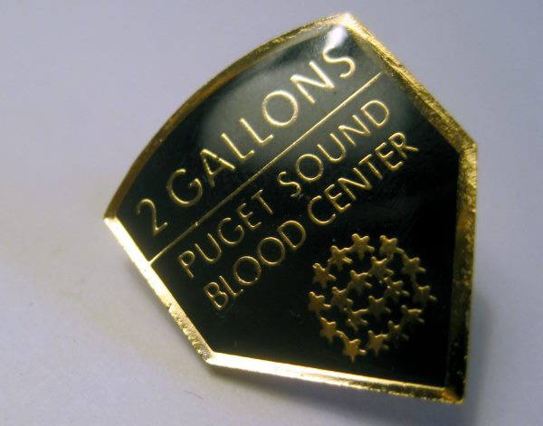

I've now donated 2 gallons of blood for Washington. I can add the new pin next to my [other blood pins](/2012/01/now-a-1-gallon-blood-donor-in-2-states/)

.

---

## Comments

### Txomin
*April 11 at 2013 at 5:19 AM*

Kudos. I wish I could donate too but here in Japan the procedure is borderline insane (and raving mad if you are a foreigner). My guess is that they have enough supply and can afford to by absurd about it. Anyway, this is a good thing (for yourself and others) that all that can should do, like donating organs or learning the fundamentals of astronomy.

---

### Txomin
*April 12 at 2013 at 2:10 AM*

I meant to ask, any effect on the headaches? And, more generally, have you experienced any of the advertised health benefits?

---

### MAS
*April 12 at 2013 at 2:56 PM*

@Txomin - You alerted me early on that caffeine was a likely cause of headaches. Last week I sold my espresso machine, which is a huge move for me. I'm on the journey to a longer caffeine detox experiment. I should know this summer how much of an effect caffeine has on my headaches. 

As for blood donations, in the past 2+ years my Hemoglobin Levels went from high normal to low normal.

---

### Txomin
*April 12 at 2013 at 9:52 PM*

I can indeed appreciate the difficulty of partying ways with your espresso machine. Good for you, my friend, good for you.

---

