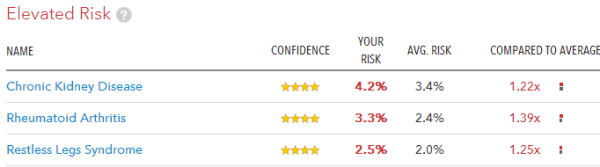
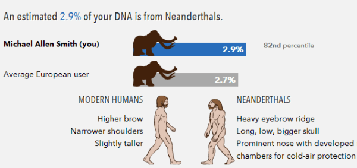

A few weeks ago I received my genetic test results from _23andMe_. After [deliberating](/2013/01/genetic-knowledge-dilemma/) on if it was a good thing to know, I decided to get the $100 test. What made me get the test was when I imagined myself with different chronic illnesses and how different my life would be depending upon which illness was more likely. Plus I just love data. :)

So am I genetic gold or genetic junk? The fact you are seeing this post should tell you that it is mostly gold. Had something bad surfaced on the report, I would have kept that secret.

### Risk Factors

From the screenshot below, I learned that I have **decreased risk** for several of the most pressing health conditions. Those include heart disease, diabetes, Alzheimer's and MS.

_Note: I reduced the image size so it would fit better on this post. The font size is larger and more readable online._ 

In the Typical Risk section, a few different forms of cancer, obesity and Parkinson's show up.

I only had a few items that showed up as Elevated Risk. One was kidney disease, which is something I had never heard of before. Clicking into the report on kidney disease tells me that **only 27-33% is attributable to genetics**. The rest is environmental and the recommendation is to not smoke, eat healthily and exercise. Done, done and done.

### Drug Responses

I was recently listening to my favorite podcast _EconTalk_ and the guest Eric Topal was talking about the future of medicine and the _23andMe_ tests. If this topic is of interest to you, I highly recommend listening to the full show [Topol on the Creative Destruction of Medicine](https://www.econtalk.org/topol-on-the-creative-destruction-of-medicine/). In the discussion it was pointed how just learning how one responds to so many drugs, including caffeine, makes the test worth it.

> Well, if you do a scan of the common variants in a genome, which is really almost becoming not useful--so you can get that now for $99 through 23andMe.com. There aren't many of those consumer-genomic companies still standing. That's certainly the main one. It was $400; it's just come down over time to now $99. That gets you a peek into the genome. It does get, by the way, going back to our discussion earlier about the drug interactions, **it gets you something like 25-30 major drug interactions about you. So, just that alone is a bargain in my view.**

I learned that I have a reduced response to a drug class called _Clopidogrel_, which is used to prevent clotting that could trigger a heart attack or stroke. I also learned something interesting about my reaction to caffeine, which I'm posting about on the INeedCoffee article [Genetic Testing for the Health Conscious Coffee Drinker](https://ineedcoffee.com/genetic-testing-for-the-health-conscious-coffee-drinker/).

### Inherited Conditions and Traits

There are entire reports for inherited conditions and traits. The one thing that stood out on my inherited conditions was that I have an _Alpha-1 Antitrypsin_ deficiency, which is a protein that primarily protects the lungs. Their advice is I definitively shouldn't start smoking because my lungs would have less protection than someone with two copies of the M (normal) form of the SERPINA1 gene.

I found the Traits section more interesting. From my saliva sample, they were able to say that my eyes were likely blue and that I am likely lactose tolerant. True and true. However, the report stated I do not have an alcohol flush reaction, which is false. And in the more good news category, I discovered that I am **norovirus resistant**. This is the "stomach flu" outbreak that sometimes hit cruise ships.

### Muscle Talk

The Muscle Performance report really surprised me. Before I share my data, I want to refer back to a post I did in August 2012 called [Is High-Intensity Training Best for Ectomorphs?](/2012/08/is-high-intensity-training-best-for-ectomorphs/) The book Body By Science talks about the alpha-actinin-3 gene and how those trainers who lack that marker could be _modest intensity_ responders. Meaning that high intensity might not be best for them. They tend to be built for endurance. And unless I misread everything, they tend to be ectomorphs.

Since last August, I assumed I was in this camp and have reduced my intensity. Well, maybe it is time to turn back up the intensity because I have one copy of the alpha-actinin-3 gene! Did not see that one coming.

### Family and Friends

There is an entire ancestry component to the _23andME_ that I've just begun to look at. They have already genetically connected me with 989 3rd to 6th cousins. I've learned that I'm 99.5% European - and I thought I was Korean. ;) How much caveman am I?  2.9%.

### Highly Recommended

I am so glad I did this test. I've only begun to scratch the surface of the massive amount of data on the _23andMe_ site. Every time I log on, there is usually some new data waiting for me. If you are at all interested in your risk factors for illnesses, drug reactions, or how you might [respond to caffeine](https://ineedcoffee.com/genetic-testing-for-the-health-conscious-coffee-drinker/) or High-Intensity training, get the test. The ancestry side of _23andMe_ is as extensive as the Health side.

---

## Comments

### Glenn
*April 26 at 2013 at 4:52 PM*

Fascinating stuff!
Usain Bolt is an ectomorph and so are we! That's pretty good company.

Perform like Bolt, look like Bolt, train like Bolt (sprinting and high-intensity heavy weight lifting - and not much else - although I think he does a lot of disco dancing too...)

http://www.youtube.com/watch?v=TSsiUyMR-gw

Also keep in mind he's a bit younger than us so obviously he recovers faster...

---

### MAS
*April 26 at 2013 at 5:03 PM*

@Glenn - I respectfully disagree about Usain.

1- Usain is a different type of ectomorph than most of us. You can see from the video that his contracted bicep meets right up to the edge of his elbow. According to Darden, this is the greatest predictor of muscular potential. Most ectomorphs don't have that gift. I discuss this in my Role Models post.
https://criticalmas.org/2012/03/fitness-role-models-revisited/

2- Flipping weights is a terrible way to train. Speed is a way to make a movement easier. And by continually taking the load off the muscles via fast faster reps, you can squeeze out more reps, but risk of injury increases. I prefer slower, lighter and more controlled movements that keep the load on the muscles longer. 

I do agree that some sprinting is probably beneficial to most.

---

### Wish
*April 26 at 2013 at 8:00 PM*

I wonder how 23andme service compares with WellnessFX. I guess I better go google it myself. I was interested when I first heard about the service. I never did anything then, and it looks like its become a lot cheaper since. Now I'm actually pretty interested.

One comment about your post specifically is that I HOPE you were joking about NOT revealing your results if you weren't so "golden". I think that would have been a mistake, and a disservice to your readers. And a missed opportunity to tell us about how you would respond. I almost wish you had issues... ;-)

---

### Anemone
*April 26 at 2013 at 8:13 PM*

I can see why you wanted to do this. You've got lots to geek out over here. Maybe I should ask for this for my next birthday. (Currently trying to save my money for something else.)

I couldn't help but be reminded of the genetic test that Uma Thurman's character does on Ethan Hawke's character in Gattaca, though, to see if he was good date/mate material. Is that going to happen with these tests?

Also, I'm confused about the part about the alpha-actinin-3 gene. I was under the impression from body typing that it's the people high in endomorphy who have high endurance, and that low endurance/high intensity types need to back off on training to failure, because of recovery times. At least for me it is very easy to train too intensely and I need to stick to body weight exercises I can do regularly, and I'm lower in endomorphy. So I assumed it was like that for ectomorphs as well. :s

---

### Roberta
*April 26 at 2013 at 9:49 PM*

Wow, fun!  I want to take it just to show I have zero fast twitch genes! Which would explain many things at the gym!  (Clearly I care about that than getting diseases!)

---

### Txomin
*April 27 at 2013 at 2:34 AM*

Thank you for this, my friend. Interesting stuff.

---

### MAS
*April 27 at 2013 at 5:21 AM*

@Wish - Had I learned something bad about my genes, then there would have been a privacy issue. I wouldn't want to be denied employment. Yeah, it is illegal to do that, but I'm certain it is still done. 

@Anemone - We are heading towards Gattaca and designer children. 

Ectomorphs not endomorphs are those most geared towards endurance. Look at marathon runners, cross country skiers and cyclists. All ectomorphs.

---

### Dinis
*April 27 at 2013 at 10:47 AM*

I took it mostly because I'm a geek - and I also love data :) Apart from the traits, I did find out something more serious: that I do have a mutation in the gene linked to hemochromatosis (although my one mutation is not prone to higher iron levels in the body).

One of the coolest things is that you can download your data and run it through other software/services to get more information. Promethease is worth checking: http://snpedia.com/index.php/Promethease

---

### Anemone
*April 27 at 2013 at 11:22 PM*

MAS, you're wrong. But I'm in no position to refute you right now because it would take a fair bit of library research. I did find this on the internet just now: http://web.archive.org/web/[phone removed]5551/http://www.mysomatotype.com:80/body-type/?page_id=74  Their approach to body typing is almost the same as Sheldon's (though of course they've added their own twist), which I prefer to the newer approach used by many researchers of somatotypes changing over the lifespan. That's not taxonomy to this paleontologist! At any rate, they have a somatotype chart with athletes and athlete types. It's true that long distance runners in events like the Olympics and marathons tend to be ectomorphic mesomorphs (NOT ectomorphs). I used to have a bunch of papers listing body types of Olympic athletes and it was basically the same as their chart. I'm somewhere in the martial arts/female gymnast range myself, not that I'm either of those things.

Also, John Douillard talks about body types in his book Body, Mind, and Sport. (I liked the first edition better.) He uses the ayurvedic system which only has three types, and he is clear that pure ectomorphs (pitta/winter in his system) tend to overtrain easily and don't have much natural stamina. (Sheldon said they were high in agility, though, and I found a paper with competitive female gymnasts being higher in ecto.) He thinks the ecto-meso types (vata-pitta or summer-winter) do best at running. He also thinks that you need to be heavier (endo-meso) to be able to do the ultramarathons. "The ultraendurance runners are usually the bigger, slower, more endurance-paced Spring types" [p.137, second edition] Here are a couple of ultramarathoners who don't look like ectos to me, though they don't look like linebackers either: http://www.nytimes.com/2006/02/05/sports/playmagazine/05robicpm.html?pagewanted=all&amp;_r=0 and http://www.yianniskouros.gr/index.php/en/ Also, I've known lots of endo-mesos who can just go all day once they get started. Grrr. One friend, who was definitely fat as well as strong, simply could not go to failure on crunches. (The trainer who challenged her did, though.) But that's anecdotal.

Also, I found a paper that I think says that ectomorphic mesomorphs made the biggest gains in aerobic fitness, compared to other athletic types they tested. So maybe ecto-mesos do all that running because they have superior aerobic potential? I know ectomorphy is associated with loving to run. Or maybe it's the agility that comes with ecto that makes people want to run? No idea. Personally I dream of parkour, which is explosive but brief, like martial arts, but not so violent, and therefore much more suited to my body type.

Unfortunately a lot of what's on the internet wrt body type, like endomorphs being good at power lifting, is wrong. True endomorphs are as birdboned and unmuscular as true ectomorphs, and prefer splashing about in the water where they float really well. They're thinking of the endo-mesos, who are amazing power lifters. So it's hard to find something good to link to.

And I really should find something better to do than to spend all day looking for data so I can be right on the internet. :p

---

### MAS
*April 27 at 2013 at 11:44 PM*

@Anemone - I'm not going to split hairs on all the endo-meso or ecto-meso breakdowns. It is a spectrum. 

Although I've never competed in or watched an ultra-endurance event, I have ran 2 marathons and a few triathlons, which I would consider a normal definition of endurance. Those sports are dominated by light lanky athletes. That is my definition of ectomorph. 

I agree that ectos overtrain and if "pure ectos" have poor stamina, I haven't seen any evidence that is true. I've witnessed the exact opposite. 

And when I used to lift weights in the hard core gyms in South Tampa, all the guys that could bench over 350 were true endomorphs. Thick wrists and stocky builds. Not even the mesomorphs were lifting that much. 

I will concede that I may be wrong about my perception of endos. I'm not one, so I don't think about them much.

---

### Anemone
*April 27 at 2013 at 11:58 PM*

You should read Sheldon in the original some time. You might enjoy it. Each of the types has its own animal totem. And you won't see a true endo in the gym, unless under doctor's orders. Certainly not in the weight room. Though we did have one guy who did a whole ton of cardio, lost a ridiculous amount of fat, became a trainer, then gained half of it back eating very lightly. His doctor told him he would die if he didn't lose the weight. Wonder if he's still around.

I get anal-retentive about this because I'm not a typical type for women, or an average type at all, and if I follow the typical advice, it works against me. It's frustrating when I keep getting the same bad advice over and over again, when it's probably predictable it won't work for me.

---

### MAS
*April 27 at 2013 at 11:58 PM*

@Dinis - Thanks for the tip. I'l look into that. I'm a data guy as well. I do a lot of work in SQL Server.

---

### Melissa
*April 29 at 2013 at 5:09 PM*

If you find your mostly European ancestry a bit dull, you can dial it back further with the Eurogenes Hunter-Gatherer Calculator, which is available on gedmatch.com though that site has been having a lot of problems recently. Nothing useful, but fun to compare with ancient populations that swept through Europe.

---

### MAS
*April 30 at 2013 at 2:55 PM*

@Melissa - My being Korean is inside Seattle joke. Because of my kimchi making and Korean cooking, I've had 2 Korean born friends tell me that "I am more Korean than they are".

---

### Skyler
*May 1 at 2013 at 3:14 PM*

Interesting! Surprised 23andme doesn't tell you your MSTN gene variant. Much more useful for strength training/ mass outcomes IMO.

---

### MAS
*May 1 at 2013 at 5:38 PM*

@Skyler - I did some digging and I found my MSTN.

190921589	rs16823986	G or T	 TT
190927160	rs1805085	C or T	 CC

One of the 23andMe comments stated:
---
CC good for sprint
CT good for middle distance
TT good for endurance.

based off Dr Emmeline Hill's presentation on 9 Jan 2013
http://www.youtube.com/watch?v=XB-VDhXnn4g
---

I'm not sure what this means for me. I've gained 30-40 pounds of muscle since Army Basic training at age 17, but I've also ran 2 sub 4 hour marathons.

---

### Cassi
*May 16 at 2013 at 9:44 PM*

Was your test specific at all on the type of European? (mediterranean, british isles???) I'm wanting to get a test to find out where my fathers ancestors came from

Thanks :)

(If it makes you feel better about the Korean thing, my husband always jokes that he knows I'm secretly Indian too.)

---

### MAS
*May 16 at 2013 at 10:03 PM*

@Cassi - Every time I log in, I see more data. I just logged in again and I now see that I am 5.3% British and Irish, but I haven't figured out to drill down further at this time. As more people complete these tests, I'm sure I'll see more detailed numbers.

---

### Anemone
*May 27 at 2013 at 9:13 PM*

I have done some reading and I think I can clarify our disagreement.

There are two types of endurance: cardiovascular and muscular. (e.g. http://www.livestrong.com/article/341360-cardiovascular-muscular-endurance/ )

You need high cardio, long legs and light body weight to do long distance running, plus a certain amount of strength, so people who are high in both ectomorphy and mesomorphy do best at long distance races. And ecto-mesos have greater aerobic capacity compared to balanced mesos, balanced ectos, and endo-mesos, with balanced mesos a close second. [M Chaouachi et al. Effects of dominant somatotype on aerobic capacity trainability. Br J Sports Med 2005;39:954–959.]

[**!!!** This paper briefly mentions the angiotensin converting enzyme gene (ACE), and ACE gene insertion polymorphism, which they say is more common in ecto-mesos and mesos than in the other types. They're talking about the I allele variant you have above rather than the ii variant you talk about with respect to high intensity workouts here: https://criticalmas.org/2012/08/is-high-intensity-training-best-for-ectomorphs/. And *ahem*, your report above says that both ii and i are more common in sprinters than in endurance athletes (which kind of endurance, I wonder?). I can send you the paper if you like.]

Muscular endurance is more about how much you can use a particular muscle until it gives up on you. The strongest athletes (where being heavy is not a liability and where shorter limbs can actually be an asset), like weightlifters, shotput, and football players, are mesomorphs with noticeable endomorphy. Those are the ones with muscular endurance. I don't know how much endomorphy contributes to muscular endurance because I haven't been able to find anything (and they don't have Sheldon in any of the libraries I've checked so far here so I don't know if he said anything or not), but my impression is that it gives people more stamina, perhaps only when combined with mesomorphy. After all, women are higher in endomorphy and are supposed to have more endurance. And I am relatively low in endo and have very poor stamina. And the people I've known who could not go to failure (e.g. on crunches) have tended to be both chubby and big boned (rather than chubby and bird-boned, or not chubby).

My original source on endurance and endo-meso body types was from John Douillard's Body, Mind, and Sport. He says:

". . . there are three basic body types. First are the smaller-framed people, with active minds and restless bodies. These people talk a lot, ask a lot of questions, and can't seem to sit still. They are quick, light, and agile, and they make good sprinters, but they're not very muscular and don't have a lot of endurance. They tend to be cold like winter, so we call them Winter types. [= vata in Ayurveda, and ecto to ecto-meso in somatotyping]

Next are the Dennis the Menace Summer types. [= pitta in Ayurveda and meso in somatotyping] They are fiery, aggressive, competitive, and vocal, and they tend to assume the leadership role whether anyone wants them to or not! They are usually strong and medium-framed. They are well-coordinated and don't have trouble with sports.

Last but not least are the Babe Ruth types, who are physically gifted but slow-going by nature. They often need motivation to become more active. They are usually on the husky side . . . and won't break any records in rope climb or the 100-yard dash. Children of this type are strong and have high endurance; they can hit, kick, and throw a ball a country mile, but at 10 years old they are unlikely to finish the mile in under 10 minutes. They tend to be heavier and hold on to more water, much like the earth in spring. We call them Spring types. [= kapha in Ayurveda and endo-meso in somatotyping] These basic types combine to make a total of ten types . . . " [John Douillard, 2001. Body, Mind, and Sport. Pages 37-38]

His system is based on Ayurveda, which seems to me to be based on male body types, since it seems to leave endo-ecto types (the vast majority of whom are women) out completely, plus I suspect it doesn't really include endos who aren't at least moderate in meso either.

As far as ectomorphy vs mesomorphy vs endomorphy goes, if you are going to divide people into just those three groups, by far the majority of male athletes at serious competitive levels are mesomorphs, including the distance runners. They just happen to be mesomorphs with a lot of ectomorphy as a second component. I found a book summarizing 20 years of somatotyping from 128 studies [The somatotypes of sportsmen and sportswomen. Peter Bale, 1983.], and the only male athletes who were not in  the mesomorph third of the diagram were high jumpers and three out of four groups of Indian basketball players. (Women are less meso and so distribute differently.) I think South Asians are higher in ectomorphy than people of European descent, judging from their artwork (their heroes lack that no-neck look, but instead tend to be slimmer with good muscle). Other basketball players tend to be on the mesomorphic side of the line, iirc. Even the ping pong players and golfers typed as meso! The only sports I can find where ectomorphy without mesomorphy is an asset is for women in gymnastics or ballet, where agility and lightness matter more than strength.

I suspect from some of what I've seen online, fitness trainers tend to assume that anyone more than 10° from pure mesomorph is either ecto or endo, but it should be more like 60° in each direction. That's why I recommend Sheldon's books, for a more realistic perspective on normal body types. (I sure wish the Atlas of Women had been published.) So what you may think of as ectomorphy in athletes may actually be closer to a combination of ectomorphy and mesomorphy rather than just ectomorphy. It just may not seem like it compared to steroidal body builders who mess with people's sense of what is normal. (The other nice thing about Sheldon is it was pre-steroids.)

At any rate, I think we were arguing about different types of endurance. I suppose the next question is what Body By Science is talking about. I still think training to failure works best on people average to above average in endomorphy, rather than those of us who are lower. But I could be wrong.

---

### MAS
*May 30 at 2013 at 3:41 PM*

@Anemone - Thanks for the all research. I never thought about breaking down muscular endurance and aerobic endurance. But it makes sense to me.

---

### mike
*November 18 at 2013 at 2:07 AM*

Ectomorph Dude, so what about the 2/3 chance of becoming obese?"

---

### MAS
*November 18 at 2013 at 2:15 AM*

@Mike - That number does seem high. Maybe they aren't breaking that number down yet? Beats me.

---

### Anemone
*November 18 at 2013 at 12:41 PM*

They're only taking a snapshot of your genes, not looking at the whole thing, and there are tons of genetic risk factors that haven't been worked out yet (and lots that won't hold up under repeated scrutiny, too). I figure my most exciting results won't show up for years.

Have you seen these articles?
http://io9.com/planning-on-getting-your-dna-sequenced-ask-your-questi-[phone removed]
http://www.fastcompany.com/3018598/for-99-this-ceo-can-tell-you-what-might-kill-you-inside-23andme-founder-anne-wojcickis-dna-r

---

### MAS
*November 18 at 2013 at 4:46 PM*

@Anemone - Thanks. I hadn't seen those links.

---

### Jim
*November 29 at 2013 at 3:57 PM*

MAS,
I saw this week that 23andme has been (temporarily?) stopped from shipping new kits due to lack of government compliance.  The company seems to be admitting that they've been slow to comply, and the government has been very patient with them.  (Too bad, that was going to be my Christmas present to myself this year).  I was curious, is your dashboard still live?

---

### MAS
*November 29 at 2013 at 4:21 PM*

@Jim - The dashboard is still fine. Everything looks the same to me.

---

### Rene
*December 5 at 2013 at 4:54 PM*

Hi, Michael :-)
Very good blog you have here :-)
I have read some of your sites now, but I cant figure out, what would be best for me ? Pavel, BBS, Hillfit, HIT, or what !
Im` betveen  Ectomorph and Mesomorph and weighs 185 lbs. I would like to put on 13 lbs of muscle more.
I train at home and at have db, bb, and a powerrack and thinking to buy kettlebells !
Hope you can help me out here :-) thanks.

Best regards
Renè

---

### MAS
*December 5 at 2013 at 5:02 PM*

@Rene - Good question. Worthy of its own post. I'll get it out sometime this weekend.

---

### MAS
*December 9 at 2013 at 8:02 PM*

@Rene - Here is that post.
https://criticalmas.org/2013/12/20-years-weight-lifting/

The short version is there are different approaches to HIT (BBS, SuperSlow, HillFit). I think HIT is better than Pavel, however I think Pavel is better than most. Just be careful about increasing volume too much.

---

### Rene
*December 10 at 2013 at 9:43 AM*

Thank you Michael :-)
I will try out BBS !
If you do the BBS, does your rowing that you also do, not conflict with your recovery time ?

---

### MAS
*December 10 at 2013 at 2:33 PM*

@Rene - By row, I meant a SuperSlow seated row. 
http://www.youtube.com/watch?v=j92IynuLOHg

---

### Arthur
*May 30 at 2015 at 12:03 AM*

Hey MAS, what do you think about ALCAT food intolerance testing? I've been trying to identify food intolerances for a few years now, but I can't seem to progress.

---

### MAS
*May 30 at 2015 at 12:12 AM*

@Arthur - Don't know anything about it.

---

### Danny
*July 25 at 2015 at 11:42 PM*

several months ago I returned my sample and never got my results back from 23andMe .why I don't know. how do get my results? please send me my results

---

