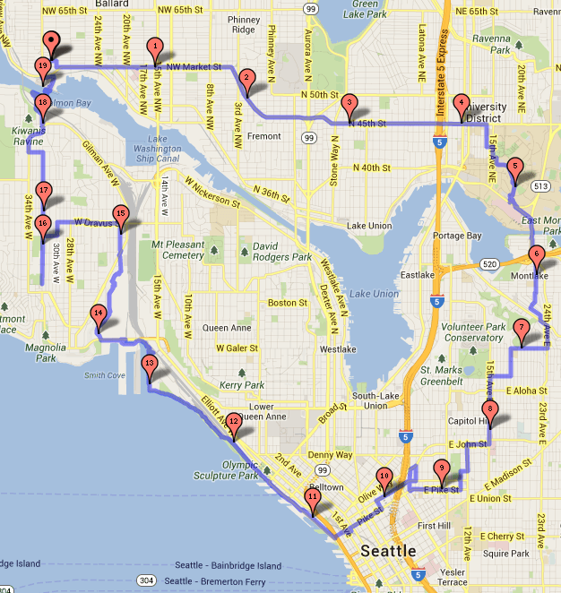

Last year I bought a pair of minimal shoes that I loved immediately. The brand was Onitsuka Tiger. Super thin sole. The sole was actually too thin to do my [uphill sprints](/2012/01/running-up-that-hill-sprinting-salvation-for-tall-people/) with, but that didn't matter, because they were perfect for walking, which is what I really care about.

Well, it turns out they weren't perfect. The shoes aren't that sturdy. Holes near the heal started appearing within a few months. They were falling apart fast. I decided I'd get a better-made shoe and reserve the Tiger for the gym when I do leg presses.

After seeking recommendations from my local Paleo group, I purchased a pair of Merrell Minimal shoes. Super light and super comfortable. And they have an orange sole, which I love. However, I noticed that when I'd walk for more than an hour or two, I felt a little achy. It took me several months to figure out that my stride had lengthened. One of the benefits I first experienced when I embraced minimal shoes was a shorter stride.

From my 2009 post [Learning How to Walk Again](/2009/08/learning-how-to-walk-again/):

> Going from running shoes to super thin shoes means I now walk slower and cover less distance. This feels more natural. I think the most I have urban hiked in my Diesel shoes has been 10 miles. **Unlike past urban hikes, I felt no lower back pain.**

Monday I decided to shelf the Merrell shoes and pull the Tiger out of walking retirement. My stride shortened and I felt great enough to cover 19.1 miles. My original plan was just to hike 10 miles. The Merrell shoes are better built, but I feel better after walking with the Tiger.

Does there exist a super-thin shoe that is well made? Not Vibram 5 Fingers, but a real shoe.

_My [19.1 mile](http://www.gmap-pedometer.com/?r=5964688) Urban Hike through Seattle._

---

## Comments

### dhammy
*June 13 at 2013 at 2:51 AM*

I've got 2 pairs of Vibrams and 2 pairs of New Balance Minimus shoes.  But lately I've been wearing exclusively my altra samson shoes.  They are zero drop and minimalist and extremely comfortable.    The NB Minimus tend to squeeze my toes too much even when purchased a full size too big.  The vibrams are always good but get rocks stuck between the toes and do poorly in cold.

http://www.altrazerodrop.com/fitness/en/Altra/Men

---

### Aaron
*June 13 at 2013 at 3:36 AM*

I agree that Altra makes good shoes.  I did a brief review of them some time back and still wear them to work everyday ... they've held up very, very well.  Mine are not thin soled, but looking at their new samson version, it appears to be as thin or thinner than the vibram bikilas which I like.  So, they are very well made and sturdy, but the thin mesh on top does not make them ideally suited for really cold or wet conditions.

---

### Stephan
*June 13 at 2013 at 8:46 AM*

My Onitsuka Tigers also died after a year or so. Huge rip had created on the sole. And I must disagree, I didnt feel like they had a particularly thin sole. Still quite an elevation at the heel, in my opinion.

I like these for a more professional look at work:

http://www.voycontigo.de/en/sole-runner-scout-men-barfussschuhe-black.html

---

### MAS
*June 13 at 2013 at 3:32 PM*

@dhammy & @Aaron - Thanks. That Altra Samson looks perfect for me. It even has some orange!  

@Stephan - Great tip for a more professional looking show. My Tiger's have almost no lift in the heel. Maybe my hikes wore them down? :)

---

### Steve
*June 13 at 2013 at 4:54 PM*

I've been doing urban hikes, trail hikes, mountain climbing, and lifting in the same pair of Inov-8 shoes for a few years now. I can't recommend them enough. They've even got a few options that are more minimal, but I like these for a 1-shoe-quiver.

---

### Richard
*June 13 at 2013 at 5:35 PM*

I've got a pair of Altra Sampson's and prefer the new Merrell Barefoot Run Vapor Glove - fits tighter with an even thinner (Vibram) sole. Truly minimal, unlike some of the others with waffle soles and what not that just seem to be capitalizing on the buzz.

http://www.merrell.com/US/en-US/Product.mvc.aspx/30843M/74389/Mens/Barefoot-Run-Vapor-Glove?dimensions=0

---

### Jim
*June 13 at 2013 at 9:14 PM*

I just wear regular Timberland boat mocs, and they seem to do fine.  I go shoe-less when inside (work from home), but just wear normal person shoes when outdoors.  I think the Five Fingers only caught on because they  were clever enough to send a free pair to Tim Ferriss, and some other thought leaders.

---

### MAS
*June 14 at 2013 at 12:50 AM*

Lots of great ideas, I think I really like the looks of the Vapor Glove that Richard linked to. The fact it is orange doesn't hurt.

---

### cameron
*January 11 at 2014 at 12:31 AM*

@MAS: Which model of Onitsuka's do you like?

---

### MAS
*January 11 at 2014 at 1:16 AM*

@Cameron - I liked the Tiger until they fell apart. I do not recommend them.

---

