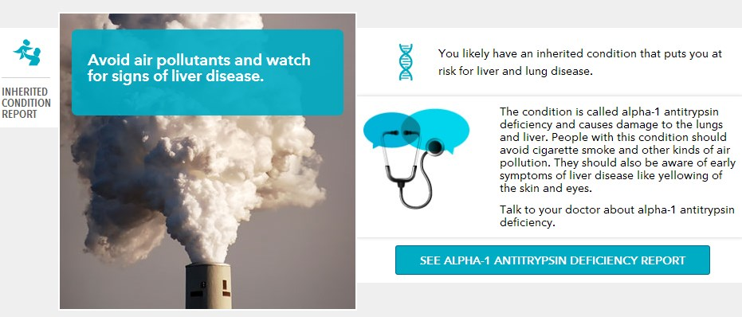

I haven't logged into my _23andMe_ account for a month or so now, but I did this morning and I found they added something cool. The new feature is a report called **Key Health Recommendations**. Unlike typical health advice, which knows nothing about you, this report is based on your DNA.

Unless you are a data junkie like myself, going through all the reports on _23andMe_ may be overwhelming. This report is great because it drills into the most important actionable items.

### 3 Key Recommendations

For me, I learned that if I were to develop Hepatitis C that I need to make my doctor aware that I have _Moderately lower odds of responding to PEG-IFNalpha/RBV treatment_. I'd really prefer just not to contract it in the first place, so I read all the prevention advice. Don't share toothbrushes, razors or nail clippers. Stuff like that.

Because I have an alpha-1 antitrypsin deficiency, I should do my best to _Avoid air pollutants and watch for signs of liver disease_. So I probably shouldn't move to one of [these cities](http://science.time.com/2011/09/27/the-10-most-air-polluted-cities-in-the-world/). On lists of air pollution in the USA, cities in California are always in the top 10, including Los Angeles. Having lived in California for 7 years, I never found the air quality poor and that includes LA. It is way better than it was 20 or 30 years ago. I'll take LA air over Rio de Janeiro or Bangkok any day.

_Click the image for a larger version._

The last recommendation had to do with inheritable conditions that I don't have, but could be passed on should I have children. For me, I have a single mutation linked to hemochromatosis, which can result in higher iron levels. I'll just tell my kid to [donate blood every 8 weeks](/2013/04/2-gallon-blood-donor-for-washington/) as their pop does.

For those that didn't see my full post on 23andMe, check out [23andMe Results](/2013/04/23andme-results/).

---

## Comments

### Nigel
*June 23 at 2013 at 10:23 AM*

"I’d really prefer just <b>got</b> to contract it in the first place,..."
I think you meant the exact opposite!

---

### Anemone
*June 24 at 2013 at 1:16 PM*

I spent a long weekend in LA last fall and coughed so badly I thought I might throw up. I was short of breath the whole time. Definitely very hard for me to breathe there. The only other time I've had that happen was my first winter in Calgary, before I got the humidifier and turned my room into a jungle. I seem to be more swamp creature than anything else. I wonder if they know the genes for that. :-)

The more you write about this 23andme stuff, the more fun it looks.

---

### MAS
*June 24 at 2013 at 2:13 PM*

@Anemone - LA still has bad days, but they are much fewer than they were 20-30 years ago. At some point I will really explore the ancestry side of 23andMe.

---

### MAS
*June 24 at 2013 at 3:25 PM*

@Nigel - Thanks. Made the fix.

---

