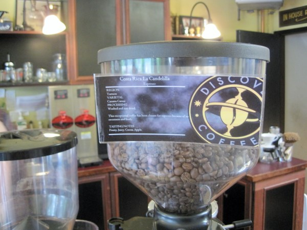
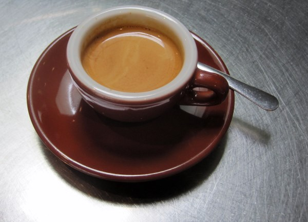

Last Saturday, I took my first trip to Victoria, BC. Because I live in Seattle, I can ride the Victoria Clipper and be there in just 3 hours. Three hours up and three hours back, with plenty of time in between to explore the emerging coffee scene in Victoria. The odds of getting five excellent espressos in a row is rare. The odds of pulling that off in a city you’ve never been to using only web research is beyond rare. But that is exactly what happened. If you have a day to spend in Victoria, here are the five places that impressed me last Saturday.

### Fernwood Coffee - 1115 N Park Street

Once I exited the Victoria Clipper, I walked directly to _Fernwood Coffee_ which was 2.6 km (1.6 miles) away to meet with friends. I suppose you could take a cab, but I like to see a new city by foot if I can. Fernwood Coffee was the busiest coffee shop of the day. I had a single origin espresso from Colombia which I detected notes of cocoa. Even though _Fernwood Coffee_ sells food, I had lunch at a nearby taco truck called _Taco Justice League_, which was amazing.  

### 2% Jazz Coffee - 1701 Douglas Street

_2% Jazz Coffee_ is a spacious coffee shop that roasts coffee on premises. Here I had the excellent 2% Jazz Espresso Blend. Caramel notes and although I was drinking a straight espresso, I could tell this blend would really stand out in milk drinks. 2% Jazz had large windows and lots of natural light. A perfect place to hang out, but I had more espresso to drink, so I didn’t spend long here. I was off to the third location. 

### Discovery Coffee – 664 Discovery Street

At _Discovery Coffee_ I had a single origin espresso from Costa Rica which turned out to be my favorite single origin espresso of the day. The staff was super friendly and provided additional ideas for other coffee shops worth checking out. Had I had more time and adrenal support, I would have purchased a Nicaragua don Francisca pour over which was listed on Daily Offerings chalkboard.  

### Habit Coffee - 552 Pandora Avenue

Passing by Chinatown, I arrived at the place I most looked forward to visiting. They use the roaster _Bows and Arrows_, which has made an appearance in Seattle recently at _Milstead and Company_. _Habit Coffee_ did not disappoint. It was the best espresso of the day.  

### Solstice Cafe – 529 Pandora Avenue

I’ve found that when I consume a lot of espresso in a day, my taste buds never seem to enjoy the later shots as much as the earlier ones. Taste overload, maybe? When I stepped into _Solstice_, I thought my lucky streak was over. But, this huge cafe with a large back patio served me my 5th and last great espresso of the day.  

### Full Disclosure

I did stop into a 6th coffee place, which I will not name. My research told me they were good, but my espresso intuition told me they weren’t as _serious_ about coffee as the other places. So I didn’t order anything there and saved my adrenals.

### Wrap Up

Victoria, BC really impressed me. They have a thriving coffee scene. On Facebook, I joked that Victoria was the Portland of Canada. Like Portland, Victoria is using multiple roasters with a strong focus on single origin coffees. Because my trip was just a single day, I didn’t even get to visit every place. I still would like to visit _Caffe Fantastico_ and _Heist Coffee_. If you get to go to Victoria, I hope you find this mini coffee guide helpful.  _In case you want to see other things in Victoria besides coffee shops. :)_