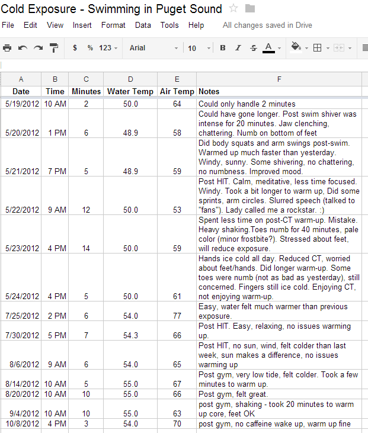

It has now been just over five years since I began exploring [cold temperature exposure](https://criticalmas.org/best-of/cold-weather-training/). When I first started doing this, I didn't use the term thermogenesis. My goal was not to lose fat, but to widen my comfort zone of temperatures. Having moved to Seattle after 7 years in San Diego, I was a wimp when it came to being cold. I recall being uncomfortable even in the low 60s without a jacket or sweatshirt. I needed to do something. Encouraged by an Art De Vany article, I began to do deliberate cold exposure. By the 2008-2009 winter, I had expanded my  short sleeved shirt comfort zone down to the mid to upper 30s F (assuming no wind). This was also the same time period that I was losing weight effortlessly.

### Fat Loss?

When I dropped the 20 pounds, I was also playing around with other factors. I lowered my carbs, experimented with Intermittent Fasting and began cooking all my own meals. There are many claims on the Internet that cold exposure helps with fat loss. Since I was trying so many things, there was no way to determine its role at that time. Over the past 5 years, I have dialed up and down the amount of cold exposure and have come to my own personal conclusion that if it helps with fat loss, that effect has been minor. In fact, when I got to really low levels of body fat, I suspected it was having the opposite effect. My hypothesis is cold exposure on a lean body is a stressful trigger telling the body not to lean out further. Again this is just a guess. When you read the stories of fat loss associated with CT, be they online or the one in the [Tim Ferriss book](/2010/12/initial-impression-of-the-4-hour-body/), I noticed a common theme. They all tend to be male endomorphs. They also tend to be at least 30 pounds overweight when they started. The cold exposure brings them to a normal weight. I don't see anyone getting shredded with Cold Thermogenesis. Swimmers and surfers are held up as examples of how cold water exposure can help them maintain very low levels of body fat even at extreme caloric levels. Maybe it has a role, but they also have a high level of activity, plus they aren't losing weight - they were already lean.

### Freeze the Animal

For a few years, I cycled between cold air exposure in the winter and cold shower rinses in the winter. Just enough to keep my comfort window wide. Then in April 2012, Richard at _FreeTheAnimal_ posted about his cold exposure experiments I was inspired to see just how far I could push my body. I didn't have a tub that I could load with ice, but I do live very close to Puget Sound. So I began a new experiment. I would track my exposure time as well as temperatures along with some notes. Here was my data.  There are 3 phases to this kind of cold exposure. Phase 1 is the courage of dealing with the shock of exposing your body to cold. Phase 2 is dealing with being covered in cold water for a period of time. Phase 3 is the warm-up phase. Phase 1 took just a few experiences to overcome the shock. Phase 2 went from tough to easy - even relaxing - very quickly. Phase 3 is where I had the issues. I had a lot of trouble warming back up. It was highly stressful at times. Had I been able to step out of the cold water onto a sunny hot beach, it would have been much better. But living in Seattle, I didn't have that option, so I ended the experiment.

### Hot Thermogenesis?

Earlier this year I started looking at ways to [increase my body temperature](/2013/03/my-plan-for-the-turn-up-the-heat-experiment/), starting with some of the articles and ebooks by Matt Stone. So when he posted [Hot Water vs. Cold Water Thermogenesis](https://web.archive.org/web/20130522114055/http://180degreehealth.com/2013/04/hot-water-vs-cold-water-thermogenesis) it really got my attention. He made an interesting point about the type of fat a mammal develops in response to the temperature of its environment.

> What’s the body’s defense against icy cold temperatures?  Body fat – polyunsaturated body fat at that.  At the higher latitudes you see more and more polyunsaturated fat, and higher body fat percentages working its way into the local fauna. Even the amount of body fat in a fish is pretty closely tied to the water temperature.  That’s why you see omega 3 polyunsaturated fat accumulating in coldwater fish, as well as seals, whales, walruses, and other blubbery cold weather dwellers.

And high levels of polyunsaturated fat lead to a lower metabolic rate. So jumping into the cold lake will cause a huge caloric burn, but do it over and over and the body mounts its own self-defense. It reduces metabolism by lowering body temperature. What is the effect of temperature on health? From the same post:

> Cold temperatures in winter are not conducive to better health and a higher metabolic rate either - or at least not greater leanness.  Winter is fattening and exacerbates most health conditions, whereas the hot temperatures of summer or the tropics tend to favor greater leanness and lessen most health conditions.  Most on thyroid meds have to up their dosage in the winter time just to keep hypothyroid symptoms at bay.

After reading this, I did an 8-day experiment. I got a trial pass to a gym with a sauna and steam room. I went every single day during this period. Although I don't think I lost weight, my sleep quality was amazing, getting 8.5-9 hours sleep most nights, which is rare for me, especially in June when the days are longer.

### My Personal Conclusion

Now I only do enough cold exposure to widen my comfort range. I've found 30-60 seconds of cold water between the shoulder blades once or twice a week is enough. During the winter, I'll wear short sleeves to about 50 degrees. After that, I'll grab a sweatshirt. I suspect that if CT works for fat loss those that will experience the most positive benefits will be endomorphic men with more than 30 pounds to lose. There is a shocking lack of information when it comes to women. Since thyroid and low metabolism issues are more likely with females, I'd be hesitant to do anything more than minimal cold exposure.

---

## Comments

### Becky
*June 26 at 2013 at 4:32 PM*

I have been reading about saunas and improved sleep quality, and most of the articles I read state that you should visit the sauna in the evening for this to be effective.  Was that your experience?  I do find that if I take a really hot bath in the winter at bedtime, I sleep much better, but that's not practical in the summer.  Supposedly, improved sleep quality is due to the falling body temperature after extreme heating.  Just wondered what your experience has been with this.  

I will say that I experimented some with cold therapy and had the same experience.  IF has been my most reliable method of reducing body fat.

---

### MAS
*June 26 at 2013 at 4:46 PM*

@Becky - Excellent question. I experimented by altering the time of day. I use a sleep quality score of 1-5, with 5 being perfect. 

Date - Time of Sauna/Steam - Sleep Quality - Notes
6/1 - AM - 5 - 9hr sleep
6/2 - PM - 5 - 9hr sleep
6/3 - PM - 4 - 7.5 hr sleep
6/4 - AM - 5 - 8.5 hr sleep
6/5 - AM - 4 - slight headache
6/6 - AM - 5 - afternoon headache
6/7 - PM - 5 
6/8 - AM - 5 - 8.5 hr sleep

AM Sleep quality average = 4.8
PM Sleep quality average = 4.7

So for this short test period, the time of day I did the sauna/steam did not influence sleep quality. Both worked equally well. A longer test is likely needed for better data.

---

### Kate
*June 29 at 2013 at 2:17 AM*

An interesting experiment.  I've wondered about the different adaptive systems to extreme heat vs. extreme cold.  As a heat adapted individual I've been curious about how people seem to develop both different temperature regulation and different air handling depending on what they are used to.  My northern friends tend to enjoy runs in cool air as comfortable and hot humid air has deleterious effects on their breathing, where my breathing is better on a 90-100 degree day with humidity and worse even in the low sixties or with dry air.

I will say, I think it make the most sense to adapt to the environments you live or intend to live in.  I maintain my heat adaption, so a broken air conditioner is only inconvenient, but put me in Seattle with no heat and I'd be lost.

---

### Rick
*October 2 at 2014 at 12:30 AM*

I'm not sure I agree with Matt Stone above when he says that thyroid activity is lower in the winter than the summer. Dr. Paul-Robert Thomas states just the opposite in his book on thermodynamics: "The thyroid hormones also trigger thermodynamic reactions, thus raising the basal metabolism. But their secretion is very slow and their optimum blood rate is only reached after some two weeks. Their secretion follows a seasonal cycle: it increases in winter and decreases in summer...Being cooled on a daily basis, the amount of circulating thyroid hormones is significantly increased after a few weeks. These hormones are involved in the cellular combustion of the entire organism, and partly explain the overall invigorating effect felt by those who subject themselves to such cooling action."

Elsewhere he writes how careful people must be in a hot climate not to overeat because they will easily build up fat especially in high humidity when the body cannot cool itself by evaporation.

---

### MAS
*October 2 at 2014 at 3:52 PM*

@Rick - I went looking for more info on the seasonal aspect of thyroid and found this post.
<a href="http://evolutionarypsychiatry.blogspot.com/2012/02/seasonal-variations-in-thyroid-hormones.html" rel="nofollow">http://evolutionarypsychiatry.blogspot.com/2012/02/seasonal-variations-in-thyroid-hormones.html</a>

Dr. Deans states that:
T4 is highest in the summer
T3 is highest in the winter

There was this line that I found interesting, which applies to animal studies.
<blockquote> Heat is generated in brown fat in part by uncoupling protein 1 (UCP-1), which is made in response to T3.  T3 also seems to increase the activity of fat-burning enzymes in response to cold. </blockquote>

And.
<blockquote>There was a negative correlation between glucose and free T4, and a significant positive correlation between T4 and the amount of carbohydrate and sugar consumed. </blockquote>

As a health hobbyist that has trouble with this topic, I am guessing the take away lesson might be to do mild cold exposure and consume carbs to support thyroid health. Is that right?

---

### Rick
*October 4 at 2014 at 12:55 AM*

@MAS - Thanks for finding that post. I agree with your take away lesson. I take cool showers and try to keep the thermostat lower and dress lighter. I also read an article on the old fashioned air bath which achieved the same evaporative cooling effect to boost metabolism (cool showers are 4x more efficient). Like I've mentioned in another post I like limiting most of my carb/sugar intake to the evening as per Dr. Sidney Baker (Circadian Prescription). That way you get the maximum benefits of carbs while having low insulin levels during the day/working hours. Thanks for the good research.

---

### MAS
*October 4 at 2014 at 11:03 PM*

@Rick D - I tend to reach for the carbs in the AM if I feel sluggish or cold or stressed. If I feel fine, I can push off the carbs or calories until later in the day.

---

### Ian
*November 20 at 2014 at 11:19 PM*

I've been in constant ketosis for just over 3 months and measuring the ketone levels daily with a breathalyser unit that is sensitive to acetone. 0.1% BAC (Blood Alcohol Concentration) works out at 1.75 mmol/L for blood ketones. "Nutritional ketosis" is between 0.5 and 3 mmol/L. The device registers in steps of 0.1% and a normal reading when eating a ketogenic diet would be around 0.1%. When I exercise strongly - either running hard for 10k or cycling in the mountains for a few hours (racing bike) then the BAC can climb to 0.2 or perhaps 0.3. Anything above 0.1 indicates that body fat is being burned - moving into "post exercise" ketosis. 

When I combine the above with a cold bath - 25 to 35 minutes at around 52°F the following morning my BAC is up to 5 which is 8.6 mmol/L without fail - a very high level of ketosis. The only other way I can achieve 5 is when racing over 100 miles while climbing  4000m to 5000m on my bike - without eating. 

What this is showing is that the Cold Thermogenesis is definitely creating a major shift in fat metabolism that lasts about 24 hours after the cold bath. Despite struggling to warm up after the bath I then end up boiling in bed during the night. 

I get the impression that if you didn't lose weight doing this then there may be many other reasons behind that. Perhaps you could try again by taking your own measurements. Of course you have to be in ketosis - and if you weren't then that might explain why it didn't work.

---

### MAS
*November 20 at 2014 at 11:39 PM*

@Ian - You are mistaken. I did lose weight following a combination of cold exposure, IF and reduced carbs. My belief is that cold exposure can help people lose weight up to a point. I don't think it is the best tool for getting shredded. 

This post is 1.5 years old, my post from yesterday covers my current thinking in more depth,
https://criticalmas.org/2014/11/cold-exposure-not-one-size-fits/

---

