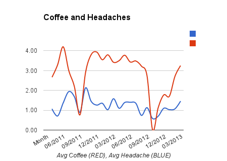

When I've done experiments in the past, I focus on one thing. For June 2013, I'm going to mix some past experiments together to see if I can get a synergistic effect. I'm also going to try a new idea, which I couldn't previously test.

My goals this month:

1.  Reduce headache frequency and intensity.
2.  Drop 5-7 pounds.

First the headaches. My past experiments have turned up 3 ideas that measurably help.

1.  No grains, except white rice. Corn seems to be OK, but I will minimize it as well this month. Although I am excellent at avoiding gluten, this month I will be just as diligent avoiding what I call the secondary grains (sorghum, millet, etc). This means no Gluten-Free treats or anything that even looks grain dominant. I learned last year that I have a secondary grain intolerance, which I posted about in [Results From My 30 Days Without Grain Experiment](/2012/10/results-from-my-30-days-without-grains-experiment/). Because the effects are less severe than gluten and random, I haven't initiated a no grain policy. For June I will. 
2.  Reduce caffeine levels, especially coffee. The data is clear. When I went an entire month without coffee, my headache intensity dropped considerably. When I added coffee back, it increased lock and step with consumption.
3.  Minimize AM caffeine. I have noticed that my sleep is better when I have a single coffee post lunch or early afternoon. Having the coffee post meal should be better for my body than slamming coffee in the AM on an empty stomach. Plus I am a natural morning person. I jump out of bed with no alarm by 6 AM most mornings.

So in summary, avoid most grains, have some tea in the AM and a single coffee post meal in the early PM. This might be the secret sauce. It combines results from 3 previous experiments. By the way, I am not looking for _new_ ideas at this time or yet another request that I see a doctor. Those comments will be ignored.

For the fat loss, I have 3 ideas.

1.  Return to IF ([Intermittent Fasting](/tag/intermittent-fasting/)). I'm going to stop screwing around with trying to [increase my body temperature](/2013/04/turn-up-the-heat-1-month-update/) by eating early in the AM. All it does is make me hungry all day long. Plus it isn't working. I have more thoughts on that, which I'll save for a future post. For the IF, my target will be 12 hours minimum, with most days between 14-16 and a random 20-22. In the past, I've used excessive caffeine to blast through IF, but I can't do that this time (see above), so this will take some adjustment. 
2.  Only consume sugar rich foods on days where I lift weights or hike at least 2 hours. Those foods would be ice cream and pudding. On days over 80 F, maybe a single Mexican cola.
3.  Back in 2011, I reviewed the book _The Shangri-La Diet_ in the post [Flavor Signaling and The Shangri-La Diet](/2011/08/flavor-signaling-and-the-shangri-la-diet/), but I could try the ideas because I was already an optimal weight. I also was eating a super clean diet that had none of the foods that are considered hyper palatable. Well after [a year of eating ice cream](/2013/03/ending-the-ice-cream-experiment/), I developed a sweet tooth, which I never had prior. So I will play with his ideas to consume foods with calories and no taste, such as Extra Light Olive Oil or diluted sugar water.

Exercise will stay the same. One to two machine based brief weight lifting sessions using a combination or slow movements and static holds. I'll also continue [urban hiking](/tag/urban/) through Seattle.

The challenge for June will be the morning. Dealing with hunger with low caffeine is going to be tough.

---

## Comments

### glenn.whitney
*June 1 at 2013 at 5:30 PM*

Sounds good.
A couple points:
1- I'm super keen on white tea - it tastes very clean and has a gentle stimulative effect on me.
2- MCT oil. I'm expermenting with it. Results are positive but inconclusive. Certainly it's making an excellent moisturizer (face and body) so far.

---

### Pauline
*June 1 at 2013 at 5:31 PM*

Interesting - I am still struggling to cut caffeine intake even at only 2 coffees a day.  One with breakfast and one with lunch.   Drinking it with a meal definitely causes a slower release of adrenaline. I tried herbal tea as a start to the day that felt good (peppermint tea with lemon very nice).  But still need those two daily doses of caffeine. Alcohol I have cut down to one glass a week.  The slow grumpy feeling next day is not worth it.  Potatoes I love almost as much as coffee!  I have come to the conclusion my body doesn’t like starch in potatoes (something about them being part of the nightshade family).  They seem to cause an ache-like feeling similar to grains/gluten in neck and back.  I eat starch infrequently but notice some inflammation effects not long after.  Whenever I have carbs with breakfast - banana, rye toast or potato, the hormonal cravings also seems to surge for that day.  I definitely feel my body craves what it has regularly, there is some kind of hormonal attunement that happens.  However, I seem to sleep better with some carbs - veggies/sugar/fruit  with evening meal.  Good luck on your new set of experiments.

---

### paulM
*June 2 at 2013 at 7:53 AM*

What is this eating early morning about? I never understood it. S many diet and exercise 'gurus' recommend it. All my life (I'm now 58) , I become RAVENOUS all day long if eat an early breakfast. Never worked for me. I always go back to fruit only or mostly for breakfast and usually after I'm up for a few hours or have already exercised.  Early am exercise seems to give greater benefits than eating at that time.... any thoughts?

---

### MAS
*June 2 at 2013 at 2:50 PM*

@Glenn - I tried MCT Oil. Sometimes it played havoc with my insides and sometimes it didn't. You are supposed to ease into it and then it is fine, but I found it unpredictable. 

@Pauline - I still haven't done the nightshade test. I suspect I am OK with them. Plus I've never found a clear answer on how long they need to be out of the diet for the test. The 30 day number is for proteins. Not sure it applies here. Do you know?

@PaulM - The best reason I've read to eat breakfast in the morning is to boost metabolism from someone with a low body temperature with high levels of stress hormones. The breakfast would be carb biased. The increased appetite signals would be a positive attribute, as it would force that person to eat more. From what I've read the ideal person for this would be someone that has a long history with diets, especially low carb. Maybe they have thyroid issues. And my observation from blogs is that women seem to benefit more. 

When I did 70 days straight of LeanGains, my metabolism showed signs of slowing down. 
https://criticalmas.org/2011/03/intermittent-fasting-70-day-review-of-the-leangains-method/

These days if I ever wake up feeling very cold, then I immediately consume some rice or other carbs. That day will usually end up being a carb heavy day. Which is fine, as it brings me back into balance.

---

### Pauline
*June 2 at 2013 at 9:02 PM*

I think all testing with possible problem foods, e.g. nightshades involves a 5 day abstinence then re-introduction (try to eat mostly that food on the re-introduction day so it is no confused with anything else you may be eating).  If you get feedback from your body of intolerance, eliminate for a month or so and then re-introduce.  Some foods are no problem to eat if you have it on a rotational basis say every 4 days, meaning fine as long as it is not regularly consumed.  Others if you have ongoing problems best to avoid for a while until your immune system has recovered and does not get triggered when eating it.  Do whatever you know during that break period to eat healing foods that work for you.  Usually some probiotics to calm the gut or adding nourishing broths etc,  just avoidance of the food brings some recovery.  This is how I found out I could not tolerate regular eating of wheat/grain/gluten.  Chocolate too is ok but not tolerated if eaten every day.

---

### MAS
*June 3 at 2013 at 2:57 PM*

@Pauline - Good to know. I'll pencil in the nightshade experiment for July!

---

### Woodwose
*June 7 at 2013 at 1:16 PM*

1.) Cold showers as a coffe substitute
I quit coffe a year ago, and it seems i have done it sucessfully. This time around I was lucky that Jack Kruses and Ray Cronizes Cold Thermogenesis craze was going on in the paleosphere because as I found out cold showers worked as a very good substitute for my morning and evening coffee. I view cold showers as a perfect adrenaline stimulator and general supressant of cravings.

2.) Resistant starch and L-glutamine as apetite supressant and gut stabilizer.
I have been using resistant starch for 5 weeks now and it's been very helpfull for my gut issues. I also find it helps with satiety. Check out Richard Nikoley's and tatertot for more on this. Watch out for "extreme gas events" if you eat the starch with a combination of other fermented foods, even if this subsides drastically after a few weeks supplementation.

3.) Protein sparing moified fast with intermittent carb-ups
I have been doing a sort of Protein sparing modified fast (low carb, low fat high protein) with intermittent carb ups after excercise for 2 weeks now, mostly inspired by what the  guy at Chaos and Pain calls the "Apex predator diet". And it seems to be working very good. (btw "Chaos and Pain" are not safe for work but contains alot of good info).

---

### MAS
*June 7 at 2013 at 3:47 PM*

@Woodwose - RE: #2 I looked over that series and it never made sense to me. I have experimented with L-Glut as a supplement several times and found it worthless. 

As for coffee, my PM experiments so far are showing promise. It is the oddest thing. For me suppressing surges of adrenaline (especially in the AM) seem to be having a benefit.

---

### Pauline
*June 13 at 2013 at 12:31 PM*

Recently picked up this book called Zero Tolerance Diet by J J Virgin, what attracted me to it is the clarity she gives in explaining how to do an elimination diet to work out food intolerances through 3 consecutive phases.  Although touted as a weight loss book its really one of the clearest written books on how and why elimination diets work.  Worth a read just for that.  I have read everything I can get my hands on over the years from books published in the early 1950s/60s up to the more recent.  I think she explains it in the simplest and practical way.  I am preparing to do the 3 week phase again (haven't done that for a while) and first thing I am going to substitute is coffee/milk with tea/lemon.  Not going to be easy but going to give it a go.  She recommend some supplements as you do the elimination phases - Vitamin C, Magnesium and Chromium (cravings in general).  I bought it on kindle and recommend it.

---

### Pauline
*June 13 at 2013 at 12:36 PM*

"As for coffee, my PM experiments so far are showing promise. It is the oddest thing. For me suppressing surges of adrenaline (especially in the AM) seem to be having a benefit."

Can you explain or are you saving it for another post?  Is there anything in particular you are doing that is working for you?

---

### Pauline
*June 13 at 2013 at 1:22 PM*

I wonder if saving your coffee for after a meal has the calming effect it has had on me.  The adrenal surge is much more muted.  Unfortunately it has meant I can enjoy more coffee.  Hence the clear out trial ahead.  Timing is important and giving our brains time to recover too.  I seem to be able to tolerate more coffee later in the day these days and vitamin B5 supplementation is more ad hoc on a need to take basis.  These things are cyclical and the early morning craving for caffeine is habit forming as it has been slowly reducing out of our system overnight.  Here's an interesting link:  http://www.energyfiend.com/caffeine-metablolism

---

### MAS
*June 13 at 2013 at 3:40 PM*

@Pauline - I think you nailed it. My entire life I've been slamming coffee in the AM on an empty stomach. I'm already a morning person. Adrenaline on adrenaline for decades. Pushing the coffee to post lunch when my adrenaline levels are lower gives me the lift without the issues I was having in the AM. At least this is what my early data is showing. With the exception of my travel days, my last real bad headaches (4 or 5) was on May 17th. 

I'm thinking about creating a coffee study where I collect data from many coffee drinkers with a few health questions. I'm most interesting in timing, quantity, age, sleep quality, whether coffee is consumed with food and even back pain.

---

### MAS
*June 13 at 2013 at 3:41 PM*

@Pauline - When do you take the B5? I've been taking it before bed.

---

### Pauline
*June 13 at 2013 at 3:48 PM*

I think all the B vitamins have a tendency to wake you up or make you more alert.  But having said that I have just taken one at 4pm as I have had a busy day and too much coffee.  I would take it earlier after you have had your meal and coffee.  I generally use it to dampen down any caffeine effects I may have.

---

### MAS
*June 13 at 2013 at 3:50 PM*

@Pauline - Interesting. I'll move it up to lunch time. Thanks!

---

