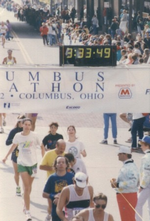

Several running apologists have linked to the long-winded [Guest Post: Sorry, but Science Says Running is Good for You, Not Bad](https://web.archive.org/web/20131126200247/http://gokaleo.com/2013/06/11/women-and-running/). With their science hats on, they dug through all the studies and concluded that _all was well_ with running. The article talks about fat burning, VO2 max, and thyroid.

Nowhere does it mention joint, hip, or knee pain.

The article completely ignores injury risk. I don't how you can write an article endorsing an exercise in the title without addressing the safety aspect - especially one as prone to injuries as running. I got into a heated discussion with someone about this online. His position was it was outside the scope of the article to discuss the risks. My position is you must account for the risks before you can say it is good. Ignoring the risks to draw a favorable conclusion doesn't make the risks go away.

### My Bias

Time for a disclaimer. As a young man, I ran two sub 4-hour marathons (1989, 1992). During that time, I was in pain a lot. I stopped running, not because I was lazy or felt it was bad for me, but because I hurt. During the time I ran, I was always looking at ways to reduce pain and avoid injuries. I was not alone. Pick up any running magazine and you'll see articles on injuries and pain management.

Just like with the barbell back squat, it was my pain and failure in avoiding injuries that forced me to rethink whether running was a wise idea. What is the goal? Can it be accomplished more safely? How can I preserve my health well into old age if the running I'm doing in my 20s is causing so much pain?

_I loved running when I wasn't in pain. Here I am finishing the 1992 Columbus Marathon._

What I learned is you absolutely DO NOT need to run to achieve a high level of health. Figure out a way to build strength and protect your joints with minimal risk of injury. **Not minimal risk of injury in 12 weeks, but in your lifetime.** Go for walks and do some static holds on the machines in the gym.

I like what super trainer [Drew Baye](https://baye.com/) said on Facebook in response to this article.

> Running to burn calories is a huge waste of time and the bigger concerns are the long term effects on joint and spine health. Whatever general fitness benefits it provides can be obtained more safely and efficiently with proper resistance training.

### No Alpha in Running

Back in my post [Responding to a CrossFit Enthusiast](/2012/02/responding-to-a-crossfit-enthusiast/), I shared a finance term called alpha, which is _the return in excess of the compensation for the risk borne_.

> All movement has a risk versus reward profile. The risk is either the movement yields no results or results in injury. The reward is positive benefits derived from the exercise.

The benefits that running provides are not worth the long-term risks. It is too easy to replicate the benefits of running with something safer and more effective. A program of walking combined with the Wall Sit from the [HillFit program](/2012/01/hillfit-strength-is-not-just-for-hikers/) will develop more strength, be much kinder on the joints, and do it in less time.

I also think walking upstairs is better than running. And when I do run, I prefer sprinting, especially [uphill sprinting](/2012/01/running-up-that-hill-sprinting-salvation-for-tall-people/) for us taller folk.

### Common Sense

**Even the worst fitness protocols can hide safety issues in the short run.** Joint pain is slow and cumulative. It can take decades. This is the same point I made in the post [My Squat Article is a "Scare Piece"](/2013/06/my-squat-article-is-a-silly-scare-piece/).

If you like to run, run. If it hurts, stop. You don't want to go under the knife for replacement surgery when you get older.

When I was back in Ohio, I learned that 2 family members were having knee replacement surgeries. Both are in shape. Both played college sports, one football and one wrestled. A combination of running and barbell back squats wrecked their knees. It didn't happen right away. It took 30 years.

---

## Comments

### Mike
*June 14 at 2013 at 4:17 AM*

If you hadn't already seen this, it's worth a look ... http://web.archive.org/web/[phone removed]2927/http://www.archevore.com/panu-weblog/2009/11/1/cardio-causes-heart-disease.html

---

### Michael
*June 14 at 2013 at 4:42 AM*

You won't be able to find a long term study that suggests that running ruins knees.

---

### MAS
*June 14 at 2013 at 4:49 AM*

@Mike - Yes, I have seen that. Art De Vany has lots of info on his site regarding similar health issues.

@Michael - There are long term fitness studies? :) Seriously, simple observation and past experience is enough to observe the injury prone nature of running. Running books and magazines don't hide the fact that injury is common.

---

### Chris
*June 14 at 2013 at 6:25 AM*

I'm not a runner.  Thanks for the Hillfit shout out too.

I linked to that article not because it was about running but because in it Sol Orwell showed how Keifer had misinterpretted and misrepresented  some studies to support his position.   Even those of us who do't run need to beware of the bad science out there.  I've seen a few people criticise Sol's article but they were knee-jerk anti-running reactions rather than addressing what he was actually saying.

---

### Txomin
*June 14 at 2013 at 12:38 PM*

I agree. Running has risks often ignored... by those that only exercise with a remote/mouse. Those that do run regularly are too busy dealing with a laundry list of maladies. Even sprinting can become tricky. But I don't think the root cause applies to the squat. The amount of repetition involved is hugely different. Maintaining good form for 3 sets of 8 deliberate reps is entirely different than doing so for thousands of strides at a clip.

---

### MAS
*June 14 at 2013 at 2:19 PM*

@Chris - I like how you presented the link. It was how SaveYourself presented it that got me fired me to write the blog post. His comparing runners to Walmart shoppers as evidence that running was swell was too much for me. 

@Txomin - Agreed. I did feel much better when I was doing barbell back squats for 5 reps (2-3 sets) than when I was running 30 miles a week. Not even close. Running was far harder on my body.

---

### dhammy
*June 14 at 2013 at 3:45 PM*

I am a runner and have been doing 20 miles a week or so lately.  And, when asked, I'm glad to tell everyone about how I run and mostly enjoy it.  At the same time I tell them, as a disclaimer, that they shouldn't do it... running is way too hard on the body.  There's a strong potential for back injury as well as foot/knee/hip problems later on...  and that they'd do better to take up walking or weight lifting...

---

### MAS
*June 14 at 2013 at 5:07 PM*

(copied from Facebook)
I'm not skilled at reading fitness studies, so I don't.

However, common sense tells me that when people hurt, they stop running. Those individuals that have excellent form, wear proper shoes and get proper rest, continue to run. The people in pain are gone. They stopped running, so studying a pool of high mileage athletes over several years would likely show a more favorable outcome, as those in pain or already injured wouldn't qualify. 

Also, comparing running to more injury prone sports doesn't make the injury rate acceptable. Some body types do better at certain sports that others. When I attended the 1992 USA Olympic Trials for the marathon, I received a program of all 125 qualifiers. Only one runner was over 6 feet tall. None were over 200 pounds. 

Do these studies model for height, weight, age? In the end, does it even matter? My original point is many runners are hurting. Science be damned. Pain sucks. Your body is telling you to stop. No need for PubMed.

---

### Anemone
*June 14 at 2013 at 11:37 PM*

Nothing about shoes vs barefoot? 

I admit I don't know much about running, but I can hurt myself doing pretty much anything so for me I think it's not what I do but how I do it. I'm about to read Born To Run and am curious as to what I will find.

---

### Rick
*June 14 at 2013 at 11:57 PM*

You have to take many things into account when ruling out a particular exercise or activity. With regards to running, marathons, half marathons,and ultra long distances are flat out over use. Running at short and middle distances can be extremely effective. Another issue is the biomechanics of running. Most people aren't taught how to run both efficiently and in ways to lessen the impact. This is critical for both injury prevention and performance.

---

### Sol
*June 15 at 2013 at 5:42 AM*

There is enough evidence going around that athletics (ala soccer, basketball, etc) have far higher injury rates than running has ever had.

So where's the backlash against that?

I'd also add your own anecdotal evidence centers around marathon. There is nothing moderate about marathon running.

---

### MAS
*June 15 at 2013 at 12:49 PM*

@Rick - That would be a good discussion. Break down running into all types. Distances, times per week, trails, shoes, height, weight, age and then show what the safest type of running might be. 

@Sol - I believe you, but I don't see basketball and soccer being pushed as healthy forms of exercise. They are sports where the large majority of those participating are young. They are doing the sports out of enjoyment or competition, not usually out of a desire to exercise. 

I've ran many distances. The 2 marathons were the outliers. Most of the distances I covered were much shorter.

---

### Kate
*June 16 at 2013 at 12:04 PM*

I think part of the high injury rates is the pressure to perform.  People commit to a run and feel they need to do it even though it hurts.  If it hurts don't run today.  Walk or swim or do yoga.

I got runners knee from capoeira and wound up going to physical therapy.  The most important thing I learned was an obvious in hindsight.  The therapist said "When your muscles are tight stretch and when they are feeling under-worked work them."  A light went off and now I change my routine based on how I feel.  If it hurts I don't run, but I can still run some if I listen to my body.

The only drawback is that many people seem to have lost the ability to listen to their bodies.  Also, it will make all the more regimented people think your crazy.

---

### StuartG
*June 16 at 2013 at 12:29 PM*

Fully agree with what you say Kate. I jog a couple of miles if the weather is good and I feel like I'm up to it, same when it comes to sprints and intervals, otherwise I'll walk or use my recumbent bike. I think that I can listen to my body, but the trouble is that the old, competitive part of my psyche, the 20 something me, sometimes chooses to ignore the messages from my 46 year old body......

---

### MAS
*June 16 at 2013 at 2:40 PM*

@Kate - Great point. 

@Sol - I was thinking about this some more yesterday. What got me fired up about this article was the title. I think a more accurate title would have been "Science Shows Running Not as Bad as Critics Say It Is". Or something similar. Without the endorsement of running or IMO condescending tone in the title, I would have been fine with the article. Maybe the title was a way to bait guys like me to link to it and discuss it. If so, well played.

---

### Donald
*July 1 at 2013 at 7:09 PM*

I'm a runner (more serious  40 mile per week 3:43 marathon runner at age 40, now just a fitness jogger in my 50's) and so I was all set to argue with what I thought was going to be another one of those stupid "running is bad for you" articles.  But actually, this wasn't so bad.   

When I ran more seriously, yes, I frequently got injured.  It would happen almost like clockwork, about once a year, and for maybe 1-2 months I'd have to just walk.  And actually, this wasn't so bad.   I liked the walking, I'd get better, and then it was back to running.  My injuries generally came because I didn't take the time out to do Pilates and strength train--if I did all three I was fine.

As for marathons, training for them (when I did the Pilates and lifted) didn't hurt me at all.  It was the running of the marathon itself which was excessive.  It's great to do once or twice, but for me at least they don't build you up--they tear you down.  There's a big difference between a 20 mile training run done at a leisurely pace and running 26 miles trying to beat some time you think you have to beat.  

As for the tone of the original article that upset you, it cuts both ways.  There's a barrage of one-sided articles by people claiming to "know" that running is bad for you, and they're not just pointing out that people get injured far too much, they're claiming it's bad for the heart, as in the first link and talking as though there's no evidence that aerobic exercise is good for you.  It's stupid.   Alex Hutchinson did a pretty good job refuting most of this 

<a href="http://www.runnersworld.com/sweat-science/the-too-much-running-myth-rises-again" rel="nofollow">link</a>

---

### Donald
*July 1 at 2013 at 7:15 PM*

And another link to Alex Hutchinson--

<a href="http://www.runnersworld.com/sweat-science/second-thoughts-on-too-much-running" rel="nofollow">link</a>

---

### MAS
*July 1 at 2013 at 10:34 PM*

@Donald - In the end, some people are drawn to running. It feels good to them. Those that experience pain will withdraw to other sports or activities. That group includes myself. 

What I like about the articles you linked to is the acknowledgement of injury risk, which was absent from the article that irked me. He brought up the U curve and body weight. All highly relevant for a discussion on whether running is "good for you". 

I still favor other forms of exercise, but what I like may not inspire someone who enjoys running. Thanks for sharing.

---

