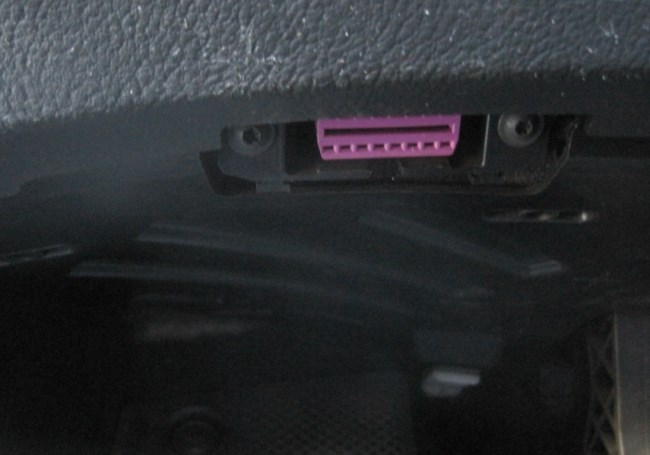

This is a follow-up post to [When the Check Engine Light Comes On](/2013/06/when-the-check-engine-light-comes-on/). If you haven't read that post, the short version is I learned how to read the engine codes thrown when the Check Engine light comes on in my car. Your mechanic will gladly charge you $85 to hook you up to "the computer" to see why your Check Engine light is on, but I wanted access to that data faster and I wanted to save some money.

### Bluetooth OBD2 adapter and an Android App

I purchased the Soliport ELM 327 Bluetooth OBDII OBD2 Diagnostic Scanner on Amazon for $5 (now $11) plus shipping and I downloaded the free version of [Torque for the Android](https://play.google.com/store/apps/details?id=org.prowl.torque). Once you have your phone connected, you can then get the $5 paid version which has more features.    Look under your steering wheel and you will see where the scanner plugs into. It looks like a printer port. Here is a photo of mine. VW was nice enough to use fuchsia so it stood out.  _Plug in the scanner there._   _The OBD2 scanner is now plugged in._ The Amazon review by Mark from Oswego provides perfect directions on connecting the Torque app to your OBD2 adapter. Once you are connected, start your car and Torque. When the Check Engine comes on, go to Actions -> Show Logged Faults. You will see the error code being thrown by the engine along with a link to a web page explaining what the problem is. Don't you just love technology? Now when the Check Engine light comes on, I can pull over to the side of the road and read the code. No need to schedule an appointment at the mechanic just to learn what the code is. I can learn the severity in real-time. I may end up at the mechanic, but I'll have more information when I schedule that appointment. And if the code is related to [prior work](/2013/04/car-repair-spreadsheet-why-didnt-i-think-of-this-earlier/), it might be covered under a service guarantee. My car has a spare tire, a jack, a first aid kit and now I have an OBD2 reader. The Torque app does a lot more that show fault codes. It collects A LOT of data points. I'll save that discussion for another post.

---

## Comments

### Anemone
*June 29 at 2013 at 2:22 PM*

My last car came off the assembly line in the mid-80s, and I haven't driven at all since the mid-90s, so it's interesting to see the picture of where the scanner plugs in. I wonder what other technology I've never seen before. (I have seen GPS in action.)

Cool.

---

### Brian
*June 29 at 2013 at 9:05 PM*

This looks great but apparently doesn't work with the iPhone. Btw, your initial product link is broken.

---

### MAS
*June 29 at 2013 at 10:55 PM*

@Brian - Thanks. I fixed the link. 

This might be an option for the iPhone.
http://web.archive.org/web/[phone removed]3314/http://www.iphone-obd.com:80/

---

