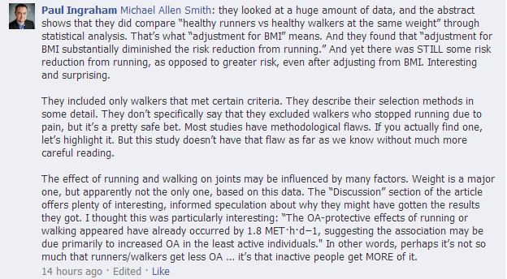
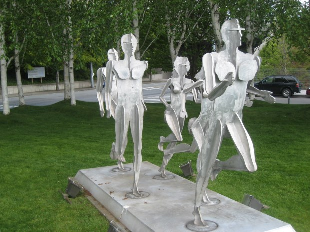

Last month I got into a debate on the SaveYourself.ca Facebook page about the article that declared that running was _good for you_. I put my thoughts into the post [Sorry, but Science Has NOT Proven That Running in Good For You](/2013/06/sorry-but-common-sense-says-running-is-not-good-for-you/). This month SaveYourself.ca (now PainScience.com) put out another pro running post that suggests that running could actually make your joints stronger than walking.

To me, this seems ridiculous. It fails the common sense test. Yet, I freely admit I have a bias against running. Some sprints are fine - especially [uphill](/2012/01/running-up-that-hill-sprinting-salvation-for-tall-people/) \- but my personal experience is that walking is far kinder to my body than running. I feel more aches and pains running 1/2 a mile than when I go for a 20-mile [urban hike](/tag/urban/). Paul from SaveYourself.ca is a skilled [PubMed Warrior](/2012/11/not-a-pubmed-warrior/) with a pro-running bias. Even his logo shows a group of runners. Because of our strong biases, I wanted to bring the discussion here for some other opinions.

Although I still think I'm right on this debate, I'm willing to be open-minded. Below is the story I am referring to, his analysis, my response, and his conclusion. Here is a [link](https://web.archive.org/web/20130808045046/http://journals.lww.com/acsm-msse/Fulltext/2013/07000/Effects_of_Running_and_Walking_on_Osteoarthritis.10.aspx) to the study.

  

Nassim Taleb came up with the term [Antifragile](/2013/02/my-top-5-books-of-2012/). It means something that gets stronger with stress. Building a muscle is a classic example. Apply stress to a muscle and provided the movement is safe and time is allowed for recovery, the muscle will get stronger. Does this also apply to joints?

From my understanding of the principles of High-Intensity Training, the goal or optimal path for fitness is to focus on building muscle as safely as possible while preventing unnecessary loading or repetitive stress on the joints. In other words, build the muscle and protect the joints.

_[Runners Statue](/2009/05/runners-statue-hidden-in-belltown/) in Seattle_.

I get how running is better than sitting on your ass. I don't get how running could be "neutral or helpful" when compared to walking. I believe that most people who choose walking over running are also consciously following a healthy path are doing so because they feel worse when they run. They self-exclude. Those who feel great running continue to run.

The Science Daily article [Stronger Leg Muscles Can Protect Against Knee Osteoarthritis](http://www.sciencedaily.com/releases/2006/11/061116100945.htm) says this:

> Stronger quadriceps muscles in the legs can help protect against cartilage loss behind the kneecap, according to Mayo Clinic researchers presenting preliminary study data at the American College of Rheumatology Annual Meeting on Nov. 15.
> 
> Knee osteoarthritis (OA) occurs when the cartilage that cushions the ends of the bones in the knee joint deteriorates over time. As this cushion wears down, the joint doesn't function as well and may be painful.

And:

> When the study began, researchers also had measured the strength of participants' quadriceps muscles (leg muscles in the upper thigh). Analyzing these measurements, researchers observed that participants who had greater quadriceps strength had less cartilage loss within the lateral compartment of the patellofemoral joint, which is frequently affected by OA.

It states 2 things:

1.  Strength is protective of joints.
2.  Joints can wear down.

I've been a runner and although I developed some leg strength, it wasn't near the amount I gained from weight training, especially from slow leg presses or the Wall Sit exercise described in the [Hillfit](/2013/07/hillfit-2-0-a-zero-budget-approach-to-high-intensity-training/) e-book. Maybe the runners had gained a little more muscle than the walkers and that served as some protection for the joints. If that is the case, it doesn't speak to the benefits of running, but to the benefit of building muscle. And in my opinion, running is a highly inefficient way to build strength.

Love to hear your thoughts.

---

## Comments

### James
*July 18 at 2013 at 8:31 PM*

No one has pointed out that this article does not show the 'effect' of running upon OA. It showed an association. We can speculate on how this association might be causative but this in and of itself does not support that running causes this effect. Only that runners are less likely to have OA. I've not read the full text but the abstract notes they adjusted for BMI which is fine. But were there any other factors that differed between the groups? Their conclusions state 'other exercise' but I can only gather they compared to walking from the abstract. Maybe people who decide to run instead of walk are more likely to engage in other behaviors that may impact OA risk. Part of the association seemed to be explained by the runners associated lower BMI also so this seems a reasonable speculation.

---

### StuartG
*July 18 at 2013 at 10:31 PM*

Personally I'm kind of torn on this debate. I have two arthritic knees, which I'm sure probably occurred from all of the competitive soccer I played since childhood, rather than from the years of competitive distance running that I did in my early and mid twenties. However I feel that the strains put on the legs via the prolonged and intense running that many runners do, both elite and amateurs alike, can't be good for many ( Look at what mega mileage has done to Paula Radclyffe, the women's marathon world record holder ).
  If I'm not mistaken what I think is evident here is epigenetics in action. We are as a species, extremely adaptable, but through long term adaptation, certain individuals, groups, and populations are capable of adapting to certain things better. Some seem to prosper on what could be considered unsafe practices, with heavy loads in the weights room, others can tolerate mega miles of running. Doesn't mean we all can. To be honest as a PE teacher myself, it still makes me laugh at how sport is promoted as a health enriching activity. It can be quite a destructive activity for the body, especially when played to the highest levels, where win at all costs is the prevailing attitude. Heck, go to a club badminton or tennis night, and I'm sure you are bound to see at least a few wearing a knee, ankle or elbow support.
   I do mainly walk, but I also jog a couple of miles several times a week. Certainly not at the intensities that I used to run, and if I don't feel light on my feet, then I'll stick to walking, as it shows me that I'm too tired to run. I like to do short sprints and intervals on the track, once or twice a week ( sometimes three times, if I have the energy ) although these are hard, I enjoy them and find them invigorating, as running fast makes me feel like a kid again, far more motivating than plodding the streets. If you think back on how we used to move around as kids, lots of walking, interspersed by fast movement, it makes me shake my head when I see people take to the streets to pound out six miles or more in an activity that is an antithesis of what kept us vibrant and healthy in our youth.  
    Finally, the thing that concerns me most about distance running, is not so much the orthopedic issues, but if the findings pointed out by James O'Keefe are correct, then partaking too much in such an activity can be as risky as smoking. Okay, maybe not quite the same,,,but we've all heard the stories of those people who've smoked forty a day and lived into their nineties....and yet there are those who smoke much less, and get cancer earlier in their lives. Seems the same may be true about running, lacing up the running shoes might be like playing the odds....
http://conditioningresearch.blogspot.jp/2012/11/run-for-your-life-at-comfortable-pace.html

---

### MAS
*July 19 at 2013 at 1:01 AM*

@James - "Maybe people who decide to run instead of walk are more likely to engage in other behaviors that may impact OA risk. " -- well said!  

@StuartG - I agree. We need to the move the discussion on running away from good vs bad to better vs worse. Weight, height, distance, pace variance, trail type, etc. For me I could care less what a group of 10,000 runners experienced. I am more interested in what 6'3 200# males over 40 experience. The experience of a group of 150 pound 20 year-olds is irrelevant. This is same problem we have in weight lifting. Workout routines are modeled after young mesomorph outliers. Drives me crazy.

---

### Matthew
*July 19 at 2013 at 6:16 AM*

I have to admit I have added short high intensity runs, back into my workout program. 

I find that running .5 - 1.5 miles a few times a week actually has a positive effect on my joints ( at least from a how I feel perspective ) and no negative impact on strength.  Once it gets past ~3 miles it starts getting worse and around 6 miles I start getting back pain.

Running doesn't seem that unnatural-- it's the chronic extended cardio that doesn't seem natural weird tribes in mexico and the kalahari desert not withstanding.

---

### StuartG
*July 19 at 2013 at 11:10 AM*

With activities such as this, and ballistic weight training ( for example ) is that  you don't really know if you have a tolerance to the dangers, or not, until something actually does happen, whether that be a spinal issue, in the  case of ballistic lifts, or a knee or cardiac issue in the case of running excessive mileage. It really is a long drawn out game of Russian Roulette that some people choose to play, when they take these activities to excess. As excessive for one, may be tolerable and productive for another. I'm with Matthew when he states that running short distances seems natural enough, but it seems that today's media , fitness media especially, seem to promote the extreme, rather than what seems sensible and common sense. This seems to inspire the extremists among us, but turns away the rest. A more common sense approach, as written about by people like yourself, Clarence Bass and Chris Highcock, would, if promoted by the media, probably raise national activity levels, as the majority would view it as attainable.
     On a final note, I always shake my head in  faint amusement at the comments sections of both your and Anthony Johnson's anti squat or Crossfit posts. Is it me? Or do the comments that come in to criticise you both, in the main, seem to come from 20 and 30 somethings, who's bodies have yet to give up on them, or experience their first debilitating injury? It does seem like the majority of your supporters in these matters seem to be, like me, 40+ somethings, who have or are recovering ( you never truly recover ) from said injuries. Aaaaah well, time, experience and pain are great teachers, shame it has to be that way though. A wise man learns from his mistakes, an even wiser man, learns from the mistakes of others. Wish I knew that when I was younger....but...youth is wasted on the young.

---

### MAS
*July 19 at 2013 at 2:41 PM*

@Matthew - Maybe if I kept my running to the sane distances you are working with when I was younger, I would view running in a positive light. 

@StuartG - Absolutely correct. However, it isn't the eager 20 something year old that feels indestructible that bothers me, it is the fitness "guru" that cheers on the volume approach, because it worked for them, a few outlier clients and their wallet.

---

### MAS
*July 19 at 2013 at 3:12 PM*

@All - To be clear, I am less interested in what a group of 10,000 runners experienced. I am more interested in the mechanism that - if true - that made running more helpful to their joints than walking. I want to know why my bias is wrong. If that can be shown, then we can explore recommendations that further reduce injury rates. I still think this is survivorship bias, but I'm open to all ideas.

---

### Glenn
*July 19 at 2013 at 5:05 PM*

As a 6'3" #195 over 40 year old:
By far the most helpful activity lately has been the super slow leg presses on a machine (thanks MAS!). I do them about three times per week.

Over the past three months I've steadily built up to using the maximum weight of the machine, holding each of four positions for 30 seconds for a total uninterrupted time- under-tension of 2 minutes. It's so painful that my head starts to spin and my legs are wobbly for about five minutes afterward. Honestly it's by far the most intense muscular pain I've felt in my life.

I also run about 1 mile every day (no shoes, outdoors on sidewalks), and every week or so I get faster. This is in line with Tim Noakes, whose research shows the fastest runner have the strongest legs on a strength-to-weight basis.

Also I think taking collagen supplements is helping prevent injuries and generally making my joints, tendons etc. feel strong.

What I love about running is - let's face it - that it's the ultimate primal movement. We are all the descendants of at least half-way-decent runners...

I feel less fragile these days, but you never know...

---

### Anthony
*July 19 at 2013 at 6:23 PM*

I'm still waiting for the day when someone gets on a horizontal leg press with the seat opened up, tacks on 75% of their bodyweight via the stack, and fires away for 30 minutes.

If people really cared about their health in this misconception of a context, that's exactly what they would do. Instead they opt for magical benefits.

---

### Anemone
*July 19 at 2013 at 7:42 PM*

It depends.

If you run with proper form, at less than 50% of your maximum effort, and you work up to it (or never stop running like a kid as you get older), you could probably go all day, just as you could if you walked that way.

If you don't use proper form, or if you work out too intensely, you will hurt yourself at some point.

A lot of runners hurt themselves because they wear cushioned shoes and run with a strong heel strike, which is just asking for trouble. Those freakish long distance running tribes run barefoot or run with the same style as a barefoot runner, which is much kinder on the joints.

There are walkers who heel strike too much and wreck their joints, too. A letter carrier/avid hiker lamented a few years ago on a hiking forum about how his knee blew beyond repair, and now he was restricted to kayaking if he wanted to get into the wilderness.

I compare it to driving a car. Too much start-and-stop traffic is hard on the car, and it is of benefit to the car to take it out on the highway for a long-distance stretch now and then to get the kinks out. (Or at least that's what my father taught me.) Exercise in general is supposed to get the kinks out, relax and energize you, rather than exhaust you, and if you're exhausted or injured you're probably overdoing it. But if you find yourself more relaxed when you're done, you're probably doing it right. There are people who run like that (and I'd like to become one of them) and they seem to know what they are doing.

So yes, running can be antifragile. All exercise can be antifragile, if you go about it the right way. That doesn't mean it is, though. It all depends on how you go about it.

---

### MAS
*July 19 at 2013 at 8:51 PM*

I'm trying to narrow this discussion down to simple question. 

Assuming good form, proper distance, healthy weight, do the benefits Paul found with some runners joints that exceeded the benefits from walking come from muscular gains or something else?  IOW, is the antifragile coming from the joints or the muscles around the joint?

---

### StuartG
*July 19 at 2013 at 9:34 PM*

Michael,
             Sorry to break topic, but going back to something you said earlier, about gurus, did you mean something like this? 
http://www.bodybuilding.com/fun/get-swole-cory-gregory-muscle-building-trainer.html?clickid=1UCybzV0vyY7x7sz%3AUWYf1VAUkW3-42lmx94QQ0&amp;irpid=58918

---

### Anemone
*July 19 at 2013 at 9:46 PM*

Just took a peek at the study, but haven't read it closely.

It's possible that people at higher risk for future osteoarthritis and hip replacements (including several of my relatives, none of whom have ever been runners in the first place, just walkers and skiiers) are less likely to run in the years prior to developing OA and needing hip replacements because there are already changes in their joints that make running harder.

---

### Anemone
*July 19 at 2013 at 10:15 PM*

It may also be yet one more thing possibly related to body type, in that the body type attracted to running may be at lower risk for osteoarthritis to begin with.

---

### MAS
*July 20 at 2013 at 12:06 AM*

@StuartG - Yes. The meme if only hardgainers worked harder they gain mesomorphic levels of muscle is complete nonsense. In fact, I believe the workout levels advised by guys like him are preventing gains by not allowing enough recovery time. 

@Anemone - So the earlier one starts running might be a variable as well? Young runners might have a preventive edge. Interesting.

---

### Anemone
*July 20 at 2013 at 12:26 PM*

Michael, I wasn't thinking of it that way, but maybe. My thought was that people who are prone to developing osteoarthritis may have stiffening hips decades before official OA sets in, which might put them off higher impact (or faster) sports to begin with. I know in my family that those who have OA tend to be stockier in build to begin with, and in my generation, neither my sister nor I have OA, but we both have stiff hips, and mine have been stiff forever. The last time I could touch my toes I was 10. Interestingly, she runs from time to time and I have a bit, too, but we're the first I know of in the family to be built like us and to run at all, so maybe it will help, but it's too soon to tell. (But we both eat Paleo from time to time, too, which might also make a difference.)

At any rate, from what I've seen (my mother has had four or five hip replacements to date) there's no way it's due strictly to wear and tear, so I'd be cautious about assuming causation from correlation with any type of exercise.

---

### MAS
*July 20 at 2013 at 2:38 PM*

@Anemone - Thanks for the clarification. I too had hip pain and stopped running completely in 1995.

I do find it disappointing that none of the pro-running PubMed warriors have responded to this post. Two were called out yesterday on Twitter. One ignored the post, the other provided a flippant response. 

I've been far too kind to other fitness bloggers.

---

### Todd
*July 20 at 2013 at 10:42 PM*

Great article, Michael.  The question of whether or not running is antifragile depends, I think, on how you do it.  If the stress of running is applied intermittently, with rest intervals, and ramped up so that muscles and joints gradually strengthen -- then it is antifragile.  If one overtrains, it is fragile.

I found that barefoot and minimalist running had the paradoxical effect of massively increasing the size of my calves, strengthening my arches and improving my running times.   Some excellent explanations for how this works are laid out in Christopher McDougall's  book Born to Run.    I elaborated on this in a post on my blog a few years ago:

http://gettingstronger.org/2010/03/the-paradox-of-barefoot-running/

This all fits into the theory of hormesis, which Taleb acknowledges as a type of "proto-antifragility" -- although I think he underestimates the power of hormesis:

http://gettingstronger.org/2013/07/antifragile/

---

### MAS
*July 21 at 2013 at 1:46 PM*

@Todd - Thanks for the comment. I've been a long time fan of your site. I love your analysis, especially how our efforts in sports to reduce injury often end up delaying injury or making it much worse when it does happen. 

Aspen Paleo made the transition to minimalist running in 2011 and I believe is now injury free. 

http://aspenpaleo.blogspot.jp/2011/12/running-ii.html

---

### Becky
*July 22 at 2013 at 3:37 PM*

I suspect that people who thrive while running have a body composition that is runner "friendly".  Due to genetics, height, levers, some people are just not made to run well.  I am one of those people.  I tried repeatedly to be a runner when young, and I suffered all types of injuries.  It's just like people who try to achieve that swimmer/gymnast body - it's not achieved through swimming.  Those with that body type excel at swimming, so the standout swimmers all look that way first!  I am sure if one is dedicated and perseveres, it may be possible to overcome some issues.  But better yet, WHY?  There are activities that achieve fitness for every body type.  Running is not necessary.  It took me a long time, but I finally figured out that there were lots of other activities that I could do that achieved what I wanted to achieve without injury.  Running is good for some people, that doesn't mean it is good for everyone.  That statement is very short sighted and not inclusive of everyone.  And it wears out your joints more quickly than walking if you are of normal weight.  That fact is indisputable.

---

### MAS
*July 22 at 2013 at 4:06 PM*

@Becky - I believe your last 2 sentences are true, but Paul at SaveYourself doesn't. This post was an invitation to running gurus to explain to me if joints can be strengthened via stress separate from the muscle gains which are joint protective. At this point I still feel that the study Paul cited above is a case of survivorship bias and IF (big if) running was helpful, it was only due to muscular gains. 

And if my view is correct, walking plus a low impact leg strength plan such as a slow leg press or Wall Sit would be CLEARLY superior to running for joint health.

---

### MAS
*July 23 at 2013 at 1:50 AM*

@All - I learned offline from someone that has studied running how running could be antifragile for joints. 

" Joints are like most other parts of the body: they respond to stress by adapting (e.g. by increasing joint surface area and proteoglycan synthesis), but beyond a certain point stress produces negative effects instead of positive effects. "

Some runners will benefit and some won't.

---

### Becky
*July 23 at 2013 at 1:47 PM*

That's exactly what I was trying to say, but obviously did not do a good job of doing.  As a medical professional, I can tell you that running is like much of life, you will not know the outcome of your actions until they culminate in something good, bad, or neutral.  Some body types do well with running and respond positively, some do not, and human nature often leads people to ignore the signals from the body that communicate things are not going well.  I have seen a lot of joint replacements in runners.

---

