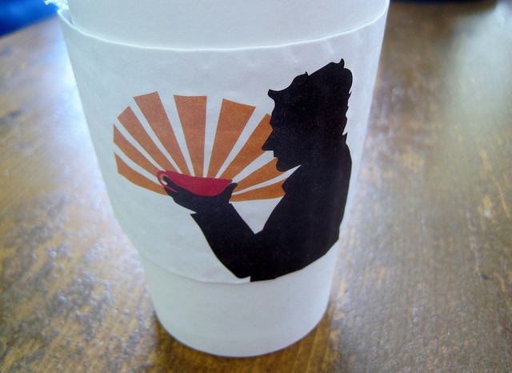

I never planned to write a post defending _Bulletproof Coffee_, but it seems a few people misread my original post [Better Than Bulletproof Coffee](/2012/06/better-than-bulletproof-coffee/). In that post, I said:

1.  I am a coffee snob that primarily drinks espresso.
2.  Although I never tried _Upgraded Coffee_, I know from my 15 years experience as a home coffee roaster that the beans Dave Asprey is sourcing are very high quality.
3.  I didn't get a cognitive boost from MCT oil, but I was already in the habit of consuming short chain saturated fats every morning.

The point of my post was that you could use the foundation of what Dave Asprey learned about coffee to "roll your own" _Bulletproof Coffee_ by roasting your own coffee at home and if like me you prefer your coffee black - to consume the short chain fats separately. At that point you can honestly compare your new coffee experience with whatever you were doing beforehand.

For me I didn't experience any additional benefits, however I've already been consuming high end coffee for many years. And I've been eating a tablespoons of coconut oil many mornings since I read the first edition of [Perfect Health Diet](/2012/06/deep-nutrition-perfect-health-diet-and-the-end-of-overeating/) in 2010. I didn't notice any benefit from the MCT, but maybe I would have had I not already been waking up to a spoonful of coconut oil.

### The Butter

The frothed unsalted butter is really a replacement for cream, which I never add to my coffee. And although I greatly prefer black coffee, frothed unsalted butter when compared to cream is fine. When I was cutting back on espresso, I used this technique as a way to reduce the flavor stimulus. But I am not your normal coffee drinker. If you like cream in your coffee, you will likely enjoy the taste of _Bulletproof Coffee_.

It is probably is frustrating to Dave that many of the critics of the recipe seemed to have failed following the instructions. Salted butter. Swapping ingredients. Not measuring anything. The fairest way to review it would be to follow the directions exactly and then compare it a cup of coffee with cream or half & half. Even my comparison to black coffee in the original post wasn't relevant.

### The Mold

As for the mold free claims, I don’t know enough science to understand that argument, but I do know that all reputable roasters do [coffee cupping](https://ineedcoffee.com/coffee-cupping-a-basic-introduction/) looking for any defects. The best roasters and importers have coffee professionals that prevent any defective coffee from reaching their customers. Although Dave restricts his coffee to Wet Processed (washed), I have never felt any ill effects from Honey or Natural processed coffee that comes from these top roasters or importers. My guess is this non-wet processed coffee is also mold free, because it is being sourced at vetted by the best in the industry. That may not be true for the average or lower grade coffees. The other option is that I don’t have a mold sensitivity. So to me the mold argument is irrelevant. Both Dave and I source our coffee from the best farms on the planet. It just tastes better.

### Butter Believer

The site _Butter Believer_ took the title of the post I did back in June 2012 and came up with their own coffee recipe. It wasn't just an [alternate recipe](http://butterbeliever.com/better-than-bulletproof-coffee/), it also was a completely different nutritional approach. Whereas _Bulletproof Coffee_ was about burning fat by depriving the body of glucose, the _Butter Believer_ version is more in line with the Ray Peat, Matt Stone and Danny Roddy view of metabolism that says running on glucose is superior for metabolic and hormonal reasons. This post is long enough already, so I’ll shelf that debate.

Which is better? It probably depends upon the individual. Try them both. Which recipe tastes better? Which one do you feel better on? I understand the strengths of both approaches, so if I were a person who enjoyed both, I’d likely cycle between them, but I'm not, so I'll keep drinking my coffee black.

### Last Words

To those who accused me of attacking _Bulletproof Coffee_, I hope this post cleared things up. In many ways, I've being consuming and enjoying a deconstructed _Bulletproof Coffee_ for a few years now.

---

## Comments

### Maple
*July 16 at 2013 at 4:04 AM*

Great entry. I know of people like you, who simply prefer a good cup of espresso and consume their MCTs separately. I don't mind either. It all boils down to increasing healthy fats in our diet, and I thought bulletproof coffee did a good job at promoting that. 

Love your writing. Very informative and objective. Cheers.

---

### Bill
*July 16 at 2013 at 3:09 PM*

"I didn’t get a cognitive boost from MCT oil, but I was already in the habit of consuming short chain saturated fats every morning."

This could also simply mean you're healthy.  I wouldn't expect healthy people to experience a noticeable cognitive boost from MCTs.

---

### Glenn
*July 16 at 2013 at 7:54 PM*

Great post. Nicely clear and objective.

I agree that for people who like cream in their coffee a real Bullet Proof Coffee a la Dave Asprey is probably superior.

But has anybody worked out how much it costs per mug to make the real recipe using only bona fide Dave Asprey ingredients. I bet it's about $5 per cup (at home!).

---

### Erik
*August 3 at 2013 at 7:31 PM*

While cutting down on coffee for a little while I came up with something roughly derived from both Asprey and tibetan salt-butter tea. It was certainly quite nice in the winter. A cup of water to a cup of mild bone stock boiled with two black tea bags and one green (boiled tea? Heresy!), a couple slices of ginger, a couple cloves. Then I'd remove the plant bits and add a good quantity of good (salted) butter, sometimes a bit of coconut oil, some blackstrap mollasses, good sea salt and a couple drops of fish sauce. Blend to froth it all together... not the best flavor ever but a very warming and energizing drink.

There's really no unified health strategy behind the ingredient selection. Tea- caffeine and polyphenols, green tea for added catechins and L-theanine, ginger for warmth and digestion, cloves since they're good for you or something, stock for minerals and gelatin, butter for fat and mouthfeel, coconut oil for lauric acid etc., mollasses for glucose and extra minerals, salt for sodium and trace minerals, fish sauce since apparently free glutamate does good things for your gut (adding another layer of intrigue to the whole MSG thing?).

It was good fun. Sometimes I would vary the herbs, incorporate a handful of roughly crushed coffee beans, add a little vodka, whatever. I was unemployed and had the time. A good tall mug of this mix made decent fuel for many mornings of shoveling snow for the rent. I don't tend to have the time lately (chickens to feed!) but passable coffee with a good bit of cane sugar and milk fresh from our goats is more than sufficient. I'm a lover of stimulants and have recently found that certain native plants make things that are nicer than caffeine, so... less coffee for me.

---

### Alexandra
*November 17 at 2013 at 6:43 PM*

Thank you for this post. It was informative and level headed towards others preferences, much appreciated.

---

### MikeK
*May 23 at 2014 at 11:49 PM*

Joe Rogan tests Dave's coffee and a few others, Dave's coffee ended having mould in one of the sample that was tested and the other weren't or were low levels of mould.  Joe Rogan stopped drinking Dave's coffee and although Joe is still selling the coffee.  From my research wet processed is better for mould free coffee but it's not a guaranteed, it should be tested from the growers to the warehouse.  Any huge fluctations in tempature or dampness can cause mould to grow.

---

### MAS
*May 23 at 2014 at 11:56 PM*

@MikeK - Interesting. The mold issue caught my attention early on, but the more I thought about it, the less it made sense. If there was a real problem with the coffee supply, I think we would know by now. The fact we've gone a few years now with this mold issue on the table and Dave is still the only one discussing it makes me skeptical.

---

