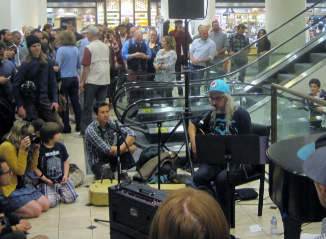
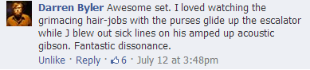

This past weekend in Seattle was the 25th anniversary (Silver Jubilee) of Sub Pop Records. On Thursday, I learned that a few bands were going to play a closed set on the tip of the Space Needle, which you could watch streaming online or [archived later](http://www.youtube.com/watch?v=LK3K3Z2YCLA). My favorite band of all time is Dinosaur Jr and their frontman J Mascis was to be there.  _Amazing what you can find on Amazon._  My plan was to find the video and watch it sometime next week. Later that evening I learned J Mascis had a flight delay and missed the show. So Sub Pop announced he would be putting on a free show at noon on Friday at Nordstrom's. My first thought was I read it wrong. Nordstrom sells clothes. It isn't a concert venue. I had to be downtown that day anyway, so I decided to see if I was being pranked. I showed up around 11:45 AM and less than 10 people were standing around the escalators. We all had questionable looks on our faces like maybe this might be a joke. I also thought maybe there was a better location in the store where he might play. Why would the _5th greatest guitarist in the world (according to Spin on a list that is no longer on their website)_ be playing the shoe department at Nordstrom's? Then more and more people started showing up. J arrived a few minutes early, plugged in, and started playing at Noon. For 30 minutes, he put on a perfect show.  _J Mascis plays Nordstrom_ He played:

1.  Listen to Me (solo)
2.  Get Me (Dinosaur Jr)
3.  Quest (Dinosaur Jr)
4.  Flying Cloud (Dinosaur Jr)
5.  Ammaring (J Mascis And The Fog song)
6.  Not You Again (Dinosaur Jr)
7.  Alone (Dinosaur Jr)

_Setlist courtesy of setlist.fm._  Only in Seattle would J Mascis stop by the shoe department of Nordstroms and jam for 30 minutes. I loved Darren's mini-review on Facebook.   **UPDATE**: For those who missed this show, check out [J Mascis at the Kennedy Center](http://youtu.be/uavyXk7lF7Q). He plays all the tunes he did at Nordstrom except Flying Cloud plus a few more.

---

## Comments

### Rachel
*July 16 at 2013 at 9:27 PM*

Damn, I would've liked to be there, too!

---

