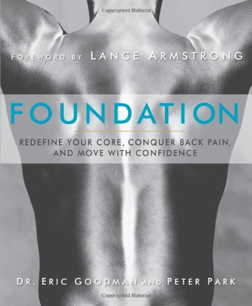

Back in April, I received an excellent recommendation from Tezza in the [comments](/2013/03/neck-and-shoulder-fixes-one-month-report/#comment-19128).

> You might want to try some exercises by a guy named Eric Goodman (Foundation Training). They seem to be more related to the lower back but they are meant to help the posterior chain and posture. I've tried them for about a week now and I feel better. You can check them out on youtube for free anyhow, well at least some of them. Good luck.

Now although I don't get back pain these days, there are days when I spend many hours sitting. My back and hamstrings do get tight. I was interested in finding a time efficient routine that could undo those hours in minutes. **Foundation Training is the absolute most efficient set of core, back, glute and hamstring exercises I've ever experienced.** And I've tried a lot.

A word of warning, do not do the entire 12 minute routine on your first attempt. I ignored that warning and my mid-back was sore for almost two days. Even though I pushed the workout too far the first time, I could tell I was on to something. This wasn't a boring low/no intensity routine and unlike yoga or other mobility drills, the positions required weren't too complicated.

To speed up my understanding of the routine, I got their book, which if you get the paperback version is beautifully edited with color photos. Although they sell a Kindle version of Foundation, I can't imagine it accurately displaying the detail of the paperback version.

 _Foundation: Redefine Your Core, Conquer Back Pain, and Move with Confidence by Dr. Eric Goodman_

The video is unlisted on YouTube. It was public when I first found it. Since they sell a DVD on the [Foundation Training website](https://www.foundationtraining.com/), it is possible they might pull it at some point. Here is the link for now.

**[12 min to Perfect Posture: Free Foundation Training videos with Dr. Eric Goodman](http://youtu.be/4BOTvaRaDjI)**

### The TED Video

Dr. Goodman also did a TEDx Talk titled **[The Unexpected Physical Consequences Of Technology](http://www.youtube.com/watch?v=BZcZenvWBlg)**. He talks about how technology is forcing us to sit more and more and how we need to actively address this problem. Movement patterns break down from hours of sitting, which can result in back pain.

### My Results

I no longer cheerlead any fitness method until I've had at least a few months to test it out. A lot of times things seem fine at first, but the benefits don't last or the routine becomes too time-consuming or boring. One example was my 2010 kind review of Esther Gokhale's [8 Steps to a Pain-Free Back](/2010/11/8-steps-to-a-pain-free-back/). At first, it seemed like it had value, but in the end, the recommendations were too passive and unsustainable for me. Constantly thinking about my posture was stressful. The Egoscue Exercises were more active and effective but required a much larger time commitment. Foundation solves both those issues.

**Foundation Training is the best, most time-efficient set of exercises for the back and glutes I've ever done.** I've found that a single 12-minute routine can undo the damage of a few days of sitting at a desk. I highly recommend trying this routine. Just ease into the routine and get the book if you can.

---

## Comments

### Richard
*August 4 at 2013 at 5:43 PM*

I would also recommend one of the other Foundation videos, the Dr. Mercola interview/demonstration, at least for the hands-on section that starts at 1:24:10. Dr. Goodman illustrates some fine points that weren't in the other Foundation videos I've seen.

---

### J.
*August 4 at 2013 at 6:37 PM*

MAS,

How much would you recommend for a novice?

---

### MAS
*August 4 at 2013 at 7:24 PM*

@Richard - Was unaware of that video. Found it. Thanks.
http://www.youtube.com/watch?v=Bsbz8qxPGNs

@J - Just a few minutes. As with any new exercise, focus on form and do less than you believe you are capable of performing. Then take a few days off before trying again.

---

### Roberta
*August 4 at 2013 at 9:45 PM*

This  might be just what my hamstring needs!

---

### Jonathan
*August 8 at 2013 at 1:56 PM*

Very interesting, and a new point of view, certainly.
Michael, do you still do the daily exercises in 3 minute maintenance? Interested in know your opinion about this book after a while (found about it here, for which I am grateful).
I have been doing they for about two months now and found improvement. Specially the additional lower back and posture exercises seen to be working. It´s hard do think in anything more time efficient.

---

### MAS
*August 8 at 2013 at 3:14 PM*

@Jonathan - I  see Foundation as complimentary to the 3 Minutes routine. One morning I'll do 3 Minutes and then switch to Foundation the next day. 3 Minutes is good way to extend movement. Foundation is a brilliant way to gain strength in those muscles we relax by sitting all day.

---

### Craig
*August 12 at 2013 at 1:50 PM*

I saw that book when it first came out. I decided, based on the large page format and gorgeous photos, that it was likely overpriced fluff.   Your positive review has me reconsidering a purchase. 

I appreciate the greater conservatism with regard to what it takes to garner a positive review from you.

---

### MAS
*August 12 at 2013 at 5:25 PM*

@Craig - I was able to get the book from the library, read it, improve my position int he exercises and then return the book. The price of the book is less than the cost of a single massage or chiro adjustment, so if it can prevent just one session then it pays for itself. Plus with Amazon, you can always sell your used copy. I do all the time.

---

### Øyvind
*August 15 at 2013 at 10:36 AM*

MAS, since foundation training are strengthening exercises, is it possible that they could interfere with recovery from the regular  strength training? Or be included in the strength training session? I do HIT training hillfit style, and i need lots of recovery, but i also struggle with lower back pain and an exessive anterior pelvic tilt. Do you have any toughts?

---

### MAS
*August 15 at 2013 at 2:50 PM*

@Øyvind - Yes, keep them separate. In the interview with Mercola, Dr. Goodman advises stepping away from strength training and focusing on Foundation if you are in pain. 

This is similar advise that Egoscue  and others gives. Fix your alignment, posture, etc first.

---

### Fabian
*August 18 at 2013 at 8:54 AM*

Michael, thanks for this review. For someone not suffering from any back pain but wanting to improve his posture while sitting and walking, would you also consider Foundation Training to be superior to Gokhale? Any thoughts on this would be much appreciated!

(Sorry about repeating comment, but the first one got caught in Askimet because I had Javascript disabled.)

---

### MAS
*August 18 at 2013 at 2:55 PM*

@Fabian - Whatever works for you is what is best. As I explained in the post, I found constantly thinking about my posture (Gokhale) to be stressful and ineffective for me. The "get key muscles super strong super fast" hack by Foundation appeals to me much more.

---

### Fabian
*August 18 at 2013 at 3:39 PM*

Thanks Michael! I was just wondering where to start. I suspect that even with strong muscles, thinking about posture is probably needed, though I might be wrong? I’ll check out the two books and see what works best for me.

---

### MAS
*August 18 at 2013 at 3:45 PM*

@Fabian - Also look at 3 Minutes. I like it better than Gokhale. 
https://criticalmas.org/2011/12/3-minutes-to-a-pain-free-life/

---

### MAS
*August 18 at 2013 at 4:17 PM*

@Fabian - I love the look of your site. Clean design, readable fonts and good content!

---

### Fabian
*August 19 at 2013 at 1:06 PM*

Thanks for the link, Michael! I ordered a copy of Foundation Training for now and will see how it goes. Will report back with my results.

Also, thanks for your kind words on TFA and for the tweet on my "whole cow" piece. :)

---

### John
*September 8 at 2013 at 2:08 PM*

Is this any good to correcting anterior pelvic tilt? If not, do you have any suggestions?

---

### MAS
*September 8 at 2013 at 4:53 PM*

@John - Based off my understanding, I think it would, but I don't want to say for certainty. I did find this video which looks like something to do prior to engaging in Foundation.

http://youtu.be/CoOayJXqvi0

---

### Claudia
*January 6 at 2014 at 6:33 PM*

To learn the exercises well, you can also go to the Foundation Training web site and look under the "find a trainer" section to see if there are classes or certified trainers in your area.

---

### Sam
*January 6 at 2014 at 8:08 PM*

If you have an overactive low back should you do these exercise that strengthen the back surely it would make the muscles more active?

---

### MAS
*January 6 at 2014 at 8:14 PM*

@Sam - I have found the exercises fix strength imbalances. Someone that sits a lot will find these are highly effective at targeting the glutes and hamstrings. I believe they are designed to retrain how we hold weight and how we move. It seems to be working great for me.

---

### Alayne
*March 14 at 2014 at 5:05 AM*

I've been doing "just" the Founder pose &amp; breathing for 1.5 weeks now. I come from Fibromyalgia (big time), Lyme disease and years of not being able to do much (was in wheelchair) for some years. Now that I'm getting better, thanks to a couple of experimental treatments, I realized that I was walking and sitting with really poor posture. I was VERY athletic until I got sick, so I have a lot of that "I can do this, no problem."  Nope. Just doing the Founder pose, the decompression breath &amp; rolling (I roll on a hard black tube you can get at many stores), andI thought I was going to croak. But, it made start focusing on how I bend, stand and sit.  

Now I bend at the hips, not at the back. And after 1.5 weeks of increased pain (strengthening the inactive hamstrings, glutes and back (and core), I am without lower back pain for the first time in years! And I'm standing straight as a board!  AND, my legs, glutes, back &amp; core already show a physical difference.  Again, that's just with the Founder pose, Decompression breathing and focusing on how I bend during every day activities. 

I've done so many things to help me out and quite honestly, this is the best I've found. It's targeting my arms, shoulders (that I can already reach much higher than a week ago), glutes, hamstrings, calves, adductors, etc. I have scoliosis in the lower back, and my right IT band that is constantly hurting from the hip down to the foot has been lumpy and sore to the touch for quite some time. The lumps and pain are gone.  It's all quite remarkable (remember that I also started rolling as well, which helps).  

We'll start going onto the other exercises in the next couple of days. We have to work very slowly, because after years of not being able to do much, we're starting from the ground up. Have to strengthen the ligaments, tendons, &amp; muscles with respect. :)  Plus, those with fibromayalgia &amp; Lyme disease (&amp; others)  will really feel the changes more acutely (possibly) than those who've been active. 

It's all doable. Just takes a bit of time and patience. Now, when I look around when I'm out, I see EVERYONE sitting in a slouched position, walking with a stoop, or not bending properly. And I'm sitting straight up because it's already more comfortable than slouching. Wow. 

People should watch the TED talks, Dr. Mercola's interview with Dr. Goodman, and his other myriad videos on uTube. Already after 1.5 weeks, I'm more comfortable sitting up straight and now, more comfortable standing and reading than I am sitting. The posterior chain gets stronger and actually makes the old positions (slouching in a chair) uncomfortable. More comfortable is standing. Go figure. Untill I started this, I was always so happy to find a chair. So it's a HUGE change in a matter of little time. 

Anyhow, I thought I'd share. I'm also looking at the Intelliskin shirt. Am going to try a few choices on tomorrow. It apparently puts you in the proper standing/sitting position and helps train the muscles through contact on the skin. Skin has a bazillion nerve endings that can be stimulated and act on the muscles.  

Hope this works for many, if not all of you! :)  Cheers!

---

### MAS
*March 15 at 2014 at 2:24 PM*

@Alayne - Thanks for sharing. I did this post last August and I am still a huge fan. My go to exercise is the one that looks like a Windmill. I do it for a few minutes about 4-5 times a week. Super powerful. 

I use it as part of my body language warm up.
https://criticalmas.org/2014/02/body-language-exercise-warm/

---

