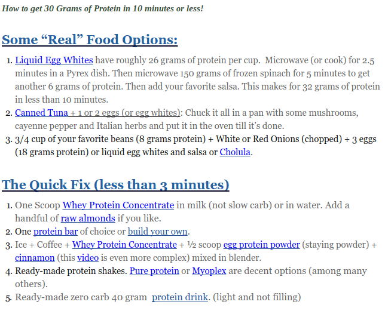

I've started a new experiment. This time I will be testing an idea from Tim Ferriss. Upon waking I will consume 30 grams of protein within 30 minutes. In the book [The 4 Hour Body](/2010/12/initial-impression-of-the-4-hour-body/), Ferriss mentions how this trick helps accelerate fat burning. By starting the day off with a high dose of protein, Ferriss has found that it has an appetite suppressing effect which results in an easier path to fat loss. _4HourLife_ has some ideas on how to get those 30 grams. For me, even though I think whey protein is the one of most hyped overrated supplements, I bought some to make this experiment easier.  _The 4-Hour Body: An Uncommon Guide to Rapid Fat-Loss, Incredible Sex, and Becoming Superhuman by Timothy Ferriss_ This experiment is a radical change for me. I've never started my day off immediately with food. In the past few years, I've gone hours before consuming calories. Besides seeing if the 30-30 method could control my appetite, I also selected this experiment because it will help me be morning compliant with an idea from the Ray Peat crowd. They warn against consuming coffee on an empty stomach as it can trigger stress hormones. I started this experiment on Friday September 20th. Way too soon to tell if it is having an effect. I'm only interested in losing 10 pounds. Unless I get a negative response, which I don't expect, I'll keep this experiment going for at least 60 days. I wonder how well the 30-30 plan works for the last 10 pounds? Has anyone experimented with it? I'd especially like to hear from those that normally would skip breakfast. 2017 UPDATE: 4HourLife removed their 30 grams of protein post. Here is an archived screen shot: 

---

## Comments

### Angus
*September 25 at 2013 at 5:44 PM*

I used to be in the skip-breakfast crowd, but I've learned a lot.
Not waking up and feeling hungry now tells me that my sleep hasn't been restful (and my last meal probably too small), with stress-related appetite suppression.
I'd try a larger dose of whey just to see if it's enough to bring back colour to my hair; for now isolate serves as an excellent brain booster.

---

### Stephan
*September 25 at 2013 at 5:46 PM*

Paradoxically, I have been doing the exact same experiment for the last 2 weeks as you are :)

Personally, I used to be a "replace-my-breakfast-with-coffee" person for the last year or so. It worked well for a very long time because I didnt have to worry about solid food in the morning. However, the body eventually adapts to everything we throw at it and fasting till lunch isnt an option for me at the moment, given the first real day job in my life.

To give you an example of what I am doing at the moment: Get up at 8 AM, drink water+apple cider vinegar, eat protein-rich breakfast (my current favourite is 10 egg whites+avocado+seaweed+spices), commute to work, coffee at 10 AM, lunch at 1 PM. Almonds or dark chocolate as snacks in between = this combination keeps me satiated nicely throughout the whole morning and early afternoon.

By the way, in recent months, I also began noticing the triggering of stress hormones caused by coffee on an empty stomach. I would get slightly more jittery and hunger would be artificially  suppressed. And it probably wasnt the mycotoxins in coffee that caused that because I buy high-quality beans (stuff that Dave Asprey talks about).  No idea how my cortisol changed during that time. 

It's funny how my hunger has changed. 15 min after I get up, I really want to have a nice breakfast.

---

### MAS
*September 25 at 2013 at 5:52 PM*

@Stephan - Why just egg whites? Convenience? 

I too have noticed being more jittery lately. I'll keep an eye on if that improves.

---

### Stephen
*September 25 at 2013 at 6:52 PM*

I'm constantly amused at how you seem to run the same experiments that I happen to be considering. I've been doing the whole IF thing for a few years now, mainly for convenience reasons. I'm feeling like it's time to change things up slightly though.

I'm planning to try out a PSMF (Lyle McDonald style) for a week, which seems to be the perfect time to begin introducing a scoop of whey first thing in the AM for satiety reasons. I have a feeling I'll probably stick with that even after I wrap up the PSMF.

I'm curious to hear your results to see if mine are similar. Be sure to keep us updated.

---

### Stephan
*September 26 at 2013 at 5:08 AM*

MAS, 
egg whites mainly for convenience. We don't get packaged egg whites in Germany so I am enjoying them here in Canada. But I throw in whole eggs in quite often too.

Also, I am not a big fan of a protein shake in the morning. Solid food just tastes better.

---

### JM
*September 26 at 2013 at 1:12 PM*

I tried that experiment 2 separate times.  Each time, I put on weight.  I rotated between canned fish, beef patties or chicken breast.  It did not suppress my appetite and the additional calories added up over the month.  These days, if I eat breakfast, I rotate between almond butter, sour cream (I prefer it to yogurt because a few bites satiate me), fruit or creamed spinach.  Choices made purely out of convenience.

---

### Becky
*September 26 at 2013 at 1:28 PM*

I never lose weight when I begin eating early in the day, no matter what I eat. Eating early in the day always gets my appetite going.  If I eat breakfast first thing, I am hungry 3-4 hours later. If I wait until late morning or lunchtime to eat, I generally only eat two meals.  However, eating protein with fat for the first meal does help me control my appetite later in the day, simply because I don't have the appetite stimulation from carbs, and it takes my body so much longer to metabolize protein and fat that I feel satisfied for much longer.  I will be interested to see how this new approach works out for you.  Keep us posted.

---

### Glenn
*September 26 at 2013 at 6:15 PM*

I'll be *very* curious to find out your results. I haven't tried it yet.

Ancestrally, the protocol makes little sense. How would our ancestors been able to regularly consume 30 grams of protein within 30 minutes of waking? (Maybe by catching a rabbit, but start-to-eating that would probably take more than 30 minutes).

But maybe the protocol works to fix modern-day metabolisms...

---

### Stephan
*September 26 at 2013 at 7:27 PM*

@Glenn,

ancestrally, having the protein leftovers from the previous night's meal seems pretty likely to me. I don't think that every single meal that included animal protein was hunted right before consumption. Hunting was likely a very tedious and energy-expensive effort and you wouldn't go hunting 3 times a day just to provide you with 3 meals.

---

### Glenn
*September 26 at 2013 at 8:43 PM*

Maybe. But here are a few points to consider:
- In a hot ancestral environment (i.e. the African Savannah) animal proteins would be the first to spoil, quite possibly over night
- How much meat would be leftover would be a function of the size of the animal and the size of the human tribe
- Even a lean cut of meat would probably have about 15% fat, right? (so ancestral humans were never consuming pure protein)
- Certainly ancestral humans wouldn't be eating the same kind of animal/protein every day; somedays elk, other days rabbit, etc.
- It seems unlikely 30g of protein would have been available to everyone 365 days per year, given weather changes and animal migrations.

BTW - How large a piece of chicken breast equals 30g of protein? (I'm too lazy at the moment to figure that out)

---

### Mr
*September 26 at 2013 at 8:47 PM*

Jack Kruse also recommends eating upon rising. In the inimitable Krusian way, he doesn't really explain why, at least not in the 12 million blog pages of his that I read, and that's only 1/10th of his output (side note, thanks for keeping your blogs brief and cogent). 

Ok, he does later explain that cortisol is highest in the morning, and not eating or exercising too much in AM exacerbates this condition. It would also help if he explained in the same paragraph that cortisol is necessary, but chronic production leads to elevated blood sugar, elevated BP, proteolysis and muscle wasting, and the dreaded muffin top syndrome (belly fat) which in turn pumps up estrogen production. Ergo, eliminate dysfunctional cortisol production and fat accumulation should be reduced. Sorry if Ferris explains all this, i haven't had 4 hours free to read his book yet and i'm finding your blogs a time saving proxy for the dozens of books/websites out there!

---

### MAS
*September 26 at 2013 at 9:03 PM*

@Glenn - I think this is a modern hack to overcome appetite issues created by modern foods. 

@Mr Interested - Yeah, I once tried following Jack Kruse, but gave up. He has a way of writing that instead of clarifying concepts actually makes them more difficult to understand. I suspect he has personal insecurity issues and feels the need to show others he is smarter than they are.

---

### MAS
*September 26 at 2013 at 9:07 PM*

@Mr Interested - Speaking of the 4 Hour Body, I did a post on his Geek to Freak chapter you might enjoy. 

https://criticalmas.org/2011/01/how-tim-ferriss-really-gained-34-pounds-of-muscle-in-28-days/

---

### Txomin
*September 26 at 2013 at 9:25 PM*

Whey is not a supplement. It's just food. There is nothing special about it other than it has a higher protein content per gram than other foods.

Ferriss is a charlatan.

---

### Glenn
*September 26 at 2013 at 10:49 PM*

Whey protein is a highly processed food-like substance. Just think about how many steps are needed to get from the udder of a cow to a liquid in your glass... (Also, first you have to domesticate the cow...)

---

