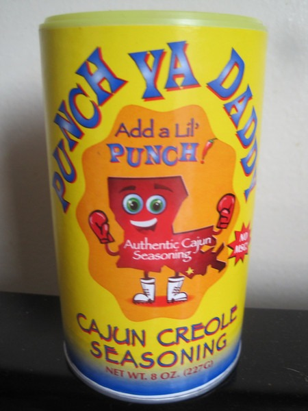
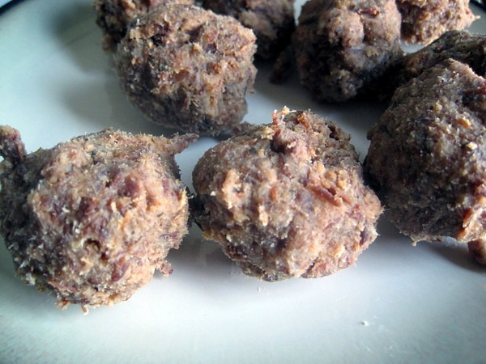

It has been almost two years since I last made [pemmican](/2011/12/my-first-pemmican/). Today I made another batch, only this time I used some Cajun spices. It was a last minutes decision to throw in the Cajun spices. I knew that I didn't want to use the Montreal Steak blend, so I reached for the Cajun blend. I found that Cajun spices rock on popcorn, so why not try it on pemmican?

The taste was not bad. Somewhere between OK and good. Better than my earlier attempts. I'll call it a victory. The Cajun magic worked. For this trial pemmican I used the following:

-   3 ounces rendered tallow
-   3 ounces dehydrated lean beef (chopped - use a food processor if you can)
-   1.5 tablespoons of Cajun spices (I used Punch Ya Daddy)

Mix everything together and then mold into meatballs.

Each pemmican ball is about 20 grams. If I did my math correctly that works out to just under 100 calories for each one. 9 grams of fat and 3 grams of protein.

---

## Comments

### Glenn
*September 25 at 2013 at 5:10 PM*

What no dried berries?

---

### MAS
*September 25 at 2013 at 5:34 PM*

@Glenn - It was odd that I made this yesterday. My intent was just to render tallow. Then at the last minute I changed my mind and made pemmican. No dried berries in the house, so I went Cajun. Seemed to work. Dried berries next time.

---

