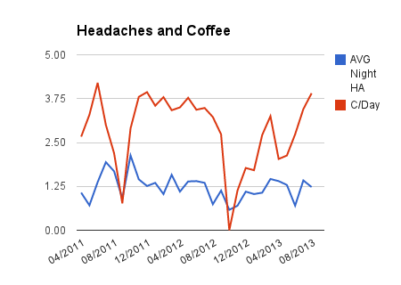

On March 24, 2011, I began tracking my headaches in a project I called [Hunting Headaches](/2011/07/hunting-headaches/). For over two years, I've started every morning by dropping numbers into a spreadsheet. Headache intensity, sleep quality and number of coffees. I also tracked numerous other metrics from shorter term experiments, such as weather and supplements.

On September 1, 2013, I ended the hunt. I've given up for now. It is time to take a long break from this experiment. I have enough data to know MANY things that aren't causing the headaches. Besides obvious headache triggers such as gluten and alcohol, which I avoid completely, I know that caffeine plays a prominent role in my headaches. Collecting more data isn't going to change that.

Red is the average daily coffee. Blue is average headache intensity. Whenever I make a serious attempt to reduce coffee, headache intensity drops. The opposite isn't always true. I also earned that consuming coffee in the late afternoon IMPROVES my sleep quality, which reduces headache intensity. This is counter intuitive to most people. For me coffee plays a complicated role.

Now I am going to learn what happens when I stop collecting data. Perhaps the missing piece of this experiment has been that I've been under pressure to solve something that might be outside my control.

I have zero plans to see a doctor. If I'm not willing to fully detox from coffee, then throwing money at a doctor is almost certainly wasted. And walking away from coffee while I live in Seattle is not likely at this time. Also, I am OK with my current state. The past 2 months I have worked on accepting my headaches. If things get worse, I can always change my mind.

The perception of pain is subjective. I'm sure some malcontent with more math skills than me will be quick to tell me that my experiment was flawed or that I did something wrong. To them I say STFU. I did the best I could and I learned a lot about myself in the process.

Once again I am not asking for new ideas to test. It is time to quit and move onto something else.

---

## Comments

### Terri
*September 3 at 2013 at 12:56 PM*

If coffee in the late afternoon helps you sleep better, that can be a sign of ADD. Not sure how that would tie into the headaches.

---

### Glenn
*September 3 at 2013 at 9:46 PM*

Maybe move on to heart rate variability?  Glenn

---

### ali
*September 3 at 2013 at 9:58 PM*

Michael~ Love your blog, but  have never commented.
I suffer from severe headaches, and agree on caffeine being a huge contributor, even decaf. 

 Just felt called to  sharing my $.02 on headaches~

This may sound odd, but I'm going to put it out there as it has helped me...

Try going on a cell phone fast.

 Even if you use an ear piece. 

Get off the phone for a week to expweriment. Or better yet, make it  two.

 If you absolutely *must* be in contact with people while "on the go" or for work related purposes , use your texting feature only. 

And place the phone far, far, far away from your person, like in a knapsack, or messenger bag that you carry. Not in your back pocket, or front pocket. Also if possible,  place your phone in some sort of EMF protective device prior to placing it in the bag that you must carry. 

Never, ever place that phone or ear piece up to your head during this fast and observe how much better you will ( I hope!)  feel after the two weeks have ended combining this cell phone fast together with all your mindful dietary and exercise changes. It makes a HUGE difference. 

...And if you have a land line in your home, do not use any cordless phones. Only use corded old school type  phones. Yes, they make them  with all the bells and whistles like caller ID, etc etc. I now own 3 of them. :)  

On this cell phone fast, you want to keep your head free of all extraneous frequencies.

If you do decide to try my idea, I would love to know if this helped. Better yet, please blog about it! :D  My physician suggested it to me.

Also...just an fyi that you may already know, getting IV of magnesium is AWESOME for reducing headaches.  If you have insurance do consider looking into it with your neurologist who specializes in headaches.

---

### MAS
*September 3 at 2013 at 11:36 PM*

@Glenn - I need to step away from the numbers and take a full break from experimenting.

@Ali - I hardly ever use my cell phone. I don't keep it on me unless I'm in transit and it is never in my room when I sleep.

---

### Scott
*September 4 at 2013 at 12:05 AM*

Michael: what about blood pressure?

---

### Glenn
*September 4 at 2013 at 12:21 AM*

I hesitate to say this, but I would be remiss... How about a gentle yoga class?

---

### MAS
*September 4 at 2013 at 12:32 AM*

@Scott - I donate blood every 8 weeks and my BP is perfect. 

@Glenn - Maybe.

---

### DrBG
*September 4 at 2013 at 3:20 AM*

Luv ur blog and biohacking!

Have you considered magnesium as mentioned above? It normalizes elevated BP as well. Caffeine and mental/physical stressors tend to deplete mag as they trigger cortisol which is a mineralocorticoid and depletes key minerals like sodium, magnesium and zinc. 

You rarely have a 'zero' on your chart! That SUCKS. Hope u feel better soon. I like Ancient Minerals as a soothing hot bath (high mag).  I've taken sea salt or REAL redmond's 1/4-1/2 tsp most days for two years for cortisol dysregulation, which has helped retain more mag.

---

### MAS
*September 4 at 2013 at 3:37 AM*

@DrBG - I take MG daily, but not in an IV or via baths. I can always experiment with more, but I do need to take a break from this daily data ritual which I've done for almost 2.5 years now. 

Love redmond sea salt. That is what I use for my kimchi and sauerkrauts. 

The numbers above are averages. Over 50% of nights, I have no headache.

---

### DrBG
*September 4 at 2013 at 3:59 AM*

I see! When the gut continues to be compromised, it's often difficult to absorb minerals including mag as the metal transporters are located in the tip of microvilli. Bypassing the gut (IV, topical mag oil or baths) maybe superior until the gut is functional again. Caffeine is difficult-- it contributes strongly to rebound because it is both an analgesic as well as a vasoconstrictor.  Some factors that add to vascular instability are omega 3 insufficiency, mag depletion, taurine deficiency (from raw meat and dairy), methylated folate and B vitamins (meat, organs) and lack of other antioxidants. All the above we need abundantly particular under stress or toxin stress (environmental, heavy metals, gut dysbiosis).

---

### Txomin
*September 4 at 2013 at 5:45 AM*

I say you've gained a lot. You might have not solved the problem but you have advanced your understanding of it. So, for sure, relax and embrace the "cost" of coffee. We all take pain in exchange for some indulgence or other. The situation will sink in and you will find you are moving in the right direction when the time is right.

---

### Glenn
*September 4 at 2013 at 2:29 PM*

Cocoa as an alternative to coffee. It's high in magnesium, polyphenols and seems to rid the body of excess iron (don't ask me to explain the mechanism).

Nothing is better than a masterful cup of espresso, but strong cups of cocoa are probably overall healthier.

---

### MAS
*April 16 at 2014 at 6:32 PM*

Closing out comments on this post. 
https://criticalmas.org/2014/04/last-post-headaches/

---

