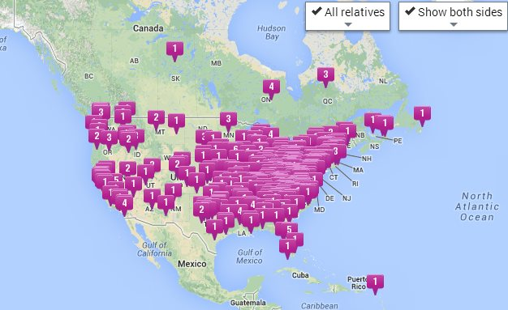

Back in April, I shared my genetic test [results from 23andMe](/2013/04/23andme-results/). That post focused on the health side of the test. At that time, I didn't really pay much attention to the ancestry side of the application. My thinking was that as more people signed up, my relatives would be found and connected. So today I revisited the ancestry side and found I have been genetically connected to 993 other _23andMe_ members. The relationship distance is between 3rd and "distant" cousin. I think "distant" means greater than 6th cousin. To protect the privacy of my "cuzs", I'm not going to post a screenshot with their names. Instead, below I'm sharing a map view of where _23andMe_ has found my relatives so far.   _23andMe_ has not found a single relative of mine in Asia, Africa, or South America. Either that confirms that I really am 99.5% European or that _23andMe_ isn't as popular in those continents. The maps do show I have a 5th cousin in Novosibirsk, Russia. Those in my family that have looked into the genealogy have said our roots are mostly in England and Germany. Drilling into the European map confirms that.  When I drill into the detail for the USA, I see the heaviest concentrations in Ohio, Pennsylvania, Virginia, and North Carolina. This is completely in line with what I know about my family's genealogy. It will be interesting to monitor the map as more and more people sign up for the test. PS - I just checked the health side again. There are still running new tests against my genetic profile. Another test in August further confirmed my Decreased Risk for Alzheimer's Disease.

---

## Comments

### Melissa
*October 3 at 2013 at 5:00 PM*

23andme and similar services are so popular with Jewish people that despite being only a quarter Jewish, almost all my matches are Jewish. I think you get more diverse maps if you have Jewish ancestry because of that. I have a ton of matches in Russia and a few in Africa, Asia, and South America– mostly people from regional Jewish diasporas like the like Tunisia's Djerba community.

---

### Anemone
*October 5 at 2013 at 5:32 PM*

I signed up for this. It's an additional $60 postage/handling for people outside the US! (And no, I didn't go from your blog - I didn't know where to find the link. Sorry about that.)

I'm really looking forward to these sorts of results, though I suspect from what I know of my family tree that my ancestors/cousins will be from a fairly small geographic area, at least in Europe. (We'll be more spread out on this side of the pond.)

---

### Anemone
*October 23 at 2013 at 1:08 PM*

I just got my results yesterday, and it will take a while to figure it all out. I find it kind of frustrating, though, that the map shows family locations, so there are multiple tags per person. I've got "cousins" who are on both sides of the pond at the same time. I only put one location for me, Ottawa, which is where my family has lived for generations, but I haven't lived there in a while so my tag doesn't show where I am either. Am I the only one who wants to see where people are right now, or only very recently (this lifetime)?

I don't have anyone closer than fourth cousin, and only 443 relatives. I don't appear to be related to either of you.

The ancestry section is interesting. I'm mostly Northern European, with .4% Ashkenazi, but my mitochondria were living in the Mediterranean/Middle East 500 years ago, which isn't part of family lore at all. (I can trace my mother's father's side back 900 years in Scotland.)

---

### MAS
*October 23 at 2013 at 2:37 PM*

@Anemone - Over time I think this dataset will make more sense. More people will sign up and more people will complete the ancestral forms.  Mine has noticeably changed in the months since I first signed up.

---

### MGE
*October 31 at 2013 at 2:43 AM*

@Anemone - I am not entirely sure, but it seems that your maternal grandfather's line cannot be established with your results. I believe either he or a son of his (an uncle of yours) needs to submit a test since the Y is passed from father to son and not from father to daughter, obviously, and therefore you would not be able to see his Y results using your DNA.

I could be wrong, but some preliminary research seems to suggest this.

---

### Anemone
*October 31 at 2013 at 11:42 AM*

Of course my maternal grandfather's line can't be established genetically without a Y chromosome. I can however list every person in the line of descent back 900 years from family records. (Of course, someone may have cheated at some point, but I'm *supposed* to be descended from a Viking king in Scotland.)

---

### JM
*November 27 at 2013 at 12:00 AM*

Sadly, 23andme was shut down by the government.

---

