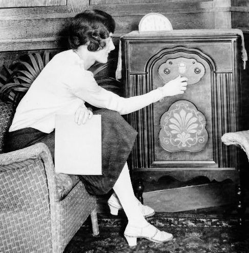

I was recently asked what podcasts I am listening to and I directed them to my [2012 list](/2012/11/podcasts-i-listen-to-2012/). Then I noticed that list is outdated already. Here are my top 10 podcasts for 2013.

1.  EconTalk (economics)
2.  Revolution Health Radio with Chris Kresser (health)
3.  NPR Planet Money (finance)
4.  Evil Sugar Radio (health)
5.  Alternative 80's (music)
6.  Accidental Creative (productivity)
7.  The Market Ticker (finance)
8.  Freakonomics (finance)
9.  Adam Carolla Show  (comedy)
10.  House of Reggae (music)

[EconTalk](http://www.econtalk.org/) is by far the best podcast. Russ Roberts can take topics that seem dull on the surface and make them fascinating. Well at least to me. Economics provides a model of understanding the world that I believe applies to other disciplines, especially fitness and nutrition.

Recently I've been enjoying Evil Sugar Radio. Although I think they are often guilty of the same biases they accuse others as having, the show is a much needed healthy response to the food fear mongers.

---

## Comments

### Stephan
*October 11 at 2013 at 5:56 AM*

I started listening to "Freedomain Radio" by Stefan Molyneux . Brilliant stuff on politics, philosophy, and entertaining ramblings from life.

---

### Stephan
*October 11 at 2013 at 5:57 AM*

Oh and, try out "Radiolab". So much effort put into that podcast.

---

### Glenn
*October 11 at 2013 at 7:10 PM*

What about The Latest in Paleo?

---

### MAS
*October 11 at 2013 at 7:16 PM*

@Glenn - It is a fine show. Maybe I'd put it at #11. I listened to it for years, but it sort of lost its novelty. I only have so many hours for podcasts, so I mix it up every so often.

---

### t
*October 13 at 2013 at 7:53 AM*

Which channel/website exactly is the Alternative 80's podcast on?  On Sirius Radio?

---

### MAS
*October 13 at 2013 at 3:47 PM*

@t - This is the Alt80s one I listen to:
https://itunes.apple.com/us/podcast/alternative-80s/id646582036

---

### Jake
*October 23 at 2013 at 11:42 PM*

"Recently I’ve been enjoying Evil Sugar Radio. Although I think they are often guilty of the same biases they accuse others as having"

^ this x 10000 lol, and they don't even realize it

---

### Gokhan
*May 18 at 2014 at 11:34 PM*

If your interested in a podcast purely For leisure you might want to check out Desert island discs, bbc. I was hooked after listning to the episode with Kahneman.

---

