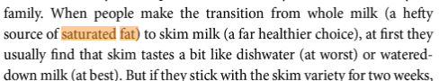
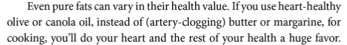

In my last post [Call Me a Saturated Fat Guinea Pig](/2013/10/call-saturated-fat-guinea-pig/), I attacked an article written by Dr. Katz which implied - without evidence - that those people that increase their intake of saturated fat would die before he did. He never states what level of saturated fat that is, but instead uses the term "a lot". I did make a mistake in that post. I falsely credited Katz with admitting that he might have been wrong about his demonization of saturated fat in prior writings.

> Dr. Katz is a classic example of the [“Now I Know Better” fallacy](/2013/10/now-know-better-fallacy/). He was wrong and now because he changed his view, we must listen to him. By preaching moderation, he can present himself as wise.

Actually, he hasn't changed his mind. His newest book which was published **just last month** continues to repeat the same health myths that have been destroyed numerous times in the past decade.

 _Disease-Proof: The Remarkable Truth About What Makes Us Well by David L. Katz M.D. I'm linking to this book so you can use Amazon's Look Inside feature. In no way am I endorsing this book._ 

Let us look at a few choice quotes from his latest book Disease-Proof, which was published in **September 2013**. You'd swear you were reading something from the early 1990s.

_page 64_

The doctor lumps saturated fat in with trans fats. Even an idiot like me can see this might cause a problem with your data set and lead to false recommendations. Then he says it is important to restrict your saturated fat intake lest you get heart disease or a stroke. No wonder his crappy article implied saturated fats were dangerous. He found himself on the wrong side of science and he has a new book to sell.

_page 94_

Our Yale doctor believes whole milk which has nourished humans for thousands of years is to be replaced with processed skim milk. I wonder if the doctor saw [this story](http://www.npr.org/sections/thesalt/2013/03/19/174739752/whole-milk-or-skim-study-links-fattier-milk-to-slimmer-kids)?

_page 108_

**"Heart-healthy" seed oils and "artery-clogging" butter? What year is this?**

The book is full of other gems such as reducing sodium and praising whole grains, but I'm going to stop here. Now to all those people who thought Katz's article was balanced, can you now see **he was using fear as a way to promote his book**? You can also see his definition of "a lot" of saturated fat is not Dave Asprey levels, it is normal traditional culture levels.

I could be wrong, but I am going to ignore the seed oil and no-fat dairy advice of Katz. I'm more swayed by the [Paleo](http://paleoleap.com/paleo-diet-food-list/), [WAPF](http://www.westonaprice.org/health-topics/abcs-of-nutrition/dietary-guidelines/), [Ray Peat](/2012/11/the-peatarian-diet-for-those-of-us-with-average-iqs/), and [Perfect Health Diet](https://perfecthealthdiet.com/the-diet/) recommendations. All of which have destroyed the health myths that Dr. Katz still clings to.

 _Nutrition and Physical Degeneration by Weston A. Price. I prefer the wisdom of this book over the canola nonsense Katz is still peddling._