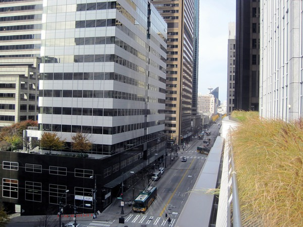
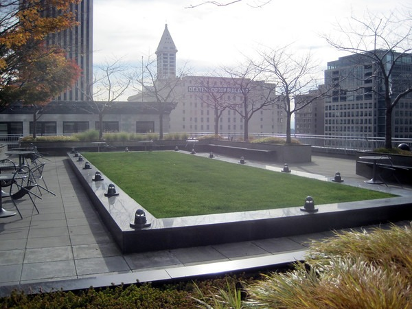

My last post was about an [amazing 17th floor view](/2013/11/the-view-almost-no-one-in-seattle-knows-about/) from the Russell Investments building in the heart of Seattle. This view isn't as high up, but is still an impressive find. During weekday business hours, go to the 4th & Madison building. You'll actually **enter the building from 3rd Avenue**. When you go in veer to the right, walk down that hall and take the elevator to the 7th floor. When you exit the elevator open the door on your right. This rooftop garden wraps around the building on 3 sides. According to the [Wikipedia](https://en.wikipedia.org/wiki/Fourth_%26_Madison_Building) it is considered a _privately owned public space_.    [Photo Gallery for 4th & Madison Rooftop Garden](https://www.flickr.com/photos/129592470@N02/sets/72157650127602151/) 3rd Ave between Madison Street and Marion Street on the East side of the street. If you live in Seattle and have another free and legal rooftop view suggestion, leave a comment.

---

## Comments

### John
*July 17 at 2014 at 7:22 PM*

The city has mapped them.  Very cool stuff.

http://www.seattle.gov/council/licata/public_space.htm

---

### monir
*February 2 at 2015 at 3:10 AM*

walk down that hall and take the elevator to the 7th floor. When you exit the elevator open the door on your right.

---

