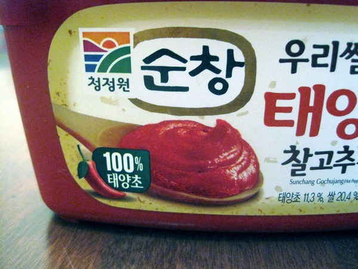
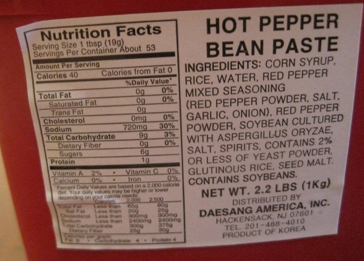

**UPDATE (September 7, 2014):** _This product is wheat-free, not necessarily gluten free._  Good news for my fellow gluten free peeps that wish to cook more Korean dishes at home. You no longer need to [make your own gluten-free gochujang](/2012/10/making-gluten-free-korean-chili-paste-gochujang/) (Korean chili pepper paste). There now exists at least one option that does not have added wheat. That is the good news. The bad news is it will still be extremely difficult to find. Most Asian grocery stores will not carry it. And of the three Korean grocery stores I visit, I've only seen it at one of them. To be honest, I actually needed the help of a Korean friend to spot it.  Start your search by looking for containers that look like this one. That will narrow your search. However, MOST of the containers that look like this still have added wheat. So you'll still need to look at the ingredients.  Not exactly the most healthy list of ingredients, but as you can see no added wheat. This is to my knowledge, the first and only brand of gochujang that is safe to eat for those trying to avoid gluten. It tastes fine. Not as good as my [homemade gochujang recipe](/2012/10/making-gluten-free-korean-chili-paste-gochujang/), but far more convenient. Several years ago when I first got into [kimchi](/2012/08/kimchi-2-0/), all the brands had added crap,. Things like MSG and a few unpronounceable ingredients, which are totally unnecessary for fermented vegetables. Today most brands of kimchi have a clean list of ingredients - even at the Korean grocery stores. This is an encouraging trend. My inner Korean is pleased. :)

---

## Comments

### thejiggler
*January 30 at 2014 at 4:09 AM*

I was totally stoked when I found this stuff in Atlanta (wife is gf and I love Korean food) a while back. We ate through a two-pound tub in about 6 months. But when I went to restock the other day, the label said it contains wheat. I'm guessing the aspergillus oryzae or seed malt have gluten and that there were some translation issues that got resolved. 

Korean food seems to be the final frontier for gf food. If that doesn't change soon, I might have to try making my own gochujang.

---

### MAS
*January 30 at 2014 at 4:14 AM*

@thejiggler - I needed the help of a native Korean to spot the Gochujang for me. If they pull it in Seattle, I'll go back to making my own. You are correct that there is a huge GF market for Korean food. 
https://criticalmas.org/2012/10/making-gluten-free-korean-chili-paste-gochujang/

---

### MikeTO
*March 4 at 2014 at 11:07 AM*

Sunchang makes wheat free gochujang.  I go through at least 3 lb tub in two months.
If you are looking for the best gochujang with no sugar, msg... added there's a brand but it's more expensive.

http://crazykoreanshopping.com/products/premium-red-chili-paste-with-100-korean-ingredients-1-1-lb-by-chung-jung-one.html

http://www.souschef.co.uk/gochujang.html

---

### MAS
*March 4 at 2014 at 4:03 PM*

@MikeTO - Thanks for the links.

---

### Sammi
*May 3 at 2014 at 1:33 PM*

another good GF gochujang option:  www.werubyou.com
it's not so pastey and flows better.

my grandparents used to make their own without any wheat.  then everything got industrial in korea and now they put wheat in everything...!  what the heck.  i guess wheat is cheap.  or subsidized.  =T

---

### Sandra
*June 2 at 2014 at 9:21 PM*

To my knowledge seed malt usually has gluten…. I got a reaction from this pepper paste so please be cautious if you are sensitive!!

---

### Graydon
*July 9 at 2014 at 4:52 PM*

I found in a local Korean market in Colorado Springs what appears to be a gluten free Gochujang.  It is titled "sprouted brown rice red pepper paste"  The ingredients appear not to list any wheat.  Little English (other than ingredients and the words sprouted brown rice red pepper paste") and not sure who the mfg. is but stamped on the bottom is "SASO" and looks like "R&amp;G Corp"  also says imported by Rhee Bros. Inc (www.rheebros.com)

---

### Bren
*September 6 at 2014 at 1:32 PM*

Beware.  Wheat free but not gluten free.  Had a bad reaction to this before I got better at reading labels,  Unfortunately, all red pepper paste uses barley for the fermentation process.  That is what malt seed is.  Barley is a hidden danger in many of the Korean foods even more so than wheat sometimes.  You are often even served barley tea at restaurants.  Remember that for people with a medically induced gluten free diet, you need no wheat, rye, or barley.

---

### MAS
*September 8 at 2014 at 4:13 AM*

@Bren - Thanks for correction. I will update the post.

---

### Liese
*October 23 at 2014 at 12:42 AM*

I just found this!
GF!
http://crazykoreanshopping.com/wholly-hot-pepper-paste

---

### MAS
*October 23 at 2014 at 12:48 AM*

@Liese - Nice find, but expensive. Probably better off making your own.
https://criticalmas.org/2012/10/making-gluten-free-korean-chili-paste-gochujang/

---

### Brian
*May 25 at 2015 at 9:23 PM*

Here's another option: Gluten Free and Vegan. Available on Amazon: 2 bottles for $9.99
http://www.gochujangsauce.com/

---

