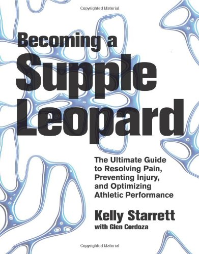

Based on all the reviews and comments I've seen on the web, I think I might be the only person who didn't love the book _Becoming a Supple Leopard_. This post will be a brief review covering the three reasons I didn't care for the book.

### #1 Who is the Audience?

Throughout reading the book, I couldn't tell if it was written for me - the person doing the exercises - or for trainers. This book is about safe movement. For many, if not most exercises, the person with compromised movement patterns is unable to see what they are doing wrong. They need an observer to make real-time corrective suggestions. As someone who works out alone, I don't have someone to fill that role. This makes me think the book was really written for trainers because even if I had someone to watch me, that ability to watch movement and make suggestions is something that takes practice and training. One idea that Stephan from BioHacks suggested was to video record your movements at the gym and then use that footage to make corrections. This is a great idea provided detecting movement errors is something a fitness hobbyist such as myself could do. This is where the expertise of the movement specialist would be helpful. They know what to look for and where. I might not even set up the camera at the right angle or I might need two different cameras to capture the movement from different sides. Even with cameras, feedback is delayed. Being able to make corrections real time would be of far greater value. Recently I went to see Nikki at [Indigo Kinetics](https://naablevy.com/) about my [tight neck and shoulder](/2012/12/help-me-fix-my-neck-and-shoulders/). Through close observation, she was able to see that my neck was fine, but I was over-recruiting rhomboids, upper trapezius and pec minor and under-recruiting my rear deltoid, serratus anterior, and low/mid trapezius. The result was some unnecessary shoulder elevation and shoulder blade retraction in my movements. This was causing my neck to tighten up. I would never have caught that from a book. I came to the conclusion that although there were solid tips sprinkled throughout the book, I think this book was written more for the trainer than the trainee.

### #2 Photos of Movement?

This is a technical complaint. Writing a book about movement is like singing a song about photography. It is hard to do. I understand that experts in every field write books on their field of expertise. However, I don't think the material presented in this book is best suited for print. The book has many photos that show at most 2 points of the movement. Reading about the movement is fine, but this is 2013. This book would be so much more valuable as an application with embedded videos. Instead of carrying a 400-page textbook to the gym, one could bring their tablet. Watch 5-second clips of every movement as many times as necessary. Trainers could use it as an educational device. The videos I would like to see wouldn't be the longer educational clips he has on [his YouTube channel](https://www.youtube.com/user/sanfranciscocrossfit), but super short crisp videos filmed with a tripod. More like what Bill DeSimone did for his book [Congruent Exercise](/2013/06/my-squat-article-is-a-silly-scare-piece/). He describes an exercise and then links directly to the online video clip of that exercise.

### #3 Different Training Philosophy

Dr. Starrett owns a CrossFit gym and has a huge audience with that community. I don't want to pick a fight with the CrossFit people today, but I will say that I am not a fan of ballistic compound exercises done under load. I think they are unnecessary for strength and have a much too high risk of injury. I only bring this point up because the subtitle says _"The Ultimate Guide to Resolving Pain, Preventing Injury, and Optimizing Athletic Performance"._  I would think that any ultimate guide to preventing injury would first seek out the safest exercises to achieve strength, not work on techniques to make risky moves safer. However, if your sport is CrossFit and you need to excel at those exercises, this book should be required reading.  _Becoming a Supple Leopard: The Ultimate Guide to Resolving Pain, Preventing Injury, and Optimizing Athletic Performance by Kelly Starrett_

### Last Words

Although I don't think this book was for me, I think it would be an excellent addition to a fitness library if you are a personal trainer or engage in CrossFit or Olympic lifting. And if Kelly Starrett is reading this post, my advice would be to hire an app developer, get a tripod and start shooting super short professional clips of every movement in the book. I really think people need to see movement. Photos and text aren't enough.

---

## Comments

### Brian
*November 14 at 2013 at 10:56 PM*

I haven't read this post yet, but point #1 is the exact question I had, and I wanted to ask Starrett about it. WHO are you gearing this book toward?

---

### Brian
*November 14 at 2013 at 11:00 PM*

Great idea about an app or some sort of interactive e-book. I'm don't have a ton of reasons to buy an iPad, but this would be one. Imagine bringing a tablet to the gym and like you suggested, looking at video clips. I think it'd be a big seller.

---

### garymar
*November 14 at 2013 at 11:25 PM*

Doug McGuff in a  recent post</a> had this to say about feedback:

<blockquote>I attended many clinics with real-time professional instruction.  None of these clinics could compare to the value of setting up a video-camera to record my performance, which I then reviewed immediately after carrying out the skill.  </blockquote>

He has a lot more to say about this, plus a reference to a study. I myself have found the best way to monitor my Max Pyramid workouts is with the video function of my little digital camera.

---

### MAS
*November 14 at 2013 at 11:37 PM*

@Garymar - Good to know. I am thinking that McGuff style HIT movements would be ideal for immediate review, as they are slow and use a fixed path. I suspect that the faster more complex movements are more likely to benefit from a professional.

---

### garymar
*November 14 at 2013 at 11:59 PM*

Actually, he was talking about BMX racing, not HIT.

Does your comment system not allow links? I put in an "href" link but looks like it got stripped out.

---

### Test
*November 15 at 2013 at 12:04 AM*

Testing comment with link.

<a href="http://www.bing.com/" rel="nofollow">Bing</a>

---

### MAS
*November 15 at 2013 at 12:06 AM*

@Garymar - You should be able to leave HREF. I just did a test above with "Test Commenter" that worked. Maybe you were missing a quote and it got stripped?

---

### garymar
*November 15 at 2013 at 12:10 AM*

Here is my test comment.

---

### garymar
*November 15 at 2013 at 12:12 AM*

yes, must have been a spelling mistake.  Anyway the test link is also the original McDuff post I referenced.

---

### MAS
*November 15 at 2013 at 12:14 AM*

@garymar - I wonder if McGuff's success in using video is in part due him being both a doctor and exercise professional? Would the average Joe be able to see the flaws in form that he can spot? Probably not.

---

### garymar
*November 15 at 2013 at 12:26 AM*

That's a thought. The man is super-bright. Also, it could be that, after <i>attending</i> all those workshops with high-powered professionals, he was primed to spot exactly what was wrong when he saw the videos.

---

### Kevin
*November 15 at 2013 at 4:36 AM*

In my estimation, Kelly is a special brand of person and he's very much in his own head. If you watch his videos, which is aimed at a common audience, he talks in a way that 90% of people likely can't follow.

His book is not quite as over-their-heads, but it's the same Kelly.

You bring up the point, "I need someone to observe me to point this stuff out" -- Kelly's not really interested in bridging the gaps for you. He's in love with the data and wants to put the data into the world. In this way, he's not a problem solver.

#3 I agree with wholeheartedly and have made the same argument.

---

### portabella
*November 15 at 2013 at 6:55 PM*

That's great.... I thought I was the only one who didn't "get" this book either. I wanted to like it too.

---

### portabella
*November 15 at 2013 at 7:12 PM*

My specific issue is not one of the ones you've mentioned. 

Kelly's method is roughly to push on tissue at the limits of your tolerance. You are not supposed to go into "the pain cave", but it is supposed to be as intense as you can stand. I found that difficult on my CNS. I did it for a several weeks, and then it dropped out of my workouts and I didn't miss it. 

I am working towards a more "coaxing" approach, where the body WANTS to do movements, like puzzles. It's more yin than yang. 

Crossfit in general is very yang so this does fit in with their overall methodology.

---

### Jim
*November 15 at 2013 at 7:54 PM*

MAS,
I've had great success using some of Kelly's videos to overcome pain and tightness, so I think that your point about using videos is valid.  It's interesting, because his posting of 365 free videos was cutting edge in a way, but the old-school book might be a step back (I didn't get it because of no Kindle version).

@Kevin_Geary:  I agree that Kelly can be hard to follow.  After seeing most of his videos (I'm a fan), I watched him on the Joe Rogan podcast, and his explanations were difficult to follow.  After three hours, my understanding had not increased.  He kept using his typical buzzwords (e.g., "ninja") and answering questions with questions. They couldn't seem to pin him down on anything.

---

### StuartG
*November 16 at 2013 at 1:07 PM*

Had a quick skim through it in a book store. My first impression was that it was not worth the extortionate price, despite it's thickness. i'd rather have Bill DeSimone's stuff any day. 
    Also the section on press ups highlighted the fact that he seems to be quite dogmatic in his recommendations, and doesn't seem to take into account, allow for, or prescribe for individual variances. He recommends a finger forward position for press ups, decrying a different hand angle to the body. I myself find it easier on the shoulders to angle my hands outwards slightly, for the same reason I prefer using dumbbells, rather than a barbell for floor presses. The slightly angled position seems to make it easier on my wrists, shoulders and elbows.

---

### StuartG
*November 17 at 2013 at 11:43 AM*

Someone else who has an issue with Mr Starretts dogmatic stance.......... http://www.jtsstrength.com/articles/2013/11/15/supple-leopard-vs-world/

---

### Sue
*August 21 at 2014 at 6:57 AM*

Are there any apps or interactive books out there that provide what you suggest. This would be great.

---

### Chris
*January 8 at 2015 at 6:48 PM*

If you follow mobility WOD on You Tube a lot of what is discussed in the book is available as short segments on his YouTube Channel.  You can also become a member of the website to get videos posted daily.

---

### buck
*February 2 at 2015 at 2:05 AM*

" see that my neck was fine, but I was over-recruiting rhomboids, upper trapezius and pec minor and under-recruiting my rear deltoid, serretus anterior, and low/mid trapezius."

the above is total non-sense - i would love to have emg data for the above muscle groups and compare to what these experts that can just "see".  the difference would be profound.  the reason these experts can spew such nonsense is that there is a lack of transferable emg data on compound movements.

---

### Nikki
*February 2 at 2015 at 3:37 AM*

Hi Buck,

Being the one that I was the one who provided MAS the info, I have a few things to add. I've never claimed to be an expert (I am a fitness professional, but we teach people how to move better, that's it!) and it would be out of my scope to diagnose. What I offered was a theory based on how I was watching his shoulder girdle move. When his shoulders should have stayed relatively stable and neutral to the spine, I watched the humerus go into internal rotation (pec minor) and the scapula go into downward rotation and retraction (rhomboids), which displaced his head position. In a lot of folks this can create additional neck strain. Based on muscle timing and ideal shoulder girdle movement, this would suggest a lack of stabilization from serratus and rotator cuff. Can I prove this (especially after the fact)? Nope and I'm not a researcher, so I care more about how someone moves in relative terms than I do about x, y, z muscle firing. I only told him that for context, since strong and weak are relative terms. But a lot of people, myself included, find that their neck pain improves after they get their stabilizers back online, because its a known fact that when global muscles try to do the job of delayed stabilizers our alignment suffers and we get joint compression. Of course, you're entitled to your own opinion and can call my response nonsense. That's the beauty of the internet, but at the end of the day, I care more about helping people create well coordinated, pain free motion than I do about figures in a lab that arguably often don't translate well to real world application.

---

### Dr.
*April 29 at 2015 at 4:02 PM*

Nikki nailed it.  It's called upper cross syndrome.  Extremely common yet rarely addressed.  It IS a motor dysfunction I (and apparently she) address daily in my office.  If you'd like to see it in person go to the local mall and take a seat in the food court.  Note the anterior head carriage and rolled shoulders of most young females.  Their posture shaped by facilitation and inhibition of muscles Nikki so accurately discussed.

---

### iolanthe
*June 26 at 2015 at 8:36 PM*

I am a physical therapist:

In reference to Nikki "I watched the humerus go into internal rotation (pec minor) and the scapula go into downward rotation and retraction (rhomboids), which displaced his head position. "  
First, if pect minor is tight that will pull the scapula into a more forward tilted position. Pect minor does NOT attach to the humerus at all.  The pect minor attaches to the coracoid process of the scapula.  Neck pain can be due to neck weakness, thoracic spine issues, muscle issues, posture issues...all take a medical a profession such as myself to determine, not a fitness trainer to determine. 

As to Buck: "' see that my neck was fine, but I was over-recruiting rhomboids, upper trapezius and pec minor and under-recruiting my rear deltoid, serretus anterior, and low/mid trapezius.” the above is total non-sense – i would love to have emg data for the above muscle groups and compare to what these experts that can just “see”. the difference would be profound. the reason these experts can spew such nonsense is that there is a lack of transferable emg data on compound movements."   You are correct in that it cannot all be seen. But through muscle testing, functional movement testing one can ascertain where the dysfunction is occurring.  
I am a physical therapist with not only years of schooling but 20 years experience. 

In regards to Kelly's book:  I take from it some good. I like his postural corrections and some soft tissue techniques.  I think for myself though.  I do not think anyone should be doing the complex motions of cross fit unless their sport is power lifting.  Strengthening and conditioning should be just that...strengthening without injuring.  That is my philosophy anyhow.  My clinic is attached to a gym. I have watched personal trainers taking clients through exercises that are not strengthening efficiently or at all and are only setting the person up for injury.  In fact one became my patient after herniating a disc.  I know the limitations of my training and practice within that. Too bad the fitness "experts" seem to think they have grasped complex aspects of the human body with little training. One good thing about that...it keeps me in business.

---

### MAS
*June 26 at 2015 at 9:48 PM*

@iolanthe Culjak - I can't speak to the disagreements between you, Buck and Nikki, but I will say that she was able to help me. The reason she helped was because I was unable to diagnosis myself correctly. I couldn't see the errors myself. Going back to my critique of the book, it is really hard to learn perfect form from 2 photos. 

I understand there is a 2nd edition of the book now. I have not reviewed it.

---

### Nikki
*June 26 at 2015 at 10:12 PM*

In response to the above comment from the physical therapist @iolanthe Culjak, I should add a correction to my original comment.

First, thanks for catching my mistake. It's true, the pec minor does NOT internally rotate the humeral head and in trying to simplify my comment (and post from my phone) I was incorrect in inferring that. What I meant to say was that when the rotator cuff is inhibited, the pec minor is often locked short creating a less than ideal placement of the scapula. However, it does not directly affect humeral head placement. The internal rotator of the humeral head is more of a result of a hyper-dominant lat (in some, but not all cases) and a lack of rotator cuff recruitment.

Additionally, as I've said before, I was not diagnosing him and was simply offering a theory with some muscle references for context, so MAS could tweak his form to experience less discomfort in his neck while performing the activity. I was not trying to identify a pathology, treat him for ongoing pain or diagnosis him for dysfunction. Diagnosis, testing and clinical explanations should be made by medical professional, such as a physical therapist and cannot be made someone with my credentials (B.S. Exercise Science and LMP). However, it can be beneficial to our clients to be given some context for why we offer a suggestion in how to change the way they perform an exercise. 

If MAS had been asking about how to fix his ongoing neck and shoulder pain, I would have referred him out to a doc. In this case, he wanted my input on how to perform an exercise, which is well within my scope.

---

### Nikki
*June 27 at 2015 at 2:53 AM*

Further edit to my above comment. "The internal rotator of the humeral head is more of a result of a hyper-dominant lat (in some, but not all cases) and a lack of rotator cuff recruitment." 

What I really should have said on that note is that internal rotation could also come from pec major/lat/and or teres major, particularly when coupled with an inhibited rotator cuff. Shoulders are complicated even if you've been teaching for a while. Though I am passionate about human movement and have spent some time studying this stuff, I make no claims to be an expert. I'm mostly just trying to help the layman better understand how some of our moving parts work together. 

It seems that some readers are worried that I'm touting myself as an expert. I assure you, I'm not. As much as I wish I could be right all the time, that's not the case as I'm in the same learning curve as anyone else who devotes their time to studying complicated subjects, but is also willing to share what they know, which may also mean going back and revising what they originally said once they are armed with better information. 

If you think you have some sort of pathology or long term pain/problem going on beyond a little general post workout tension or a twinge during a certain move, it's best to see a health care provider who can diagnosis and create a treatment plan for you. A reasonably knowledgable fitness pro may be able to offer some insight for better movement, but we don't do rehab. Likewise, the internet can be a nice resource for better understanding how things work, but it's not where you want to go to self-diagnose a problem.  

Should anyone want to continue the discussion on this topic, they are welcome to email me at [email removed], but honestly, my role in this blog post was secondary to the point that MAS was making about the book review. We just spent a little time doing some testing and learning with the exercises and I offered a bit of anatomy info.

---

### Matt
*August 1 at 2015 at 3:05 PM*

I think to address some of your concerns
#1) This is an education resource for many (athlete, coach, therapist, every day person)  Can it be understood by everyone and applied with the intent is was meant by everyone?  No, it does take some level of education to understand this book. Which is why there is a disclaimer on the inside cover to seek a professional.  Like anything in life, it helps if you have a better understanding of the topic being written about to further comprehend.  So, yes if you are a trainer, or therapist you will understand this much better, then if you have no strength and conditioning or physiology knowledge.  

By reading the book you "should" understand that for example the pain in your neck can be caused by issues upstream or downstream from the problem area"in this case your neck", downstream from your neck is your rhomboids. traps, pec, delts, etc.  If your rhomboids, traps, pec, delts are locked up, not firing, then you are going to have issues with the areas of the body that are upstream(your neck) or downstream from that location.  That I thought was pretty well laid out by Kelly, and easy to understand, but maybe I am wrong.  So pretty simple, if you don't have the movement awareness yourself, seek someone who does, video yourself, research a little more about what the means.  This isn't a movement for dummies book, results and knowledge take work, and the concepts in the book can't be laid with the ease our society would appreciate. Your list of 3 issues with this book would likely turn into 100 if it was attempted to be dumbed down.  Actual professionals would then question everything in the book.

#2 Of course any text would be better if it was accompanied by nice short to the point videos.  The problem with that is Kelly would probably get torn to shreds by other PT's or S&amp;C professionals if he didn't go into the detail he did and he wouldn't be as successful without his methods.  Human movement, the applications, the corrections, the modifications, the science, the safety, require more than a quick 5 second clip.  If all you want is to see a movement or exercise being done quickly, there are clips all over the web.  I think if you bought this book, you are more interested in the how, the why, the science, the modifications for different demographics, and how do I apply this to either myself or my own practice or profession,  that again is going to take some education, not simplicity.  I'd love to see a simplified app version of this book, thats a good idea, but I don't see it happening, unless you either fully understand the content of this book, then you won't need previous knowledge or application, then it could be simple.  But if you a newbie, and you are given complex content in a simple format, it can be highly misunderstood.

#3 The training philosophy is not just CrossFit and is sad if you believe that.  This book is about human movement, functional exercise, performance training, human maintenance etc.  People, athletes, coaches have been prescribing this stuff long before CrossFit, and will do so concurrent with Crossfits existence, and after it ever dies out, ever looked at a football players training program, a gymnast, a volleyball player, a runner, ever looked at what an out of shape unaware of -how to move- human being needs?  All of these people perform or needs the majority of the stuff in this book.  Crossfitters happen to be one of the audiences for the book because their competition often requires functional movements done for time therefore positioning, mobility, technique, and cues are going to be critical when they have to conditioned to perform these under a state a fatigue (obviously not recommended, but is any "competition" recommended for health of the body?)  Football isn't safe, basketball isn't safe, MMA isn't safe, any physical competition has risk, which is where the criticism on CrossFit gets ridiculous, it's a sport, it has risk, people need to get over it.  Those that are best prepared (which is the intention of this book=preparation) are at the least risk.  The movements involved in CrossFit, are much of the same movements involved in ANY performance training discipline.  
Kelly specifically breaks things up into category 1,2,3 movements and makes it clear you should not attempt loaded powerful versions of exercise before you have a great foundation in movement and mobility. He specifically has multiple chapters in the beginning of the book on the basics, the foundations for strength and positioning before instructing or attempting more advanced moves, so I do not see your concerns. He is only helping everyone in those disciplines become better and safer at what they do so people understanding the mobility and maintenance required to perform with less risk.  If he was instructing 50 year old never exercised before obese arthritic client to perform repeated snatches for time day 1, I'd be highly concerned about his advice, but he is not doing anything near that.

---

### MAS
*August 1 at 2015 at 5:01 PM*

@Matt - Thanks for your comment. You've inspired me to seek out the 2nd edition of the book.

---

