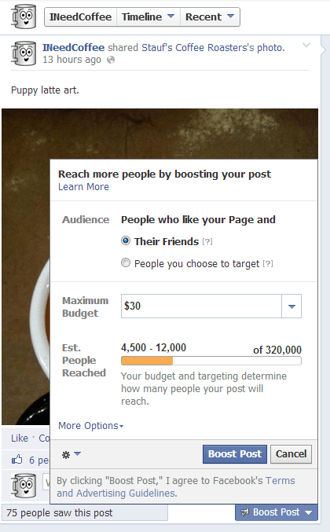

I have some pretty strong opinions when it comes to the web, especially when it comes to [owning and controlling your own work](/2008/03/i-hate-blogspot-too/). In recent months I've become increasingly frustrated with Facebook. I think it is a fine social network for individuals, but when it comes to Pages, I have some issues.

### #1 Facebook is Hiding Posts

Facebook does not show every post to those individuals who LIKE the page. It selectively hides based on what it thinks the user wants to see. Then on my end, I get the _opportunity_ to pay money to Facebook to get my post on the wall of everyone that already clicked LIKE. I don't respond well to digital extortion. Below is a screenshot of the _Boost Post_ option from my INeedCoffee Facebook page.

This post went up yesterday. **The INeedCoffee Facebook page has 1,443 LIKES and yet Facebook has decided that only 75 should see the post.** In the screenshot above you can see that for $30 I can get this post to 4,500-12,000 people. I have no interest in that offer. I'd prefer to reach 1,443 people for $0, but that isn't an option. Some will argue that Facebook needs to make money and that I'm using their service for free and this is a fair compromise. I disagree. Not only am I providing content on my Facebook page for which they can run highly targeted ads beside without compensating me, but I'm also directing my readers to the Facebook server. Plus I am not asking to go outside my network for views.

What I noticed about the INeedCoffee Facebook page was **as the number of LIKES increased, the engagement ratio decreased**. I wanted to know more about _Boost Post_, so several months ago I paid $5 to promote a new piece of content on [INeedCoffee](https://ineedcoffee.com). I wanted to see how many new LIKES I got and if that engagement increased traffic on the posts that followed in the next two weeks. It failed. The site got very few new LIKES and the engagement level dropped immediately back to pre-extortion (um I mean _Boost Post_) levels.

CriticalMAS has far fewer LIKES, but do I really want to go through this process again?

### #2 Facebook Comments Aren't Searchable and Available to All

This blog has almost 9,000 comments. I consider them as valuable as the almost 2,000 posts. Those comments can be read by anyone on the Internet. I am a big proponent of openness and transparency.  I even acquired a search plugin that searches comments, which is something 99% of WordPress blogs do not have. **Your comments are very important to me. I want to be a good steward of those words. I can't do that on Facebook.** Comments get lost as time passes. My non-Facebook readers can't see the Facebook comments, whereas the Facebook readers can see the blog comments.

The quality of comments is getting greater and greater on Facebook. Every time I see an awesome comment, my first thought is I wish that were on the blog where everyone can see it. If I let the Facebook page continue to grow, this problem is just going to get worse.

### #3 Facebook Comments Have a U/I Threading Bug

Depending on how you reply to a comment on Facebook, you may or may not see the entire thread. It has the appearance that comments are being deleted. The only way to see the entire thread of comments is to click on the date beside the post. This is not an intuitive design. Here on the blog, every comment is visible on every page draw. Nothing is ever hidden.

### 4 Ways Facebook Users Can Continue to Read Critical MAS

Posts by Email - This is handled by Google's Feedburner. It is easy to unsubscribe and your email address is safe. (2021: Feedburner no longer offers posts by email)

[RSS](http://feeds.feedburner.com/criticalmas/zooq) - I love RSS. If you aren't sure what RSS is, go to [Feedly](http://www.feedly.com) and set up an account. It should all make sense then. RSS connects content producers directly to readers without having to go through sites like Google and Facebook. Another great thing about Feedly is it can display content in a mobile-friendly format, even if the subscribed site can't.

_Screenshot of my Feedly RSS Reader. The left column shows the new articles I have available to read from sites I have subscribed to. I selected the post from Beyond Kimchee and a snippet from the newest recipe appeared in the right column. Sometimes a snippet appears. Sometimes the full article. For CriticalMAS, at this time I show the full article. Sites that have had copyright theft often use snippets._ 

@CriticalMAS - A link to each new post to automatically sent to Twitter. Because Twitter responses are limited to 140 characters, those with valuable comments will leave them on the blog.

Google+   G+ to my knowledge doesn't hide posts like Facebook does, but unfortunately, they also collect comments, which I dislike. The good news is my G+ readers are still leaving comments on my blog and not G+.

### Last Words

I'm tired of [digital sharecropping](http://www.roughtype.com/?p=1600) for Facebook. I'll probably lose a few readers, but it is better to take a small hit now and not a larger one in a few years. So I will be pulling the plug on the CriticalMAS Facebook page in a few days. The 18-month experiment has ended. The INeedCoffee Facebook page will remain, as that audience despite being much larger, almost never leaves comments, let alone interesting ones.

**Update December 2013:** I created a [CriticalMAS Pinterest account](http://www.pinterest.com/criticalMAS/). Seems I'm getting more referrals from there than Facebook and Twitter combined. Mostly recipe posts.

**Update November 2017:** I quickly got bored with Pinterest and I often forget to share posts on G+, which seems to be on life support. Too bad Google fumbled that product so badly.

**Update December 2018:** Google is shutting down G+.

Also, there are now more reasons to abandon or devote as little time as possible to Facebook Pages. I still have a Facebook Page for INeedCoffee but have found it to be a waste for driving traffic. Search still rules.

---

## Comments

### PAul
*November 18 at 2013 at 8:22 PM*

I love the analytical approach of these articles. And agree for the most part (although i was tempted to comment on G+ to break your stones ;-) )

Although i have noticed that feedback does increase the more their is action on a post. For instance if someone comments on it then facebook pushed the content a bit more, very counter intuitive. Make sure to mark the date in GA and compare after a couple months! 

I'm doubting FB is sending any of us real traffic. Pinterest on the other hand does actually direct significant traffic to visually stimulating content. May be worth looking into making a few Info-Mas-Graphics

---

### Txomin
*November 18 at 2013 at 8:25 PM*

Never cared for Facebook. I was once worried that I would eventually be forced to use it ("universal" login almost did it) but it seems we might just be able to outrun it. Same for twitter.

Anyway, thank you for updating the layout of this site. It is much, much better to my taste.

---

### MAS
*November 18 at 2013 at 8:28 PM*

@Paul - Funny you should mention Pinterest. The last time I looked at site stats a few weeks ago, I noticed I was getting more referrals from Pinterest than Facebook and Twitter combined. And I don't even have a Pinterest account for this blog. 

For me this is less about traffic. I'd rather lose pageviews than good comments.

---

### PAul
*November 18 at 2013 at 8:39 PM*

for your enjoyment, this is how you see what people are pinning from your site. https://www.pinterest.com/source/criticalmas.com/

---

### MAS
*November 18 at 2013 at 8:47 PM*

@Paul - I suspected it might be the recipes. Thanks for sharing. I do have a Korean soup recipe I need to post.

---

### Jeff
*November 18 at 2013 at 9:04 PM*

Good riddance I say. Used to tolerate Facebook but even that stopped. I actively avoid links to Facebook now.
It could fade

---

### Fabian
*November 19 at 2013 at 8:04 PM*

Wise choice! Facebook is tempting for its sheer quantity of members, but provides horrible conditions for content creators. That's why I’ve never signed up there in the first place and decided to take their Like/Share buttons off my blog a long time ago. It has affected my traffic slightly, but I feel much better about it now.

Considering Google’s recent history, I'd also be careful with Feedburner's posts-by-email feature. I’m still using it myself, but am prepared to move it over to Mailchimp if they decide to can the feature to suck more people into G+. I’m using G+ because of the hangouts, but would love to replace it with a paid service sooner rather than later.

---

### MAS
*November 20 at 2013 at 1:16 AM*

@Fabian - Good call on the Feedburner. I have the same concern. Looked into Mailchimp this weekend, but found it rather complex for my needs. So holding onto Feedburner for now.

---

### Jim
*November 20 at 2013 at 2:59 AM*

Do people still go on Facebook?

---

### thomas
*November 21 at 2013 at 8:21 PM*

Went into a Starbucks today and thought of you and your need for coffee.  Why haven't you opened a coffee related business?  Are the margins too slim or are cafe costs too high?  Do you need a partner?  What exactly is the reason?  Seems like someone with your encyclopedic knowledge of coffee would have started a related business.

---

### MAS
*November 21 at 2013 at 11:09 PM*

@Thomas - I have lots of interests. One interest I don't have is running a business.

---

### CrazyCanuck
*November 23 at 2013 at 6:27 PM*

I thought I was going crazy.  I would see some post disappear if I refreshed.  It was driving me nuts, now I hardly use it anymore. Facebook has become this annoying worthless piece of trash.  

I don't care for G+, Google is forcing youtube users to use G+.  I prefer blog posts and twitter for now.

---

### Bill
*December 6 at 2013 at 2:21 AM*

Hi Michael,

Always looked forward to your posts, no matter where I traveled. Now will continue to follow you through Feedly. Wish you all the Best ... Beyond FB !

Also, appreciate your tips and motivation, along with how you always answered my questiions (posts) in Real Time...unlike many. 

Best to You !!

Bill

---

