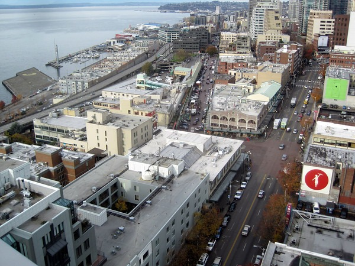
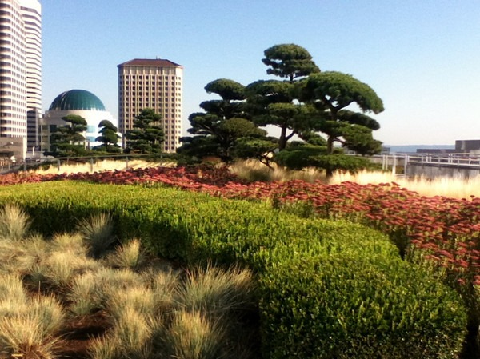

Ever since I arrived in Seattle in 2007, I have been an [exploring machine](/tag/urban/). I've seen more of this city than many people who have been here since birth. But until one evening this summer I had no idea about this killer view overlooking downtown Seattle. Back in 2006 when Washington Mutual was busy printing money writing bad mortgages they built a 43 story building in downtown Seattle. On the west side of the building at the 17th floor they constructed a 20,000 square foot garden for their employees.

Times were good for WaMu. Who could have seen they were doomed for failure? Actually, me. [I predicted WaMu would fail](/2008/06/i-wouldnt-bank-there/) on this blog in June 2008. In September they were placed in receivership with the FDIC. After their failure, their brand new Seattle building was purchased by Russell Investments.

If you are standing in the Pike Market area look up to the southeast. You will see a 43 story building with a 17 story back facing west. This is where the view is at. According to the [Wikipedia](https://en.wikipedia.org/wiki/WaMu_Center) this garden is private. According to a friend of mine that works in the building, it is public, but they just don't tell anyone. I've been up there four times now. Each time I've walked right past security and went to the left elevators and got out on the 17th floor. Once you step off the elevators you will see a set of doors leading out onto the rooftop garden.

The building is closed on weekends and I _believe_ access to the rooftop is restricted after 6:30 PM. Please leave a comment if you know the exact hours.

Anyway, here are some photos I took over two dates. The reason I say very few people know about this is because for months I've been asking people if they were aware and nobody knows about it. This is a well kept secret. The Space Needle will cost you $19, unless you can time [$1 day](/2012/10/space-needle-for-1/). This costs nothing.

1301 2nd Ave, Seattle WA 98101

[More Photos by Me](https://www.flickr.com/photos/129592470@N02/sets/72157647802815704/)

[And a photo from the Wikipedia showing the view from the 43rd story looking down to the 17th story garden](https://en.wikipedia.org/wiki/File:Wamugardenroof.jpg)

UPDATE: Another Seattle [rooftop garden at Madison & 4th](/2013/11/4th-and-madison-rooftop-garden-seattle/).

---

## Comments

### Stephan
*November 13 at 2013 at 3:43 AM*

Why didnt we go there yesterday?

---

### MAS
*November 13 at 2013 at 3:44 AM*

@Stephan - We had a 23andMe errand to run! :)

---

### Roberta
*November 13 at 2013 at 5:48 PM*

I work in this building! Not that I make it to the 17th floor much.

---

### Ed
*November 14 at 2013 at 11:38 PM*

Me and another person actually plumbed the waste and vent in the core bathrooms all the way to the top among other things. I remember reading about the bank failures that were coming due and mentioned it a couple times to some people who recoiled like I was nuts. Of course most people don't listen to alternative news sources. I was gone by the time the garden was done on the roof top. Thanks for bringing that up, maybe I can check it out one of these days. Nice pictures too!

---

### Peter
*April 13 at 2015 at 4:06 PM*

There are actually several buildings like these with similar views. They are like Easter eggs of the city.

---

### Matt
*September 23 at 2015 at 9:00 PM*

I just went there today. You have to go into the elevator the same time as someone that works there. Then you have to ride the elevator until someone gets off at the seventeenth floor. It's a popular floor so you won't wait long. Dress somewhat professional or you will stick out like a sore thumb.

---

### MAS
*September 24 at 2015 at 2:11 AM*

@Matt - Thanks for the tip.

---

