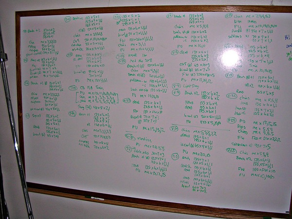

Although I actually started lifting weights on a regular basis after I moved to Florida in June 1994, I do recall going to the old Ohio State student weight room a few times during winter break of 1993. The old weight room looked nothing like what is available to the students today. The old gym was an embarrassment. Anyway, that was 20 years ago this month.

For this post I thought I'd recall my journey. Who were my mentors, what gyms did I go to and what my training philosophies were. I'll touch on what I got right and what I got wrong based off my current understanding of fitness. Hopefully, some younger lifter can walk away with a lesson or two.

### Initial Motivation

One day in study hall during my junior year of high school, a gym teacher was leading a class of about 15 boys from the weight room back to the gym. This meant the class had to walk through the study hall. Sharing my table in study hall was a cute freshman girl. When Troy from the gym class walked by, she let out a moan. I looked over at her and could tell she wanted Troy BAD! Troy was the only one in the group that I recall having built any muscle.

She wanted Troy. Troy had muscle. I needed to gain muscle. Lesson learned.

You'd think I'd start lifting weights that day, but I didn't. Maybe it was laziness or maybe I made excuses that I didn't have access to a gym or both. This was pre-Internet and pre-[Hillfit](/2013/07/hillfit-2-0-a-zero-budget-approach-to-high-intensity-training/). I hated push-ups and didn't even know what a squat was. The one thing I could do well was run. So all I did was distance running.

### College

In the first paragraph, I mentioned how the old student gym at Ohio State was awful. This is not to be confused with the gyms available to the football team or other sports. Those gyms I'm sure are very nice. The problem with the old student gym was it was very small. For a university with over 50,000 students, it was ridiculously small, but worse is it was used for classes. This meant it had very limited hours. Most students that looked into using it quickly gave up.

_Since my graduation, I have learned that OSU students now have a very nice modern gym._

If you combine the hassles of the OSU gym with my lack of energy from distance running and a vegetarian diet, you can see why I didn't pursue weight lifting then. In the post [The Runner 1989-1995](/2008/03/the-runner-1989-1995/), I covered my running and triathlon experience in more detail. The important line from that post:

> During my triathlon training I stumbled upon the book Optimum Sports Nutrition by Dr. Michael Colgan. In the book the doctor explained how weight training can give endurance athletes a competitive edge. I used that wisdom and started lifting weights as a way to avoid the pain of running.

It was actually a line from that nutrition book that finally inspired me to start lifting weights.

### Florida

When I arrived in Florida I joined a gym and started training three times a week. My initial source of "knowledge" was _Muscle & Fitness_ magazine. Many people now called this rag _Muscle & Fiction_ as most of the articles are for steroid monsters and not the average lifter. Later I found _Muscle Media 2000_. My go-to book was _Getting Stronger_ by Bill Pearl, which became my foundation. During this time I did 3 sets of 8-12 reps for many exercises. Body part splits across days.

_Getting Stronger: Weight Training for Men and Women by Bill Pearl_

While in Florida, I gained the muscle that I should have gained in high school and college. I went to several gyms in the Tampa Bay area, most of them were the old school rust gyms, which are almost all gone now. Back then I got it into my head that free weights were superior to machines because the machines are used by beginners and those people don't seem as strong. I wouldn't figure out the error in this thinking until 2010, but I'm getting ahead of myself. I also focused more on the frequency of workouts and volume. I did get injured from time to time, but I was young and bounced back rather quickly.

### Dot-Com Pain

I moved to the Washington DC metro area during the dot-com days. Traffic was hell and I worked a lot more hours. Just going to the gym required getting up sometimes before 5 AM. Everything was too crowded. You couldn't even get a parking spot if you attempted to go in the evening. I was beyond stressed out. I hated DC. I got completely out of shape and frequently had back pain. My posture was terrible and I was abusing caffeine. My body image was at an all-time low. DC was killing me, so I moved to San Diego in June 2000.

### California and Pavel

My first year in San Diego had me slowly getting back into lifting. Maybe a few times a month, sometimes more. My workouts lacked focus. Then in May 2001, I bought a home and converted the single car garage into a gym. I decked my home gym out with a squat rack, 2 sets of PowerBlocks, a dip stand, thick barbells, and a bunch of other accessories. I had a huge whiteboard where I could write down my workout numbers.

_My home gym whiteboard_

Almost immediately after I set up my gym, Pavel's Power to the People showed up in the mail. It changed everything. I wrote an entire post just about my long history with that book titled [Power to the People - 10 Years Later](/2011/03/power-people-10-years/). The short version is I gained muscle and got into great shape. I began preaching the gospel of low reps and heavy weights to anyone that would listen.

Then I started experiencing injuries when I tried to push the volume. I followed mostly a fish plus a vegetarian diet. Lots of soy and grains. I'm still abusing caffeine and I'm still getting frequent back pain.

_Power to the People! : Russian Strength Training Secrets for Every American by Pavel Tsatsouline_

At a certain point, I realized that I wasn't gaining any more muscle. I seemed to top at 210. I joined the Army weighing a scrawny 156, so I should have been pleased, but I wasn't. My [fitness idols](/2007/03/fitness-role-models/) boxer Evander Holyfield and surfer Laird Hamilton were more muscular than me. Years later I would post on how those idols were [unrealistic](/2012/03/fitness-role-models-revisited/) for my frame. Excessive lifting resulted in wrist surgery, which sidelined me for several months. And months before I'd move to Seattle, I [completely threw out my back](/2007/04/no-more-morning-dead-lifts/) doing a warm-up deadlift.

_A high volume approach to Power to the People resulted in wrist surgery._

### Seattle and HIT

My first few years of lifting in Seattle were mostly very conservative Pavel style low-rep workouts. I started paying more attention to safety. I reduced the weight and increased the time between sets. I fell into a rhythm that was more motivated by not getting hurt than making gains. Then a combination of three things happened that changed everything. I read about High-Intensity Training on [Conditioning Research](http://conditioningresearch.blogspot.com/search/label/HIT), got ahold of a library copy of Body By Science, and an email invitation from Seattle-based HIT trainer [Greg Anderson to workout at his gym](/2011/02/high-intensity-training-at-ideal-exercise-of-seattle/).

I've written numerous posts on why I love HIT. My intensity is far greater now than when I was doing "functional" compound movements and I never get hurt in the gym. But to understand why HIT works has a lot to do with unlearning things that are considered gospel in the weightlifting community. Machines are not inferior, provided they are used properly. Weight is merely one metric to measure and likely isn't as important as TUL and rep speed. Momentum is not strength. Nor is it a skill.

My go-to resources for HIT besides _Body By Science_ are [Hillfit](/2013/07/hillfit-2-0-a-zero-budget-approach-to-high-intensity-training/), which is for those that want to use bodyweight exercises at home, and [The New High Intensity Training](/2011/05/the-new-high-intensity-training/) by Darden, just ignore his nutrition advice.

### Last Words

That is a brief summary of 20 years of lifting. The greatest gains you will make will come from avoiding injury and [understanding survivorship bias](/2013/09/fitness-blogging-disclosures/). Find a workout that minimizes injury risk while allowing you to dial up the intensity. Then rest and trust the process.

---

## Comments

### StuartG
*December 10 at 2013 at 6:18 PM*

MAS,
        I love this post. My favourite fitness authors ( yourself included ) are those that are not afraid to catalogue their failures, as well as their successes, so that others can learn from their experiences. I hate it, and simply groan when I read yet another piece from a dogmatic author ( or read the various posts in internet arguments ) who refuses to budge an inch from their standpoint, for fear of losing their precious niche in the market. ( This is usually because they either have a financial or emotional stake in their stance. )
      This post is vying for my top three fitness pieces of the year. Coincidentally the other two I have also read this very week, Skyler Tanner's piece currently featured on the Hillfit Facebook page and Richard Winett's article " Understanding Applications of Response Variation is Critical to Your Training and Health ". I urge you to check this excellent piece out, if you haven't done so already.
     Chris Highcock's posts charting his current approach / views on fitness also get a very honourable mention.

---

### Anemone
*December 10 at 2013 at 10:04 PM*

Isn't it fairly common for men to fill out after they've finished growing upward? I met a mesomorph once who was built like Superman even though he didn't lift weights. (He swam, cycled and cross country skiied; also Scottish Country Dancing - all very aerobic.) But he was scrawny even in university, and appears to have filled out sometime in his 20s.

So how do you know the weightlifting is what added the weight? Some of it might have come on anyways by that point. (I suppose it would depend on how old you were when you shot upwards. Some guys are tall early on and bulk out earlier, like my brother; others shoot up later on and only bulk out when older.)

I could be wrong about this, though.

---

### Adam
*December 11 at 2013 at 4:32 AM*

As a fitness enthusiast in their mid-twenties, I very much appreciate this post Michael. I'm interested to see if you stick with HIT or move on to something else. I've been doing HIT since stumbling upon your recommendations this past summer and have enjoyed not really getting anywhere close to injured while still making gains, but I know I really haven't been on the regime all that long.

---

### MAS
*December 11 at 2013 at 4:56 AM*

@Stuart - Thanks for the nice words.

@Anemone - That probably does play a role, but I wonder how much. I was still quite lanky before I started lifting and I was months away from graduating college. 

@Adam - There are many different flavors and concepts of HIT. I have experimented with many and will continue to change those, but I don't expect ever to trade HIT for compound or momentum based strength training. Glad to hear things are still going well for you.

---

### Txomin
*December 13 at 2013 at 6:16 AM*

Interesting read. Thank you. Where would you say you are now in regards to goals? What has been accomplished and what is left to be done?

---

### MAS
*December 13 at 2013 at 3:56 PM*

@Txomin - Great question. My quick answer would be that I now am happy with what I achieved based off my somatype and age. One thing I do need to work on is the outside muscles on my upper back, which I recently discovered haven't been firing properly. 

Currently I am thinking a lot about non-load bearing movement, such as yoga. It might be the safe way to bridge some of the disagreements between HIT and traditional weightlifting. 

I'm going to ponder this question more.

---

### Craig
*December 15 at 2013 at 12:25 AM*

If you are training for the long haul, it is important to find a program that doesn't derail with injuries.  For you, that seems to be HIT.  But I am curious: does HIT training get you as strong as you were when you used Pavel's (not "Bear") program?  I know it can be hard to gauge strength because you will always test better doing the test on an exercise that you train. But subjectively, do you feel you are hitting comparable strength levels, or is it the case that you take whatever you can get from the HIT approach because it is better to be injury free?

---

### John
*December 15 at 2013 at 1:00 AM*

Actually, I was going to ask the exact opposite of Craig. 

You told us a lot about preventing injuries by following HIT protocols, but I recall a post you made that appeals to us ectomorphs, "Never forget that size is the prize".  So, I'm actually not interested in strength gains as much as I am in lean mass gain. How much "size" did you gain using HIT?

To be completely honest, I do like that approach of low reps and heavy weights, and I love gymnast holds (can't do any one of them properly yet, but they are an amazing feat of strength), and don't plan leaving free weights until I'm around 165-175 lbs (145 currently), but HIT seems like an useful way to maintain mass while staying injury and stress-free.

---

### MAS
*December 15 at 2013 at 2:06 AM*

@Craig - I feel HIT is superior. I am able to generate much higher intensity levels, because safety isn't compromised when I get close to  achieve failure. With Pavel, you always had to weave a balance between volume and intensity, all while trying your best not to compromise form as to avoid injury. I was unsuccessful finding that balance, which is why I dumped the Pavel Bear approach.

The problem with with the word strength is to me it is hard to quantify. Should we use pounds, reps, sets or Time Under Load? How much of the movement is strength and how much is skill? When I was in Army Basic Training, I was able to demonstrate that I could do 70 push-ups. Today there is no way I could that many, yet I could do a static hold in the push-up position for 70 seconds. I am clearly stronger than my 17 year old self, yet I can not demonstrate it on that exercise.

---

### MAS
*December 15 at 2013 at 2:14 AM*

@John - Size is a combination of exercise stimulus, caloric surplus and rest. Ectomorphs focus way too much on the first and not enough on the other two. The muscles don't know if you are using free weights or machines or static holds to target the muscle fibers. Your joints might know, but your muscles don't. They respond to the load. 

The big problem with ectomorphs is we are impatient. We don't see results as fast as we like, so we cut short our recovery time, which is when the muscle is actually being built, and return to the gym too soon. We need longer breaks, more food, more sleep, and less stress. That is where the focus should be. 

Even though I am HIT now, because of the greatly reduced injury risk, I probably could have gained more muscle faster in the early free weight years had I done shorter workouts with greater rest periods. More ice cream and sleep, not more hours at the gym.

---

### Craig
*December 16 at 2013 at 12:26 AM*

I certainly understand the issue with strength. It can only be defined in terms of specific tasks.    That makes it difficult to make objective comparisons between vastly different exercise protocols. 

I do struggle with the term intensity.  It can mean a lot of different things.  If, for example, I do a wall sit for 120+ seconds, it feels very intense as the burn begins to ramp up.  But those wall sits never built up much muscle.   So I wonder if the pursuit of a feeling of intensity from an exercise is always a good indicator that it was productive stimulus.   That was part of the reason for my question.

---

### Muts
*December 17 at 2013 at 1:10 AM*

@MAS:

I used to suffer from terrible and unpredictable pain too when deadlifting. I reached the point where I almost gave it up for good (after almost 20 years of weightlifting). Then, I had a coach help me with what actually was causing my back to go out. (It was so bad that when my back would lock up, my entire torso would shift 2-3" to the side and I couldn't hardly walk or breath, no joke!) 

For me, it was/is the psoas muscle that spasms and pulls on the spine from the front.

Solution is multi-pronged: 

1. Make sure I am optimally hydrated. I use unrefined salt in my water to help.

2. Pre and post workout, perform 2-3 sets of extended ROM split squats; this can be with bodyweight only or weight w/ DB's can be added (the most I use are 25lbs DB's in each hand).

3. At least one a week, using a kid's size (#3) soccer ball, perform global gut smash (Kelly Starrett). The first time I did this, it was eye-opening to say the least. 

4. Proper bracing during the deadlift changed everything for me. Learning to create a tension wave in the whole body so that instead of going from 0 - 60 mph, you go from 40 to 60 mph when you finally move the bar. 

Putting all of these together resulted in my taking my deadlift from 500 to 625lbs in one year. So, I'm not going to break any world records with that, but I did reach a personal goal (600) and surpass it. 

Don't give up on the deadlift!  :-)

Cheers
Muts

---

### MAS
*December 17 at 2013 at 1:14 AM*

@Muts - Thanks for the tips, but I gave up the deadlift years ago. My body feels much better. 

I just ended my gym membership. Heading back outdoors to do Hillfit.

---

### MAS
*December 17 at 2013 at 1:23 AM*

@Criag - I believe intensity is a good measure of stimulus. This post I did discusses if ectomorphs might do better by spreading the intensity across multiple sets.
https://criticalmas.org/2012/08/is-high-intensity-training-best-for-ectomorphs/

I gained more muscle from squats and deadlifts than the wallsit, However that isn't a fair comparison, as those were early pounds of muscle that were the "low hanging fruit". I was also younger. Had I started with HIT, I'm certain those gains would have came just as fast. Actually faster, since I wouldn't have had downtime to recover from injuries.

---

### John
*December 21 at 2013 at 9:00 PM*

Hey Michael,

I see your point when you say there is no way in which we could measure strength, and I agree with that. That's why I asked you about your size. Given that you body fat percentage remained the same, are your arms circumference bigger? Your thighs? Your torso?

I see that most people end up injuring themselves at one point or another if they continue to pursue PRs on weightlifting, but I think that's because we aren't built to lift metal objects of unusually high mass. Deadlifiting 300 lbs, independently of how big and strong you are, will beat the sh*t out of you. But being able to lift an amount that the body was designed to lift, and I would arbitrarily say that this means 80% of something a lean 170 lbs male at around 6ft could lift, is and interesting feat and with good form, would rarely injury you, given that you don't attempt to deadlift more than once per week, treat your body well enough when you aren't on the gym, by having decent mattress, getting massages, foam rolling and stretching frequently.

There is hardly a reason why I shouldn't get good at the most common movement patterns for the human body, given that being I'm not skinny at 145, but clearly undermuscled (that's the right word). Had I done more muscle intense tasks as I would if I had to hunt animals to survive instead of sit all day, I doubt I'd be 145 lbs by 20. As I get closer to what should feel "natural" to my body, then you are right, there is no reason to do it as intensely anymore, and that's when I plan to give HIT a shot.

I just ordered a Gymboss stopwatch to help me not being longer than 45 minutes in the gym, I don't do more than one big lift for the day and just go four times a week (I'll change for three times a week, starting next monday). I have a Lacrosse ball, also ordered a textured foam roller and will start to schedule massages from time to time. And I hope that helps me pass the 145 mark, because the first 15 lbs came rather effortlessly, but I can't seem to move the scale anymore than this for about two months now. I started eating a big bowl of ice cream after your recommendation, but that started helping once I was 145 lbs.

---

### John
*December 21 at 2013 at 9:05 PM*

I mean, eating the bowl of ice cream didn't help me as much as before once I got to 145 lbs.

---

### MAS
*December 21 at 2013 at 9:39 PM*

@John - I have gained in size in my 20 years of weightlifting. I do not have data for that period. I kept decent records around 2002-2004, but quickly grew tired of it. How I look in the mirror is all that counts. 

I think you are wrong on your assumptions about HIT being inferior to traditional lifting for gaining muscle. Muscle inroading combined with caloric surplus and rest are keys. But do what you need to do. 

As to your comment:
"There is hardly a reason why I shouldn’t get good at the most common movement patterns for the human body..."

The question is should they be done under heavy load or high volume or both? I think not. Train to failure or near failure using safe HIT exercises and then later while not under load engage in a full range of human movements. This belief that we need to do both at the same time probably originated in the 1980s and continues today. It is a recipe for injury.

---

