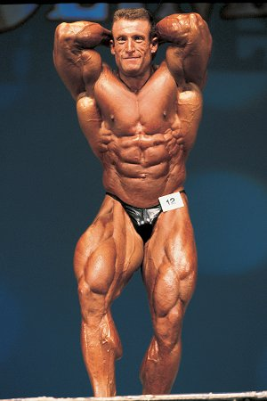

One of the false criticisms of High Intensity Training is that the top bodybuilders in the world don't use HIT, so therefore it is less effective than traditional bodybuilding methods. This is false for a few reasons.

1.  I would guess that over 99% of all lifters are never even exposed to HIT. It would be a fair criticism if half of all beginning lifters used HIT and got worse results, but they don't.
2.  We don't know how those same bodybuilders would have developed using HIT. They could have turned out better, worse or the same. We don't know.
3.  This is an extension of point #1. Most of the easiest gains come in the first year of training. Some would say in the first six months. Very very few lifters start with HIT. The young lifter associates their gains to their workout protocol and not the fact they are a beginner. This sets off a culture built on attribution bias. "I made the most gains with the squat" instead of "I made the most gains when I was a beginner".
4.  Mike Mentzer and 6-time Mr. Olympia Dorian Yates.

HIT does have its elite bodybuilding role models in Mike Mentzer and Dorian Yates. I hate to cite an outlier as a defense, but when someone mentions that no top bodybuilders use HIT, they need to be corrected.

Mentzer has written tons on HIT, so I decided to read more about Dorian Yates. These quotes are from a [2008 interview on BodyBuilding.com](https://web.archive.org/web/20231202191347/https://www.bodybuilding.com/fun/dorian_yates_training_insight.htm).

### #1 On Squats

> Well, I was a big squatter in my early days. That's what everyone did and it was macho exercise as well. It was like if you don't squat then you are not even a real man. That was the attitude in the gym. And, of course, Tom Platz was the big guy around back then, with his massive legs and his preaching about squats. But there were times when I was forced to look at alternatives - from the free weight squat anyway.
> 
> I would always pre-exhaust before I got onto the compound exercises, but I did leg press, and hack squatting, or squatting on a Smith machine instead of going to squats. And I found I got much better development from these exercises than from just heavy squatting. It depends a lot on your structure, but it (the squat) didn't suit me. So hack squats, leg presses and pre-exhaustion with leg extensions.

The great Dorian Yates preferred the leg press to the squat. He started with squats but changed his mind and got better results.

### #2 On Training and Momentum

> I usually ask, "What is the usual max weight you would use?" The usual reply is, "300 pounds," or some excessive weight. I have those people using 150 to 200 pounds and getting a much better workout. I make them do it properly and focus on different mechanics, the correct conditioning and correct control - **no momentum** - so all of the stress is going on the muscle and they have the best workout ever.
> 
> They are not throwing around the kinds of weights they are used to doing, because that's what they are doing with them: throwing them around. They are using other muscle groups, using momentum to get the weights moving and the muscle that they are targeting is not benefiting as much as it should be.

One reason I believe there is so much hostility to HIT is that a traditional lifter has his ego tied up with a number. They say they can lift X number of pounds. When their friend momentum is reduced or eliminated, they find they can't lift anywhere near that amount. It is humbling to see just how much your "strength" declines when you stop throwing weights.

### #3 On Negative Lifting

> I believe it is important, if not more important than the positive part. So I always emphasize the negative part because more muscle damage occurs during the negative phase. And it's the damage that is repaired that makes the muscle grow.

If you use machines correctly, you can control momentum and target the negative portion of the lift. Two things that you can't do safely with a classic barbell back squat. Based on the comments in this interview, Dorian chose the machines not because they were the [safer option](/2012/06/lower-risk-alternatives-to-the-barbell-back-squat/), but because they were more effective for him. And his results speak volumes. From 1992-1997, the top physique in the world didn't back squat.

_Do you even squat bro?_

---

## Comments

### Kevin
*January 1 at 2014 at 1:14 AM*

Roids help too, apparently.

---

### MAS
*January 1 at 2014 at 2:24 AM*

@Kevin - As they would help all pro bodybuilders.

---

### Øyvind
*January 1 at 2014 at 3:11 AM*

http://npcnewsonline.com/powerbuilding-you-dont-grow-in-the-gym/63930/

This link is to the kind of T-head site i am usually wery sceptical to, but there is a lot sense in it.

"Take your body somewhere it hasn’t been before then give it enough food and rest so it can adapt and grow!!!"

Like most cases it is hard to tell if Stan Efferding is on the roid rage, though, but at the very least it is another nice example of sombody being very successfull with H.I.T like principles, and not stressing volume.

Like you have pointed out so manny times, the idea that "how you train is necessarily how big you will be" is allready the dominant fallacy, but its fun to meet the anti H.I.T rhetorics on their own stage too :D

---

### MAS
*January 1 at 2014 at 3:08 PM*

@Øyvind - Love this quote from your article link

<blockquote>It’s never the training routine that’s limiting growth, it’s always the recovery phase, eating and sleeping. The vast majority of people who want to get bigger and stronger already train hard enough to grow, they just don’t eat and sleep enough to grow.</blockquote>

With that said, it is logical to pursue safety first.

---

### Ondrej
*January 3 at 2014 at 8:00 AM*

I think Yates trained 3x/week with warm up sets as well, so not exactly BBS big 5 in terms of volume. I think most people would benefit from 2x/week frequency and certainly more exercises per muscle group per workout, 2-3. So 10 exercices targeting the whole body twice a week would be "optimal". 5 exercises once a week are efficient, but clearly suboptimal. It is this very low volume trainng people often attack and rightfully so if it is meant to be a bodybuilding workout...

---

### MAS
*January 3 at 2014 at 3:53 PM*

@Øyvind - The point of this post was not to defend BBS as optimal, it was simply to show that one could develop massive leg strength and muscularity without squatting. I'm not a fan of using outliers, but for many of those that worship the squat, they look for the elite survivors and then extrapolate back a cause. Yates and Mentzer are merely examples that contradict their "squats are magical, machines are inferior" narrative.

Optimal gains are a results of intensity and recovery time. Chemically enhanced mesomorphs will have shorter recovery windows, which will allow them to train more frequently. That isn't the same as saying more frequent workouts result in greater gains. Faster recovery is likely the key.

---

### Brian
*August 17 at 2014 at 6:24 PM*

Volume training is easier, both physically and mentally.  In volume training, when the subject begins to feel "discomfort" the set is usually terminated, to save energy, in anticipation of having to perform additional sets.  In HIT, the "discomfort" mentioned previously, marks the "start" of the set.  The set is taken to complete failure and comprises an all out effort.  Holding back, to conserve energy for additional sets is considered counter productive.

HIT requires much more focus, and a higher tolerance for pain.  Quite frankly the majority of people aren't even capable of putting forth the degree of effort required for HIT.  It's usually these very same people, who are the loudest critics of HIT, thereby, deflecting any accountability for their lack of effort and knowledge.

---

### Andrew
*August 29 at 2014 at 6:10 AM*

@brian well said. That's all there is to it. It's hard to refute a 5x mr. Olympia.

---

### Justin
*August 30 at 2014 at 6:18 PM*

I am incorporating more HIT methods in and yes i believe they do work

---

### Portabella
*January 8 at 2015 at 12:40 PM*

@Brian: I think of it the other way around.

If the majority of people aren't capable of doing HIT well or properly, that is a good argument for a more conventional training regimen, what Dan John refers to as "sustainable" workouts.

Sure, they shouldn't knock HIT if they haven't tried it, but there's no problem with people who simply don't WANT to go that route.

In the end, it is all about progress and ability to meet one's goals.

---

