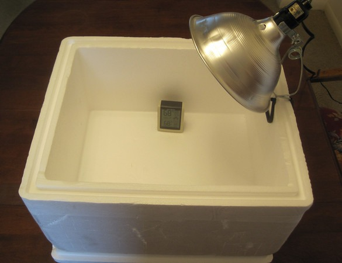
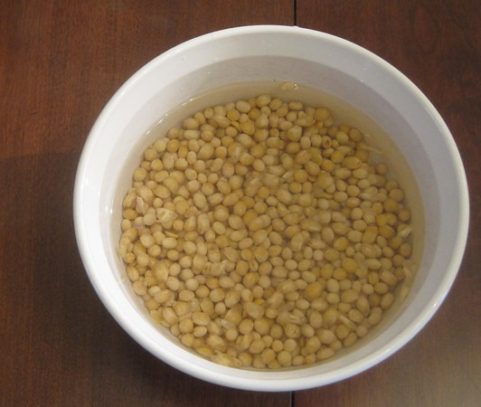
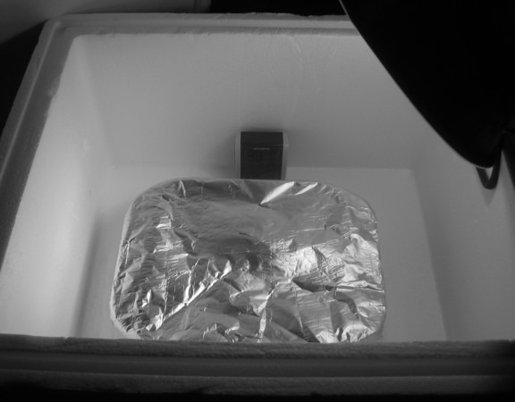
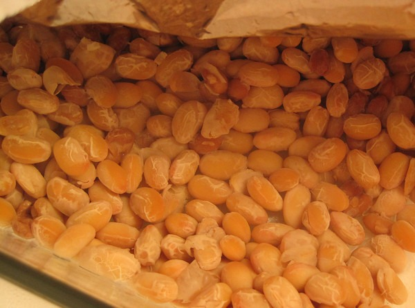
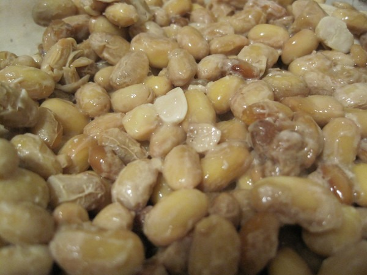

I want to thank Stephan at Biohacks.net for sending me an email about natto. I was well aware of how healthy the Japanese ferment was, especially its very high vitamin K2 levels. What I didn't know until I researched it further was the fermentation time was just 24 hours. For some reason, I had always assumed it was much longer.

Fellow Weston A. Price fans that read his book [Nutrition and Physical Degeneration](/2011/01/nutrition-and-physical-degeneration/) will recall the author theorized there existed a _vitamin-like activator_. That "Activator X" turned out to be Vitamin K2. Chris Masterjohn wrote [On the Trail of the Elusive X-Factor: A Sixty-Two-Year-Old Mystery Finally Solved](https://www.westonaprice.org/health-topics/abcs-of-nutrition/on-the-trail-of-the-elusive-x-factor-a-sixty-two-year-old-mystery-finally-solved/) for the WAPF site.

### You May Not Like the Taste

Natto is fermented soybeans. They are slimy and have a weird texture. Most people I talk to have either never heard of the food or dislike it. Natto was one of the few non-animal parts foods to make it into the book [Yuck! The Things People Eat](/2012/12/yuck-the-things-people-eat/). Here is how that book describes natto:

> Sticky, smelly, slimy and with an unpleasant aftertaste.

Although I agree the texture is odd, it has always tasted fine to me, especially over rice with some mustard or soy sauce.

### Why Make Your Own?

Before we proceed, I thought I'd mention my two motivations for making my own natto. The primary reason is the pre-packaged nattos sold at the Asian grocery store are loaded with crap we don't want to eat. Seattle's Uwajimaya is a nice grocery store and they sell probably 20 different brands of natto. However, they all have some nutritional defects. Soybean oil, MSG, wheat, or things listed I can't even spell. For my natto, I picked the cleanest one. I wanted it for culture. Once I was up and running, I wouldn't need to return to Uwajimaya for more natto.

The second reason I decided to make my own is that I love to ferment. It is a cool hobby. Check out my [Fermentation page](https://criticalmas.org/best-of/fermentation/) for other ideas.

Enough with the background, let us make some natto.

### Supplies Needed

-   organic soybeans - I got mine in the bulk section of a local grocery store
-   a single packet of natto for the culture
-   an incubator that you can use to hold a temperature of ~104 F for 24 hours
-   stockpot and steamer
-   foil
-   thermometer
-   container to hold ferment - I used a small glass Pyrex pan

I live in a city with a Japanese grocery store, so acquiring some pre-made natto was not a problem. Look for it in the refrigerated section. If you can't acquire natto where you live, there are places online that sell cultures, including eBay.

I used a little over 6 ounces of soybeans. This is a small amount, but I wanted to error on the low side for my first ferment, in case I messed something up. Spoiler alert: I didn't mess anything up. :)

### Build the Incubator

According to Natto King, the fermentation needs a stable temperature between 100-113 F. My oven is too warm as is my slow cooker. Although some slow cookers with a Warm setting might work with a water bath. See [Making Natto in North America on Umami Mart](http://umamimart.com/2010/02/making-natto-in-north-america/) for info on that method.

I decided to use a directed light inside a styrofoam cooler. I got the idea from chicken farmers that build their own egg incubators. Mine would be a simple version of theirs.

About 15 minutes after I turned on my lightbox lamplight, the inside of the cooler jumped to 107 F. Perfect

### Soak the Soybeans

After rinsing the soybeans, I covered them in filtered water and let them soak overnight. They will triple in size.

### Steam or Boil the Soybeans

I steamed the soybeans in my stockpot for 1 hour. You could also boil them or use a pressure cooker.

### Mix Natto Culture into Cooked Soybeans

Before I forget, while the soybeans were steaming, I put my Pyrex pan in the oven at 250 degrees to sterilize it. Got that idea from Umami Mart. Mix the cooked soybeans with the package of natto. I added a little bit of hot water to the packaged natto to loosen it up for stirring.

### Cover and Ferment

I covered the Pyrex with foil, poked a few holes so it could breathe, and set it into my incubator. I monitored the temperature and let it ferment for 24 hours.

_Here is the natto after 12 hours._

_Natto at 24 hours_

### Refrigerate and Wait

I had a small sample at the end of the ferment that I was pleased with. However, most of the online resources say that the flavor of natto continues to develop for a few days to two weeks. That it did. More gooey fun!

During the fermentation, I didn't smell anything. That could be because I used a small amount covered or maybe its odorous reputation is unwarranted. I've never considered it a stinky food. Slimy yes, stinky no.

Next week I will make my [second batch of natto](/2013/12/natto-2-fermentation-boogaloo/) using a culture from the natto I made. I will also attempt the WARM setting on my backup slow cooker, although I am concerned it will get too warm. I'll be certain to update this post with that information.

**UPDATE Feb 2020:** I was wrong about the packaged natto having nutritional defects. The natto was fine, the little packages of soy sauce was where the wheat and MSG were at. Just throw those packages away.

---

## Comments

### Griffin
*December 21 at 2013 at 9:21 PM*

MAS, kudos for trying natto and for experimenting with fermenting it yourself.  Sounds fun.  My wife and I ferment lots of veggies, kefirs, yogurts, and more.

For extra vitamin K2 and adventure, I also tried natto (only store-bought, so far).

The good news:  I can stand the taste, smell, and texture.

The bad news:  it gave me a headache.  I read that the stringiness is because the natto bacteria produces a polymer of glutamic acid.  For many years,
I've noticed that monosodium glutamate (MSG) and similar ingredients give me a headache, so that makes some sense, unfortunately. The internet has anecdotes of concerns about glutamic acid in natto.*

(Before buying, I carefully checked the ingredient list for ingredients that give me a headache and found nothing suspicious.)

Do you have ideas for headache-free natto?  For example, I could soak or rinse it with water.  Vitamin K2 is fat-soluble, and presumably poly(glutamic acid) has significant solubility in water. The problem is apparently in the natto itself (not an additive); otherwise, I'd think that homemade would be the fix.

Do other people who are sensitive to MSG also notice a reaction to natto? 

I already eat raw-milk kefir, grass-fed butter and liver, pastured eggs, fermented vegetables, fermented cod liver oil, and fish eggs for vitamin K2.  I know that list is long, but I want the world's best source, ha!  

*References:
Discussion of glutamic acid in natto and concern with glaucoma:  
Increased intraocular pressure from certain foods: http://www.fiteyes.com/blog/walk6981/dietary-amines-and-free-glutamates

---

### MAS
*December 21 at 2013 at 9:44 PM*

@Griffin - I do recall seeing a few brands without MSG. They exist. However, your best bet however would be to get the culture on eBay and do it yourself.

---

### Rajan
*December 23 at 2013 at 8:47 PM*

Mas,
Is it possible to ferment natto on beans other than soybeans and still have K2?  Like black beans?  I would think so, since I’m assuming the K2 and other health benefits of natto come from the bacteria.  Also does it have to be beans?  Could it work with vegetables like cabbage or carrots?

Thanks,

Rajan

---

### MAS
*December 24 at 2013 at 12:40 AM*

@Rajan - I have read how some people are using chickpeas instead. Here is one link.
http://infiniteoneness.empowernetwork.com/blog/home-made-natto-with-chickpeas-for-vegan-vitamin-k2-aka-activator-x/

---

### Massage
*June 23 at 2014 at 8:18 PM*

Hi Michael, it's Alison.  What do you think of using a legume other than soy for natto?

---

### MAS
*June 23 at 2014 at 8:28 PM*

@Alison - I haven't tried other beans but Cultures For Health says you can use use garbanzo and black beans. Let me know if you try it.

---

### Mario
*June 9 at 2015 at 11:11 PM*

I use black beans most frequently and must say they make the tastiest natto I've ever had. I reckon any beans would work and encourage experimentation.

---

