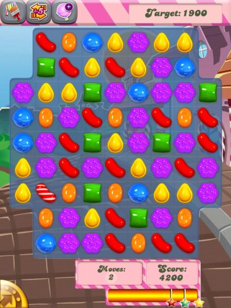

I hesitate to post this, but I need to hear from others. As some of you know I sometimes experience night headaches that wake me up in the early hours of the morning. When I [stopped quantified self](/2013/11/quantifiable-self-form-journaling/), my rate of headaches dropped considerably. For a few months things were going OK.

Then I read about how the [Candy Crush Saga](https://en.wikipedia.org/wiki/Candy_Crush_Saga) game was sweeping the country in popularity.

Normally I don't play video games, but I like to have some awareness of popular pop culture. For example, I watched an episode of Jersey Shore just so I would know what a [Snooki](https://en.wikipedia.org/wiki/Snookie) was. With video games, I watched my nephews play _Call of Duty_ and I myself played a few rounds of _Angry Birds_. So I decided to see what _Candy Crush_ was all about.

_Candy Crush Saga - The crack of video games_

_Candy Crush_ turned out to be the most addicting game I've ever played. And I don't even like video games. When I installed it, I figured I'd knock out a few levels and then never play again. Like I did with _Bejeweled_ a decade ago. That was the plan. But this games gets in your head. I couldn't stop playing. Thankfully, I never connected the game with others on Facebook.

During the month of December I installed and uninstalled the game three times. I watched video tutorials on YouTube to guide me through levels. I was seeking out _Candy Crush_ tips from friends and family. And I was getting way more headaches. I was fully prepared to blame the increase in headaches on the season. Shorter days means I tend to consume more caffeine and caffeine in high levels is a known trigger for me. But I uninstalled _Candy Crush_ two weeks ago and my headaches have dropped all the way down to pre-_Candy Crush_ levels.

The article [13 Surprising Headaches Triggers](http://www.care2.com/greenliving/13-surprising-headache-triggers.html) by Diana Vilibert provided a clue.

> If you’you've ever found yourself slouching over your phone playing Candy Crush for hours, you may want to give it a rest. The brightness of your screen activates the retina and the nerves behind the eye, which can cause eye strain and head pain—and the same goes for your laptop.

I was playing _Candy Crush_ from my iPod, which is a device I mostly use for music and only look at briefly. I was suddenly spending an hour or two, often before bed bent over playing. During the time I was playing the games the most, I got what I am calling _Candy Crush Elbow_. Crushing candy is tough work. ;)

I've been clean and _Candy Crush_ sober for two weeks now and am feeling better. Anyone else get headaches from this game or others?

---

## Comments

### Beth@WeightMaven
*January 15 at 2014 at 1:16 AM*

I've been playing Candy Crush on the iPad (now iPad mini) for a month or two and am not having problems. That may be because I'm not prone to headaches in general, or it may be because I tend to not play too close to bedtime (and I have f.lux on my mac).

---

### garymar
*January 15 at 2014 at 7:00 AM*

Are you happy that you now know what a Snooki is?

---

### Pauline
*January 15 at 2014 at 1:30 PM*

I had Bowen treatment for what I thought was fibromyalgia in shoulder, neck and running down my arm into my hands.  Through some research I read and bought Trigger Point Therapy Workbook by Clair Davies, which explained a lot of pain being caused from computer work and sitting with the body in .   But I had already realised this from going on Macbook Air blogs and reading about people having problems from keyboard and set up of macbook air laptop on lap and hand/wrist pain etc.  I now mostly type at my desk, no more on laptop (though I am lapsing today).  After two sessions of Bowen my pain has mostly resolved and it is all computer and workspace related.  I realised the computer forces our bodies be held in fixed positions which puts the whole posture out from head/neck, to arms wrists and back, even down into legs and feet.  The restricted movement cause our muscles to stiffen in odd positions and then the whole body compensates for this with as other muscles have to overwork and carry the misalignment.  Bowen is fantastic, very gentle but very healing.  It works on the covering of the muscles causes them to relax and this treatment, when it is done right brings about a very deep level of relaxation and re-alignment all over the body.  I can't recommend it enough.  I only needed two treatments.  The one before Christmas was magical I have never felt more relaxed and I don't normally have any massage/body therapy. I was in so much pain when I went in to the session but it released over the weeks and as I learnt to use my computer correctly and watch my posture, alignment.  The second treatment (she notices if knots in muscles have released - there was so much improvement overall in tension and new relaxation in the body) she felt I should only come back if I felt I needed any remedial follow up later in the next month or so.

---

### Pauline
*January 15 at 2014 at 1:31 PM*

sorry, a lot of pain from sitting with the body in very fixed stiff positions.

---

### Anemone
*January 15 at 2014 at 4:17 PM*

Too much computer time is my biggest source of headaches. I don't need to play computer games either (and don't) - scrolling rapidly is the biggest trigger.

---

### MAS
*January 15 at 2014 at 6:38 PM*

@Beth - I wish I could put f.lux on my iPad. AAPL doesn't allow it. I have it on my WIN 7.

@Garymar - I do a lot of grocery shopping, which means standing in line looking at tabloids. Knowing the difference between a Snooki and Kardashian increases the enjoyment of my grocery experience. :)

@Pauline - Preventing the pain in the first place is probably the wisest path. This was the 1st program where I would spend a considerable amount of uninterrupted time in a hunch position.

@Anemone - I hadn't thought about how high levels of movement on the screen could be the trigger. This might explain why an hour of Candy Crush feels worse than 2 hours in front of a spreadsheet or text editor.

---

### Roberta
*January 15 at 2014 at 10:39 PM*

I've had similar addictions (all currently in remission, thank goodness). If you install it again, buy some amber colored goggles. I wear them every night after 7 if I'm going to be using some sort of device. They helps!  

http://www.amazon.com/Uvex-S1933X-Eyewear-SCT-Orange-Anti-Fog/dp/B000USRG90/ref=sr_1_1?ie=UTF8&amp;qid=[phone removed]&amp;sr=8-1&amp;keywords=amber+goggles

---

### Txomin
*January 16 at 2014 at 12:11 AM*

Sure. I've always gotten headaches, even nausea, from playing 3D games. Pity too as some are quite good. But I'm not a gamer even though I have designed some timewasters over the last three decades. In general, I don't touch the stuff any more except for certain tower defense types.

---

### Anthony
*January 16 at 2014 at 8:34 PM*

Hey MAS

I have some experience with this. Here is what I recommend.

A) Find a professional color calibration profile for your laptop/desktop monitor. Typically a photographer or graphic artist somewhere in the world has your same monitor - and also, the tools to properly calibrate the color profile. Find that profile, install it, and enjoy after the initial ~24 hour period of awkward adjustment (you'll never go back after you get past that hump).

B) If you can't do the above, calibrate the screen yourself using the software tools available on your OS or the monitor itself. Tip : when done even approximately right, the screen is much more red than most people would think is accurate, and much less blue.

C) Pass on those Uvex glasses linked by another commenter. They present far too much of a color-distraction. Instead do an Amazon search for "gamma ray glasses". These won't affect brightness much but will help fix everything else going on with your digital devices WRT your eyes. Search for "gunnar glasses" if you feel like buying a high quality pair.

D) If you are really concerned with brightness, pick these up instead : http://amzn.to/1i2ggvf   . My fiancee says they look horrible on me, but they work as good as the Gamma Rays, only cost a few dollars more, and have a darker tint, as well as a other features that help reduce glare/extra light (above and beyond the gamma rays). These glasses are also heavier though, and I would recommend buying 99 cents worth of gel based eyeglass nose-pads to replace the stock plastic ones. (You can get these at any eyeglass store).

Note : I own both Gamma Rays as well as the glasses from item D. I like switching back and forth throughout the day, but stick to the darker tint glasses at night.

E) Blink more often, look away more often, even if only for 10 seconds to focus on something other than the screen, especially something distant.

---

### MAS
*January 16 at 2014 at 10:49 PM*

@Anthony - Lots of great tips. I took your advice and got a new calibration profile file for my monitor. Looks a little sharper. Not as washed

The issue with the iPod - where I was playing CC -  is Apple doesn't allow applications like f.lux to adjust the colors. 

I think the headaches were not from the brightness, but from the hunched position, moving objects and less blinking (your other tip). Since I'm not really a video game guy, I just removed the application and all seem to be fine again.

---

### Geoff
*January 18 at 2014 at 9:21 PM*

Damn it, MAS.  You have no idea how much time I wasted playing Candy Crush Saga this week after you wrote about it.  It is the most addicting, crack-like game I've ever encountered.  Something about the bright colors. And the <strong> sounds </strong> -reminds me of Yello's classic "Oh Yeah!"  Fortunately no headaches for me - I must not be gaming hard enough.  I am seeing it in my dreams though.  I need to detox - once I get past the next level.

---

### MAS
*January 19 at 2014 at 3:01 AM*

@Geoff - I warned you. DIVINE! TASTY! Oh Yeah!

---

### Tammie
*February 17 at 2014 at 12:08 PM*

I had bad headaches while playing candy crush last year. Stopped playing for a few months and they went away. Recently,  I started to play again and the headaches returned. Now, Im thinking, the seizures that I had last year were triggered by the candy crush game. No more games for me until I discuss with my dr!

---

### MAS
*February 17 at 2014 at 5:36 PM*

@Tammie - Glad to hear you were able to isolate the trigger. Sorry it had to be Candy Crush, as it is super fun. :)

---

### Tammie
*March 7 at 2014 at 1:36 PM*

Went to doctor and he agreed 100% that the seizures I had was caused from the flickering lights on candy crush and pet rescue. After being out of work for 8 months I can now return. The problem is they replaced me already. I wished I would have figured this out months ago!!

---

### Jacqueline
*March 24 at 2014 at 10:24 PM*

I agree - it can trigger seizures. Candy Crush is not the only game I experience it with but yes it does cause them in some people.

---

### mel131
*May 13 at 2014 at 5:58 PM*

The rainbows in level  306 of candy crush caused me to visit the emergency room last night for a seizure.  I will stop playing asap.

---

### MAS
*May 13 at 2014 at 10:23 PM*

@mel131 - Wow! Glad I never made it out of the 30s.

---

### Maria
*July 1 at 2014 at 4:32 PM*

I am on the 311 level and the changing candies are giving me headaches, I never had headaches before level 300's, do I give up, so much hard work lost if I do. I will give it afew more days and then see.

---

### Laura
*October 21 at 2014 at 2:42 PM*

SOOO glad you posted this!  I have been wondering why my headaches have morphed into pounding headaches.  Yeah, I blamed the season change, too!  (And thought I avoided the Candy Crush saga, but I am apparently addicted to its cousin!).  Glad I think I found the source.  Thanks for your post :-)  L

---

### MAS
*October 21 at 2014 at 3:03 PM*

@All - After Candy Crush I switched to playing computer backgammon, where I can take as long as I want to make a move. Pieces move slower too. Although not as fun as Candy Crush, it is relaxing and I don't get headaches playing it.

---

### KK
*December 2 at 2014 at 3:00 PM*

Developed a migraine with aura while playing Candy Crush in bed with glasses off, ie about 2 inches from my eyes. Haven't had a migraine in 2 years. I knew something was wrong when those purple candies started to look utterly sickening.....

---

### mary
*September 29 at 2015 at 8:23 PM*

I have been having vision problems ever since christmas of last year (when I got my new kindle HD) and the only reason I wanted it was so I could play candy crush. I immediately downloaded it and started playing. The time I spent playing increased and I became much more addicted. I noticed that after about a week of playing 2-3 hours a day that I started having visual problems like sensitivity to movement on the TV like it was making me almost motion sick, feeling as though my eyes were focusing and unfocusing on their own every few seconds, with or without my glasses. The number of headaches I had also increased and they were different from the typical headaches I had pre-kindle. Some days are better than others and it's been almost a year now having to deal with this weird dizzy feeling that seemed to just develop out of nowhere. My doctor asked me if anything different was introduced into my life around the time the symptoms started. It dawned on me that the only thing different in my life is that damn kindle and candy crush. I have decided to stop playing it for a few weeks and see if the symptoms go away. I will keep you posted.

---

