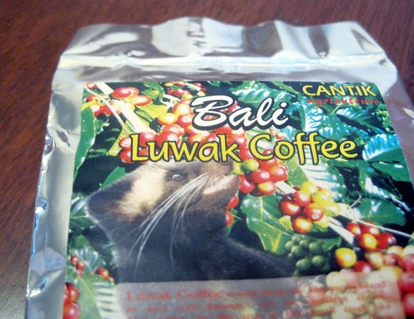

Well I can cross Luwak coffee off my food and beverage bucket list. A friend of mine returned from Bali with a sample of Bali Luwak coffee. When it comes to interesting foods, I have little fear. I'll try just about anything: [testicles](/2012/06/cajun-style-sheep-testicles/), [uterus](/2012/10/pig-uterus-still-an-offal-idea/), [bugs](/2012/12/potato-soup-with-bugs/) - bring it on! Yet when it comes to coffee, I am a serious snob. The thought of gross coffee makes me gag more than some random animal part from the pages of [Yuck!](/2012/12/yuck-the-things-people-eat/) For those unaware, [luwak coffee](http://ecofriendlycoffee.org/toddy-cat-coffee-beans/) is made from beans that have passed through the Asian palm civet animal. The beans are then cleaned and roasted. I wonder who was the first person who thought it was a good idea to recover coffee from animal waste. Often this coffee is quite expensive. When it first hit the scene, reports were the coffee was extremely good. Over time the lore of luwak coffee has faded. Other animals have gotten into the game. Reports of [animal cruelty](http://www.dailymail.co.uk/news/article-2543051/Retailers-ban-luxury-cat-dung-coffee-campaign-treatment-animals-rainforests-Indonesia.html) have also tarnished the image of this exotic coffee.  My first fear was that beans would be over roasted. This is the problem with a lot of tourist coffees (ex: Hawaii). Fortunately, the beans were roasted a light medium. This is what you want when you are trying to detect subtle flavors. Lighter roasted coffee also last much longer. Dark roasted coffee usually goes stale in under a week. Lighter roasted coffee stay fresh for weeks. On the plus side the Luwak coffee appeared to be roasted to the color level I'd expect from a delicate flavored coffee.  A few beans were a little darker, but overall, the roast was even.  I prepared the coffee using the [Aeropress](https://ineedcoffee.com/aeropress-coffee-maker-tutorial/) and as soon as I added the hot water I could tell there was going to be a problem. There was zero bloom. Gas will escape from fresh coffee. These beans were stale. I'd estimate they were probably 2+ months old. There was no odor - good or bad. The taste was neutral. Smooth but without any flavor notes - probably due to the age of the beans.  I didn't have high expectations for the beans. Nobody I respect in the industry cares for civet coffee. It is a novelty at best. Still if I was stuck at a tire shop in the middle of the country waiting for service and I had to pick between a Charbucks French Roast or stale Luwak, I'd take the Luwak coffee.

---

## Comments

### Stephan
*January 30 at 2014 at 8:04 AM*

How much did you pay for that bag?

---

### MAS
*January 30 at 2014 at 1:55 PM*

@Stephan - Nothing. It was a gift.

---

