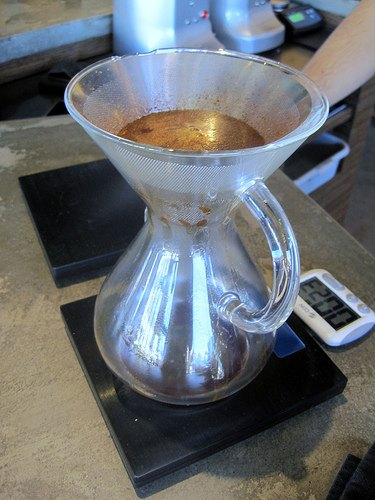
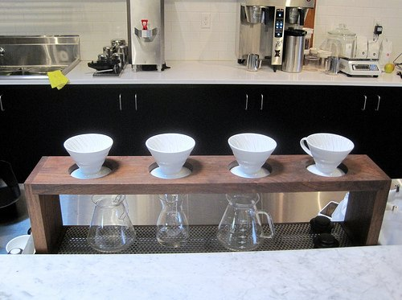
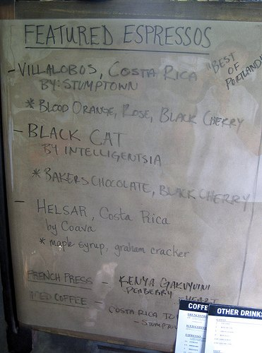
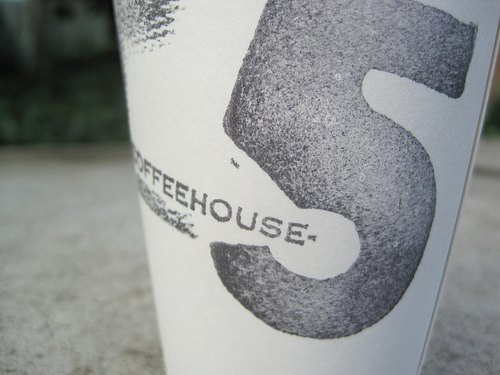

_This post was written after a 2010 trip to Portland._

Once Mark Prince over at _CoffeeGeek_ published his guide to the best micro-roasters and cafes in Portland, all I had to do was book a hotel and drive south. There is a tradition in travel literature where the traveler will try and retrace the steps of the author. Do a regular vacation or you can _follow in the footsteps_ of Hemingway. Well, my vacations are about trying great espresso and I had been meaning to visit Portland, Oregon so the _CoffeeGeek_ guide was perfect timing. Lonely Planet for espresso drinkers!

I decided not to read the article until I returned home. Instead, I would fill my GPS with all the locations mentioned in the guide, have my own experiences and then see if my espresso vacation was similar to his.

### Some Background

Throughout my Portland espresso vacation, I would hear the term _**single origin**_ over and over. This means that a particular coffee offering comes from a single geographic origin, as opposed to a blend that combines different regions. Espresso is traditionally made from a blend of different coffees. Finding a single origin coffee that can stand on its own as an espresso is difficult. Not impossible, but difficult. Was Portland able to make outstanding espresso using single origin coffees? Let us find out.

### Coava Coffee - 1300 SE Grand Ave.

My first stop was _Coava Coffee_. This was a wide open space inside a warehouse type building. They served two single origin espressos, one single origin decaf espresso and two single origin Chemex brewed coffees. During my two visits here, I tried both espressos, the decaf, and a Chemex. The highlight was the [Chemex](https://ineedcoffee.com/chemex-coffee-brewing-history-and-tutorial/), which is brewed using a metal filter called the KONE, which they designed themselves. No more paper residue. The Chemex was outstanding as was the decaf espresso. The two single origin espressos were also good.

 _Coava Coffee - Coffee Menu_

 _Coava Coffee - Chemex and the KONE_

### Sterling Coffee Roasters - 2120 Northwest Glisan St.

_Sterling_ is more of a large kiosk than a coffee shop. They have a 1 pound roaster on site and they offered two single-origin espressos. I had the Washed Yirgacheffe, which as claimed tasted like peaches. Very good espresso and super friendly baristas.

Upon leaving I noticed that they offer one espresso for $2, but you can get both offerings for $3 (a flight). I love it. I wish Seattle had something similar. I'd sign up for that flight every day! Another thing I love about _Sterling Coffee_ is that they post a photo of their coffee offerings daily on their Facebook page.

 _Sterling Coffee_

 _Sterling Coffee - Coffee Menu_

### Heart Roasters - 2211 E. Burnside

_Heart Roasters_ is another great neighborhood coffee shop with two single-origin espresso offerings. I had one from El Salvador that was very good. _Heart_ also offered pour overs and siphon coffees. The one suggestion I would make here is to post some information on the offerings. Excellent coffee shop.

 _Heart Roasters - Espresso Machine_

 _Heart Roasters - Pour Over Station_

### Ristretto Roasters - 3520 NE 42nd Ave

By this point, I was getting a little tired of the single origins. I desperately wanted an espresso blend. Lucky for me, _Ristretto_ offered both a blend and a single origin. The Beaumont Blend delivered. It gave me just the lift I needed to make it to my next espresso stop.

 _Ristretto Roasters_

### Barista - 1725 NE Alberta St.

This place was not mentioned in the _CoffeeGeek_ article. Instead, I got this suggestion from Jason at _Caffeinated Conversations_. Excellent call Jason. This place was outstanding. They offered three espressos from three different roasters. I love that. This place had a great wide-open feel with plenty of outdoor seating. I had a Villalobos, Costa Rican single origin espresso which was good. I also tried their decaf espresso, which was very good.

 _Barista - Alberta_

 _Barista Espresso Menu_

### Water Avenue Coffee - 1028 SE Water Avenue

If you twisted my arm and said I had to pick a favorite place in Portland it would be _Water Avenue Coffee_. Absolutely beautiful coffee shop, extremely friendly staff, and excellent coffee. I had an espresso and pour-over here. This place is closed on the weekends, so plan your trip accordingly.

 _Water Avenue Coffee_

### Coffeehouse-Five - 740 N Killingsworth Street

My last stop before returning to Seattle was at _Coffeehouse-Five_. Like _Barista_, this place had guest roasters. I got to try the Big Truck Espresso Blend from _Olympia Coffee Roasting_, which was stellar. They also had a single-origin option. Their decaf espresso from Peru was also outstanding.

 _Coffeehouse-Five_

### Missed Places

When I visited Vancouver in 2009, I was able to visit nine places. In Portland, I visited seven. I needed to stay in Portland one more day because I didn't get around to visiting _Extracto Coffeehouse_, _Public Domain Coffeehouse_, and _Spella_. I am fortunate to live just 3 hours away from Portland, so returning will be easy enough for me. Since _Stumptown Coffee_ has been roasting in Seattle for over two years, I didn't feel the need to visit them.

### Overall Thoughts

I loved the espresso scene in Portland. You can feel the excitement when you go into the coffee shops. Like Mark Prince at _CoffeeGeek_, I tend to prefer espresso blends over single origins. However, I sort of like the _unplugged_ stripped-down approach to coffee. Portland isn't trying to copy anyone else. They are doing their own thing. I really look forward to returning in the coming years to see how they are progressing.

### Resources

[Portland Coffee Scene 2010](https://web.archive.org/web/20201109032612/http://coffeegeek.com/opinions/showreports/09-14-2010) - by Mark Prince at CoffeeGeek

[Full Photo Gallery](http://www.flickr.com/photos/digitalcolony/sets/72157625102483228/) - For this post.