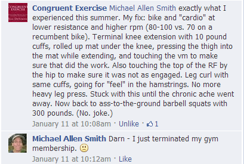

It has only been one month since I stopped going to the gym, but I signed back up today. In the post [Stepping Away From the Glitter...Again!](/2013/11/stepping-away-glitter/) I ranted about how hot my glitter gym was and how I couldn't take it anymore. I would go outside and do [Hillfit](/2013/07/hillfit-2-0-a-zero-budget-approach-to-high-intensity-training/) instead. That was the plan and it would have worked except for one thing. My knee isn't getting better. Since spring it has been [bumming me out](/2013/10/left-knee-bumming/). Rest isn't working. It isn't even that bad. I can walk for 7 miles with no pain, but driving an hour or more with my stick shift car causes minor soreness. I have stability issues trying to do a wall sit or bodyweight squat in the bent position, so I avoid those movements. I've done foam rolling, braces, topical magnesium, rest, ice, heat, and had taken copious amounts of MSM, gelatin, and Zyflamend. It hasn't gotten much better. A few days ago I was reading a post on the Congruent Exercise Facebook page about the leg extension exercise when I asked Bill about what he'd do for my type of knee pain. Here was his response.  Later in the thread, the _Framework for the Knee_ book was recommended, so I picked up a copy. I went through it quickly and realized that sitting on my ass waiting for my knee to heal wasn't going to work. Like Bill suggested, the book was clear that I needed access to a stationary bike. Dr. DiNubile writes about cycling:

> It is the cornerstone of knee rehabilitation because, from an exercise specificity standpoint, it targets the ever important quadriceps muscle better than any other aerobic-type exercise, building both strength and endurance.

After reading this, I closed the book and returned to my old gym. With hat in hand, I resigned up. The gym is still too hot, but the focus now is on knee rehab. My gym is only $16.43 a month, so it is a small investment to see if stationary cycling does the trick.    FrameWork for the Knee: A 6-Step Plan for Preventing Injury and Ending Pain (FrameWork Active for Life) by Nicholas A. DiNubile

---

## Comments

### charles
*January 17 at 2014 at 1:23 AM*

Have you seen a doctor?  Had an MRI?

Have you investigated prolotherapy?

---

### MAS
*January 17 at 2014 at 1:28 AM*

@Charles - No, no and no. 

As I've stated many times, I do not go to doctors unless it is an emergency situation. 

I'll try cycling first.

---

### Adam
*January 17 at 2014 at 3:11 AM*

Best of luck Michael, I'm very interested to see how this turns out for you. I've had a little bit of knee discomfort too lately and instinctually was thinking of picking up a used Schwinn Airdyne (it specifically looks good for HIT). I regularly bike outdoors during the summer and am now curious (since you posted this) if my knee pain is at all related to my time off from biking.

---

### Aaron
*January 17 at 2014 at 3:37 AM*

I've got one of those stationary resistance trainers you hook the back wheel of your bike up to that you could use in your apartment.  I'll bring it up for you if you want to use it (my brother also has one, so we have two here right now).

---

### MAS
*January 17 at 2014 at 3:57 AM*

@Adam - I will give an update in a month or so.

@Aaron - Wow, Thank you for the offer. However, I don't own a bike, so I'll pass on the offer. If you do visit Seattle, I'd be happy to give a tour.

---

### thomas
*January 17 at 2014 at 6:02 AM*

just read this and thought of your site.

http://www.dailymail.co.uk/news/article-2540945/Kevin-Ogar-injury-CrossFit-athlete-left-paralyzed-waist-having-spine-severed-dumbbell.html

---

### charles
*January 17 at 2014 at 3:32 PM*

"I do not go to doctors unless it is an emergency situation.

I’ll try cycling first."

SO - if you have ligament and/or tendon damage cycling my damage it further!

---

### MAS
*January 17 at 2014 at 3:37 PM*

@thomas - probably worthy of its own post.

---

### Marybeth
*January 17 at 2014 at 4:27 PM*

I have RA and do a spin class 2xweek. I truly believe it has helped me with keeping my knees in shape. And I agree with the lower resistance and higher RPM of 80-100.

---

### David
*January 17 at 2014 at 6:28 PM*

He does give great tours!

---

### glenn
*January 17 at 2014 at 11:35 PM*

Might be worth experimenting with indoor rowing as well - on the lightest setting. It could possibly be beneficial to do a variety of low stress knee movements - not just cycling.
Best of luck!

---

### MAS
*January 18 at 2014 at 5:00 AM*

@Glenn - Today I started with 5 minutes bike, 3 minutes rowing, 5 minutes inclined treadmill. I will be rowing. It was the perfect amount of movement for my knee.

---

### BigTex
*January 18 at 2014 at 3:20 PM*

Just buy and bicycle and tour around Seattle...it will be much more enjoyable!

---

### Matt
*January 20 at 2014 at 6:23 PM*

Hi Michael,

I too have been suffering with knee pain.  I went to physical therapist and he recommended the stationary bike, which has been helpful, but also other strengthening exercises which are helping are:

Step ups and step downs off of a box, not too high. The step downs are more stepping off the side and back, not letting  your hips collapse and trying not to collapse at the bottom.
Lunges, and side lunges
lying on your side and lifting your leg up and back.  I see more women than men do this but it helps strengthen the adductors and glutes which support the knee.  You can also try the machines where you open your thighs and the one where you close them.
One legged balance exercises, either on the floor with your eyes closed or open, or on one of those half bosu balls.

I also resumed using superfeet, especially when I know I will be on my feet for a long time.  I feel that these have helped a lot, possibly keeping things aligned and supported while I heal.

The pt also did some massage which seemed to help.  Ice and heat could also help with inflamation/ circulation.

Good luck!  I always enjoy your blog!

Matt

---

### MAS
*January 20 at 2014 at 7:17 PM*

@Matt - Thanks for the tips. I have noticed that when taking 2 steps (going up) , I feel a lack of stability, so any step ups I do, I'll need to be careful.

Glad to hear the bike worked. I did another 7 minutes today. When i got home I did 10 minutes of ice.

---

### thomas
*January 30 at 2014 at 3:28 AM*

Looking forward to more comedy stories.  There was a guy at my gym who has been working out for years but still looked the same, the funny thing about him was that he would always bring up something inappropriate no matter what you initially talked to him about.  

I always liked to say "hello" and then just see how long it would take before he mentioned something pervy.  It was usually pretty quick because he would always comment about women checking him out.  However, I asked one girl if she ever did and her reply was "Ewwww."

Keep an eye/ear out for crazy gym stories!

---

### MAS
*January 30 at 2014 at 4:03 AM*

@thomas - The gym I go to now is rather dull when it comes to Tales From the Glitter Gym. I was there for over a year and nothing. Contrast that to 24 Fitness or that gym in Queen Anne, where I saw something funny every week.

---

### Sal
*February 1 at 2014 at 10:41 PM*

Hi Michael,
I'm working on my bad knee as well and here are a couple of sites with some good info http://savingmyknees.blogspot.com
http://dougkelsey.com/knee-cartilage/
Good luck

---

### MAS
*February 2 at 2014 at 6:17 PM*

@Sal - thanks for the resources!

---

