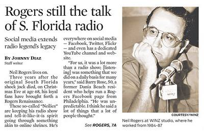

One of the web projects I am involved with is the tribute site to radio legend Neil Rogers. You may not have heard of him because he broadcasted from Miami and was never syndicated. People in the industry knew who he was and greatly respected him. Howard Stern [wanted him for his Sirius channel](http://www.youtube.com/watch?v=wMX99B3YE3A) and Phil Hendrie recently said this about Neil:

> The best I ever worked with. And the greatest goddamned talent I ever heard.

You can read more about Neil on [his Wikipedia page](https://en.wikipedia.org/wiki/Neil_Rogers). Even though he often talked about politics or sports (mostly hockey), his show wasn't like the talk radio of today. He was an authentic stream-of-conscious broadcaster. He was funny. He was angry. He was real. Not every show was great, but when he was on, he was brilliant. Neil Rogers broadcasted in Miami from 1976 to 2009 and died in late 2010. 

### Becoming A Fan of Neil

When I moved to the DC Metro area in 1998, I had an office job where I could not get a radio signal. We also couldn't stream audio. So when I was home I searched the internet for shows to download that I could burn onto a CD and take to work with me. I recalled someone in Tampa telling me about this show in Miami that I would enjoy. That was the Neil Rogers Show. From his website, I was able to download shows from the archive. Even though I never lived in Miami, I became hooked. I loved his rants about local politics. He had a way of making boring topics entertaining. I listened to the show until late 2000. The show was becoming increasingly focused on national politics, which I found less entertaining than what initially drew me to the show. So I stopped listening. _Classic Neil rant - [Choke the Coach](https://www.youtube.com/watch?v=zXONvNqHSF0)_

### Building an Online Presence

In 2011, I was poking around on the internet and learned that Neil had died. I found The Neil Rogers Facebook group, which included a number of fans along with people who worked with Neil. I joined the group. Then I shared with the group that I still had one of those burned CDs I took with me to the office back in 1999. I had 60 full shows. I set up an account with a free file sharing service and soon others were downloading these shows. The Facebook group soon began discussing where we might get more audio. Neil had his own website called _NeilRogers.com_, which was run by a man named Eric Harold out of Orlando. I guessed that if anyone had old shows, it would be him. He ran the site at least going back to 1997 and based on my assessment of his technical skills, he most definitely would have saved backup copies of all the Neil Rogers shows from the digital era (1997-2009). Just when I was about to reach out to Eric, I discovered he had recently died. Young man too. I believe he was in his 40s. Eric was a one-man operation. At this point, I realized it was just a matter of time before the _NeilRogers.com_ site went dark. Servers need human intervention and they also need someone to pay the electric bill. Using a download program I was able to grab all the audio from the site, which were the bits he played. A few months later the site went dark. There was no backup name on the domain registration. No one knew anyone associated with Eric. To this day the data on that server or any backups remain lost. While all this was going down, I created a quick one-page website using Google Sites. It pointed to the Facebook group and where others could download the few shows we had recovered. Using archive.org, I recovered a few more hundred shows by pulling up snapshots of the official site from years ago. Then others started coming forth with saved shows. The archive was growing. In April 2012, YouTube notified me that my uploads would no longer be restricted to 15 minutes. I could now upload unlimited-length shows. This seemed too good to be true, so I tested it with some full-length Neil shows, and it worked. Soon, all the MP3s that had been recovered for download were uploaded to YouTube. Neil fans found the shows and joined the Facebook group. This connected us with others who had more audio to share, and the project grew. Google is a weird beast. For reasons I'll never understand, they never indexed the Google Sites page, so I created the [NeilRogers.org](https://neilrogers.org/) site. Over time, I got a Twitter, Google+, Flickr, and Pinterest account for the site. The audio continued to come in and working closely with a man named John in Florida, who is skilled in working with tapes, the archive now holds over 1,700 Neil Rogers shows going back as far as 1987. Along the way, a few hundred other shows from other South Florida hosts were discovered and uploaded. 

### Lessons Learned

I'm not going to say much more about the show. You'll either like it or you won't. The important lesson of this story is about how easily important data could be lost without a backup plan. We were able to save a large number of shows from a legendary broadcaster before they were lost forever. From the start, I knew I didn't want to make the same mistake Eric did. Every show is saved to multiple servers. There is a document shared with a core inner group that includes all account and password information. If anything happens to a member of the core, there is a documented procedure in place. There is almost zero risk that these shows will ever be lost now.

### Legacy

In the past year or so, over 1,000 new members have been added to the Facebook group. Almost 800 have subscribed to the YouTube channel, which had over 2.5 million minutes of audio listened to in 2013. As someone with both web and data mining experience, this has been a highly rewarding project for me. Friends, co-workers, and fans of Neil have been highly appreciative of the audio restoration project. An article about this project appeared on the front page of both the Sun-Sentinel and the Miami Herald last weekend. Although the article was very positive, it was chock full of errors, which is one of the reasons I wrote this post.  If you are a fan of Neil Rogers and would like to share audio with the project, visit [NeilRogers.org](https://neilrogers.org).

---

## Comments

### Geoff
*January 12 at 2014 at 2:55 PM*

MAS - In college I was a radio DJ, and I believe my time in Miami (1996-2006) may have briefly overlapped with your time in Tampa.  Even though Rogers' show typically wasn't to my taste, I do recall listening to him during the Elian Gonzalez situation and in the days following the 2000 Presidential election.  Thanks so much for helping curate his broadcast legacy.  Too much of the work of some classic radio personalities has been lost.  You are doing a great service.

---

### MAS
*January 12 at 2014 at 8:15 PM*

@Geoff - Thanks. I too thought the show was the best between the period of Monica Lewinsky and Elian Gonzalez. You are correct, I was in Tampa from 1994-1998.

---

### Eric
*March 1 at 2014 at 3:32 AM*

Neil, god!  Miss you, Neil, as well as Hank and Mad-dog.  And Jorge, too! :)

---

### MAS
*March 1 at 2014 at 3:44 AM*

@Eric - I just uploaded our oldest show to date from Feb 1985. 

FYI - Jorge is still broadcasting at http://www.thejorgerodriguezshow.com/

---

### Jon
*January 11 at 2015 at 7:12 PM*

OY!

---

### Steve
*October 31 at 2024 at 6:54 PM*

Does anyone know what happened to neilrogers.org?  Please email me at [email removed]

---

### MAS
*October 31 at 2024 at 7:07 PM*

@all - here is a backup link while I try to get the main site back online.
https://neil-rogers-astro.netlify.app/

---

