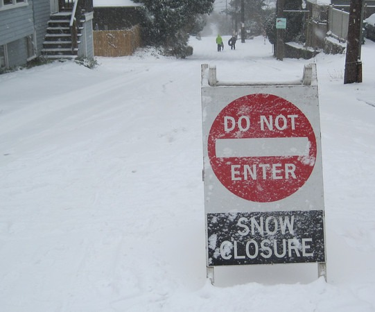

My first exposure to the idea of Intermittent Fasting came from the original Paleo essay written by Art De Vany. I read it in December 2007 and as 2008 progressed, I started tinkering with short fasts. After more than a decade of eating every few hours, it was a radical change. In late 2008, I read [Eat Stop Eat](/2011/01/eat-stop-eat-a-guide-book-for-intermittent-fasting/) by Brad Pilon and began experimenting with 1-2 fasts of 20-22 hours a week.

Although the fat loss that came from IF was a pleasant side effect, one of the main reasons I began doing IF was for autophagy. For a full discussion on the topic, read the article [Going "Green" with Autophagy as Your Evolutionary Health Care Plan](https://web.archive.org/web/20220523073856/https://theiflife.com/green-autophagy-evolutionary-health-care-plan/) by  Mike O'Donnell. I also have a description written by Art De Vany himself in the post [Autophagy and Loading Trucks at UPS](/2009/04/autophagy-and-loading-trucks-for-ups/). In short, autophagy is the cell's ability to recycle damaged material when deprived of nutrients.

Sounds wonderful, right? It might only be half the equation though.

In all the articles I've read on IF, mostly from Paleo writers, the rate of the cell is implied as being constant. By constant I mean that the actions we fasters take do not impact the rate at which the cell performs its job. That might be an inaccurate view.

Before I explain myself, I'd like to revisit an IF experiment I did in early 2011 where I did a daily 16-hour fasting (_Leangains_ style) for 70 consecutive days. You can read the [entire post](/2011/03/intermittent-fasting-70-day-review-of-the-leangains-method/) if you like, but the short version is it started very well but ended poorly. Towards the end my body was cold, I was tired and caught a cold after going through a long period of being in top health.

I don't want to rehash the criticisms I got in comments and emails. Some of it was valid. Some weren't. At the time, I chalked up the problems I experienced to a [lack of randomness](/2011/03/intermittent-fasting-spontaneous-and-random/). The body was predicting times when I would fast and would down-regulate my energy via lower body temperature and just being tired. I now think that is a partial explanation.

### The Bioenergetic View

In the past two years, I have been reading more about body temperature and how it relates to health. Danny Roddy, [Matt Stone](/2013/03/diet-recovery-2-and-the-turn-up-the-heat-experiment/), and Andrew Kim have written about how increasing body temperature results in positive health outcomes. A highly functioning cell is working under less stress and that reducing stress is paramount to excellent health.

In November, Andrew Kim posted _Diet Dogma Rears Ugly Head Again: Become a Fat Burner, Eat Your Own Crap, and Live Longer_. Hopefully, he won't take down this post, as he has with so many of his previous writings. **UPDATE 2017:** It appears Andrew Kim took down his entire site. Here is a [copy](http://50kzone.blogspot.jp/2014/05/diet-dogma-rears-ugly-head-again-become.html).

This is the first article I've read that challenges the notion that forcing autophagy is beneficial. Before we get into that, it is important to understand that in the Bioenergetic view becoming a "fat burner" is stressful. It is less stressful for the body to run on glucose because running on fat can impair thyroid function. Lower the thyroid and your body temperature starts to drop. This is a possible explanation for my temperature issues or Richard Nikoley's when he was [strictly on low carb](/2014/01/low-carb-paleo-can-fool/).  Note that the often-repeated meme in Paleo is that to burn fat, one must deprive the body of carbs. This is not true.

Back to autophagy. From the post :

> Simply put, autophagy is an adaptive response to metabolic stress that when chronically activated drives premature aging by inducing catabolic processes that outpace the renewal ability of cells.

In other words, this is a stressful path to repair. But that isn't the only path.

Andrew Kim explains that _"__a high resting metabolic rate accelerates cell protection and repair mechanisms by way of enhanced protein synthesis."_ Reduce stress and focus on increasing the metabolic rate. The article goes on to say that autophagy is a process that occurs regardless of whether we actively try to trigger it. Forcing it and forcing it repeatedly is a stressor and that could result in a lower metabolic rate. 

### Reconsidering IF

I don't know what happens under the microscope, but what Andrew Kim has posted makes sense to me in the context of my own IF experiments. I will still engage in Intermittent Fasting from time to time, but far less than before. I still feel benefits from an occasional hormetic stress, but my metabolism comes first. Since I've focused on [increasing my body temperature](/2014/01/gettin-hot-metabolism/), I feel better.

**2017 UPDATE:** For an alternate critique of autophagy see the post [The poor, misunderstood autophagy](https://web.archive.org/web/20241107230450/https://caloriesproper.com/the-poor-misunderstood-autophagy/) from _CaloriesProper_.

---

## Comments

### SimonM
*February 11 at 2014 at 10:47 PM*

MAS -- do you think IF could be a handy way for some people to actually get in a caloric deficit to lose weight?  

Just skipping breakfast a couple of times each week and not taking in any calories until lunchtime might be the most effective way for people who don't want to surround themselves with food or find their willpower snaps with any sort of eating leading to more.  

I appreciate that isn't the main point of IF but it might be an effective strategy if you find you need simple, easy to follow rules to break out of unhealthy habits.

---

### garymar
*February 11 at 2014 at 10:57 PM*

The key word here is <i>chronic</i>. When I get to feeling stuffed, a 24-hour fast is a great way to break through that bloated feeling.

---

### glenn
*February 11 at 2014 at 11:10 PM*

Yes - that makes a lot of sense.
Let's consider that we are all the descendants of *successful* hunter-gatherers.
Our ancestors - in all likelihood - were the ones clever enough, strong enough and resilient enough to regularly find food and be fit enough to mate, reproduce and protect the offspring into reproductive age... and so on and so on for hundreds of generations.

---

### MAS
*February 12 at 2014 at 1:01 AM*

@SimonM - Yes, IF can absolutely be an effective way to get calories under control. However, if your metabolism drops from excessive IF then you may gain it back easier or experience other health issues. The measure of excessive will vary from person to person. 

@Glenn - Makes perfect sense.

---

### John
*February 12 at 2014 at 4:42 AM*

I've been IF'ing consistently -- nearly 'perfectly' -- for 1.5-2 years (16h fasts nightly), and while I find it easy to not eat until noon, I can say I have seen zero improvement in weight-management. And, if anything, I've been colder than ever before. This is despite eating <i>Perfect Health Diet</i>-style: no grains, vegetable oils, sugar, etc.

Of course, back in my pre-enlightenment days -- 15+ years of high-carb, nearly zero-fat, nothing-but-wheat eating -- I was consistently warm. Shorts and a T-shirt in 50 degrees kind of dude.

Anyway, I've lost weight under my Perfect Health IF'ing but as always only under strict calorie-counting. Whenever I stop counting, even while fasting, the weight skyrockets. (As in: 10lbs in a month.)

Your links have me on the fence now, and entertaining the notion of giving up the calorie-counting, eating when hungry even if it's only been ten hours, and accepting the weight gain as possibly the way it all should be...

I don't think I can go all the way down the cane-sugar rabbit hole that Anthony Kim and Matt Stone and others seem to propose, but I did have ice cream tonight and my daily carbs easily exceeded 200g. Nightmarish!

---

### MAS
*February 12 at 2014 at 3:42 PM*

@John D - Thanks for sharing your experience. A lot of people report gaining some weight at first when they go to improve their metabolism. But it seems logical that if one is low calorie and cold that they've metabolically painted themselves into a corner.

---

### Mike
*February 13 at 2014 at 11:44 PM*

Nice write up Mike. If you are solely interesting in autophagy, you may also enjoy looking into "protein cycling" as a potential pathway (there is a book called that on the net somewhere). Would be interesting to see more experiments that focused on protein restriction (and mTOR suppression) as an autophagic modulator when overall calorie load remained constant (not restricted...aka increased fat/carbs with lower protein).

I suspect many of the IF issues (along with creating a chronic stress environment through too few calories) may also come from also forcing in high amounts of "unnecessary" protein along with carb restrictions (add in high amounts of exercise for full crash and burn mode as well). One should always fine tune what works best for them of course.

Somewhat ironic that we strive in our youth for more protein and growth...and then later in life it seems you want to start restricting it (IGF-1 for example) for longevity benefits. Finding that balance between restriction (catabolic) and "pulses" (anabolic) may be the real key. Ah nature....you glorious mysterious vixen!

---

### MAS
*February 14 at 2014 at 5:16 PM*

@Mike - Thanks for the comment. I had forgotten about low protein fasting. Wonder what Kim would think? Seems to get around his glucose restriction objections.

---

### MikeTO
*February 27 at 2014 at 4:58 PM*

If you been fasting twice a week, eat stop eat style your symptoms might be due to the wider range of weight fluctuations.  That's why you might been under weight.  Accord to this pdf I read it is highly advise not to the two but one IF a week eat stop style.  Simply put you're over doing it.

http://www.precisionnutrition.com/intermittent-fasting

---

### MAS
*February 27 at 2014 at 5:59 PM*

@MikeTO - I only did ESE 2x a week once back in 2008. Too much for me.

---

### MikeTO
*May 8 at 2015 at 11:15 AM*

Andy Morgan talks about taking diet breaks.  He still advises to fast just taking a break from the diet.  Brad Pilon suggest taking a break from fasting for two weeks couple times a year eating the same foods.  I highly suspect eating too clean can be a huge stressor.  Brad Pilon doesn't eat clean all the time, he regularly consumes those foods people tend to stay away from.

Lean gains method with macros, eat clean then during the diet break you don't.
Eat Stop Eat  Eat mostly healthy foods however eat others foods considered bad in moderation, however if you fat loss stalls stop fasting for 2 weeks and try to maintain your weight then continue fasting.

http://rippedbody.jp/diet-break/

http://bradpilon.com/weight-loss/help-with-fasting-part-2/

---

