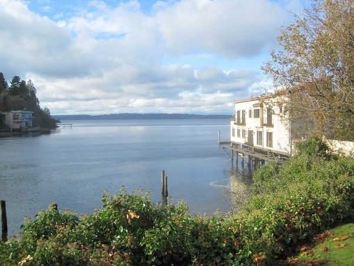

Last October I posted about my upcoming [eviction](/2013/10/evicted/). I live in the highly desirable neighborhood of Ballard in Seattle. In the past few years rents have increased and developers have been responding to this demand by building more and putting capital investment into existing structures. The apartment complex I live in was sold last year to a developer that plans on turning them into luxury apartments. Not only will the rents go up, but the construction is such that the tenants need to leave.

I get this and I'm not complaining. It is business. The fact is me and my neighbors have been paying **below market rent** for a few years now. When we move, we will be entering a market with higher rents.

_My neighborhood of Ballard._

I recently ran into a neighbor who was distraught about having to move. Even though we likely won't have to leave until June or July, the neighbor has begun looking for new places. He asked if I had. I haven't and I don't plan to until the end date gets closer. He seemed puzzled, so I shared my 3 reasons why I'm holding on to the end.

1.  We are paying below market rent. My guess is we are underpaying by $200-$300 a month should we stay in Ballard. Every month we stay is a month we don't have to fork over that money.
2.  There could be delays with the developer. It could take an extra month or several. I also reminded him that when the recession started in 2008 developers shelved construction plans for more than a year. Although the Seattle economy is super bullish now, it could always reverse. There are a number of things that could delay the construction. Again, every month we don't leave is money in our pocket.
3.  As anyone can see that lives in Seattle, there is massive amounts of rental construction underway. This is especially true in Ballard. Lots of these buildings will completed this summer. If you combine the high demand from people moving into Seattle with very low interest rates, you get a commercial building boom. Although I don't expect rents to drop immediately, I do think that increasing the supply of units available will relieve the upward pressure of rents. Basic supply and demand. Supply has been lagging demand for a few years. I not only expect it to catch up, but during booms builders have this history of building too much. This is good for renters.

My neighbor understood my first two points, but went ballistic on the third. He started yelling at me a bunch of economic nonsense about how increased supply always leads to increased costs. He also ranted other economic conspiracy nonsense. Too much for a single post.

Like so many people in Seattle, he lacks basic economic understanding. Increasing the supply of apartments with higher rents does not increase the rents everywhere. Those new apartment buildings are being constructed to deal with the current pent up demand. **Those people are still moving to Seattle whether or not those apartments get built. And if they got a job offer from a tech company they can likely pay higher rent than most.** That is exactly what has been going on in the past few years. Incoming high paid tech workers are bidding up the rental market.

As a renter, I see additional construction of rental units as a good thing. If the builders build too much, which is a possibility, we will start see rents come into line. If they don't, then I'll likely leave Ballard and pay less in rent.

I attempted to cheer up my neighbor and he was rude and angry towards me. I excused myself from the conversation telling him I couldn't continue as I understood economics. There are reasons for my neighbor to be pessimistic. They are known. All I was attempting to do was provide some much needed balance to this discussion, but he wasn't receptive. Lesson learned.

---

## Comments

### Tina
*March 19 at 2014 at 9:03 PM*

I'd stay just for the view!

I'm over near a hilltop in N. Kirkland - my view is just a bunch of tree trunks.  Better than a view into my neighbor's window... but nothing like water front!!

As for the neighbor... "increased supply always leads to increased costs"  WTH???
That's not how I understand it... maybe I'm the idiot, but I think increased prices (not costs) lead to increased supply as more developers want to "get in" on the revenue.
As more suppliers get in the market, there's less demand per supplier and the price drops back down again to match up the market partners.

In any case, it's not worth being rude about.
I guess there's an idiot in every crowd.  I'd bet he's not a native Ballard-ite, though.

---

### MAS
*March 19 at 2014 at 9:16 PM*

@Tina - I was trying to come up with a better word than "idiot", but he was rude to me. Also, I think he has a graduate degree, which is more than I have, so I don't want people to think I'm picking on someone less educated. 

Your grasp economics is accurate. Sadly, many here on the Seattle side fail to think through basic economics. He is not alone.

---

### Bill
*March 19 at 2014 at 10:14 PM*

Sounds like he is angry that his nice, under market rent is being taken away from him.  There is also a strong anti developer attitude in a lot of

---

### Bill
*March 19 at 2014 at 10:18 PM*

Oops...didn't get finished.  Ballard has really been transformed in the last ten years, especially with the zero lot line townhome development, and now with a lot of new apartments coming online.  It will be interesting to see what happens to rents in Ballard when the recently announced 1900 new rental units at South Lake Union get built.  They are certainly close enough to have an effect.  Some of the affect probably depends on Amazon.  They are hiring at a crazy rate.

---

### MAS
*March 19 at 2014 at 11:04 PM*

@Bill - He wants to live in a desirable neighborhood, pay low rent and keep the developers away. And when he doesn't get his way, he blames City Council. It is sad that so many intelligent adults have such an infantile understanding of the world. 

I agree with you about SLU units. Young developers with high incomes are going to move into those units before they ever make it to Ballard. The new units in Ballard will need to compete with those 1900 units.

---

### The
*March 20 at 2014 at 1:50 PM*

Arguing with a person like that is like trying to teach a pig to dance.  All it does is frustrate you and the pig enjoys it...

---

### JM
*March 20 at 2014 at 5:19 PM*

Ethos, Pathos &amp; Logos.
Strong Logos, but where were the other 2 stool legs?

---

### glenn
*March 20 at 2014 at 5:24 PM*

A quote for your neighbor, allegedly from John Wayne:
Life's tough; it's even tougher if your stupid.

---

### MAS
*March 20 at 2014 at 5:38 PM*

@The Good Mark - Agreed. I was proud of myself for stepping away the moment he turned our discussion into a argument. 

@JM - I had to look up what your comment meant. Good stuff.
http://pathosethoslogos.com/

@Glenn - The problem I see in Seattle is when it comes to economics there are a lot of stupid people. They fail to see the unintended consequences of the policies they champion. And a lot of times they are shielded from the fall out. I could probably write 50 posts on this topic, which would bore my current readers and anger a lot of people. I don't need the stress. As The Good Mark said "teaching pigs to dance".

---

### Ed
*March 21 at 2014 at 3:21 AM*

I think your neighbor may have just realized that the standard of living for most Americans is going down not up, and the country as a whole is in a economic decline, not incline. It just hasn't hit Seattle yet like other cities for the reasons you have stated. 
With our wonderful leaders picking fights across the globe, 2014 may prove to be an interesting year.

---

### Pauline
*March 21 at 2014 at 10:24 AM*

We all react to stress differently.  Some resist change and fight for things to remain the same, others look and listen, then adapt.  We are all in there on that continuum.  Resilience as we learn to adjust our inner response and like kung fu, flow with the energy and retreat when necessary to regain our poise and balance.  Life is a daily lesson in confrontation, the fear of loss.  Feeling the need to challenge or retreat.   Always coming back to our centre, our self.  There are many parts that want to act and react. Finding that inner act of friendship - that full hearted embrace, first to one's self.  This act of kindness, acceptance, transparency is the best way we can live in our world.

---

### Geoff
*March 21 at 2014 at 1:13 PM*

MAS - Sorry that the conversation turned unpleasant.  I think you did the right thing by disengaging.

It seems we are seeing something similar to what is happening in Ballard in my community (a small college city in central Virginia).  There is a frenzy of "luxury apartment" construction here, and this trend has had the effect of reducing the supply of lower to moderately priced rental units - at least for the time being. Rents may eventually come back into line, but for now people who cannot afford a "luxury" rental rate are being displaced to locations far outside the city. Certainly I don't blame developers for seeking to exploit pent-up demand and maximize their RoI, but the current reduction of moderately priced rental housing is having a detrimental impact on our small community.

---

### MAS
*March 21 at 2014 at 3:14 PM*

To me it just makes sense that new construction will be priced higher. But new doesn't stay new forever. And what was new 10, 20 or 30 years ago is likely more affordable. When my neighbor and others try to freeze progress and lock in their below market rent, should they get their way, are setting up a situation where in the future lower income individuals have fewer rental opportunities. 

Another thing I don't see discussed here in Seattle regarding luxury apartments is this endless supply of tech workers not only will end, but these young adults with high incomes will get married, have kids and want to purchase a home and leave apartment life. 

What I failed to communicate to the neighbor is these cycles can't run forever. Markets do respond. 

A big reason I left San Diego for Seattle in 2007 was at that time it had a cost of living of 32% cheaper. 
https://criticalmas.org/2007/04/seattle-vs-san-diego/

I'm certain that has flipped by now and Seattle no longer has a Cost of Living advantage to San Diego. But someplace does. It might be another neighborhood in the area or somewhere else.

---

### MAS
*March 21 at 2014 at 3:17 PM*

I just reran the COL calculator. San Diego is now 2% CHEAPER than Seattle. That is one helluva a swing in the last 7 years.

---

### Ed
*March 21 at 2014 at 11:21 PM*

re:" When my neighbor and others try to freeze progress and lock in their below market rent, should they get their way, are setting up a situation where in the future lower income individuals have fewer rental opportunities." 

In the hub of the city, lower income individuals already have fewer rental opportunities.  If wages for most jobs are stagnant except for the tech industry which Seattle and surrounding area is quickly becoming, then obviously these people will be displaced  with higher rents, trying to freeze progress is futile. Any intuitive person should have seen this coming.  
I live just north of Redmond, and someone recently told me that a one bedroom apartment can't be found for less than $1000. Obviously due to Microsoft campus headquarters and possibly other tech firms.

The best way to look at things is from a global geopolitical and financial level instead of a local level. Then once your convinced that the worst is in front of us not behind us, then you can adjust your living conditions based upon survival, not the extraordinary view from your "locked in" apartment.
   
How am I doin Geoff....go ahead and apologize for me.
MAS.......disengage at once!

---

### MAS
*March 22 at 2014 at 1:44 AM*

@Ed - Tyler Cowen's latest book discusses how he believes in a generation certain top metro areas will have very few poor people. He sees an economic migration when low and mid-level earnings go to places where the cost of living is better. I would guess Seattle would fall onto that list. 

For those interested, here is a podcast on the topic. I actually prefered this interview to the book itself.
http://www.econtalk.org/archives/2013/09/tyler_cowen_on.html

---

### Mike
*March 24 at 2014 at 2:38 AM*

Moving into an apartment that has more rooms and getting a room mate or two would solve that problem.  However finding a good room mate that you can deal with and that will pay bills on time is another issue.

---

### Matt
*March 24 at 2014 at 4:50 PM*

I have a half baked theory that because of the upward redistribution of wealth for the past several years and the bank bailouts etc. that there is way more money out there than investment opportunities and that investors are jumping in to real estate development because they have to do ‘something’ with all of the money that has piled up.  

Last year I believe that the S+P 500 appreciated by 28% or thereabouts.
Not to mention China and India’s economies booming and their having more money to invest.  

There was an article in the Seattle Times a couple of weeks back about Wall Street Investors buying up large numbers of homes for cash in the Seattle area.

Market forces are definitely a factor with the development, but I feel that speculation is a driving factor as well and I worry what the fallout will be when all is said and done.

---

### MAS
*March 24 at 2014 at 5:27 PM*

@Matt - You are absolutely correct. Suppressing interest rates is the root cause for the rise in asset prices, be it real estate or equities. When borrowing costs are low, use of leverage increases. Savers are punished and speculators are rewarded. But policy makers have painted themselves into a corner. Interest rates can't go lower. If and when they start to rise...look out.

---

