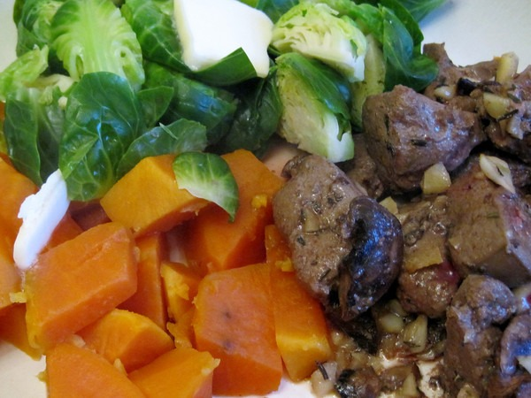

_For a background to this post see [How I Plan to Lose 20 Pounds and Win the Bet](/2014/02/plan-lose-20-pounds-win-bet/)._ Week #7 Weigh-In: **\-1**. Total Loss: **\-7**. Last week was the one week where I gained a pound. I was concerned that I might need to go back to the food journals. On Monday, I weighed myself and saw I was up 2 more pounds. Yikes! I really don't want to do food journals again, but I told myself that if I didn't register a loss this week, I'd return to writing down every meal. Well I turned it around and dropped that weight plus an additional pound. **The motivation of not journaling turned out to be quite effective.** I decided to use Tuesday and Thursday as days where I wouldn't go to the gym for knee rehab and instead really restrict calories until mid-afternoon. The other days would be maintenance. The strategy of cycling between caloric deficit and baseline is an effective one. You get the weekly calorie reduction, but you don't run your metabolism into the ground or feel deprived day in and day out.  _Beef liver + Brussels sprouts + sweet potatoes_ Notes:

1.  Foods that I have found to reduce appetite the best so far (besides calorie dense cheese) are: tuna, carrots, kimchi, potatoes and beef (especially organ meats).
2.  Competitor #2 in the fitness bet did a blog post this week that highlighted some quotes on an article about the problem of _thinspiration_.
3.  Competitor #3 is tied with me at 7 pounds lost. No weigh-in updates from Competitor #2 and Competitor #4.
4.  Competitor #3 began the bet pretty apathetic, but now seems highly motivated. Although I have more discipline, he has more weight he could lose. I suspect my last 5 pounds will be tougher than his last 5 pounds.

---

## Comments

### Bill
*April 15 at 2014 at 2:45 PM*

A bit off topic but sort of related.  You have mentioned Matt Stone before so I'm wondering if you ever did a total "refeed" like he advocates in order to restore metabolism?  I tried it for a while but was unwilling to deal with the weight gain since I've never been overweight.

---

### MAS
*April 15 at 2014 at 3:42 PM*

@Bill - Not a total refeed. Also my motivation was different. When I was underweight, my research came to the conclusion that ice cream was the ideal food for me. I'm pretty sure that is one of the foods on his refeed list. My metabolism was never low. It was high and I had trouble eating clean to maintain it. 

https://criticalmas.org/2012/07/why-ice-cream-is-better-than-protein-powder/

---

