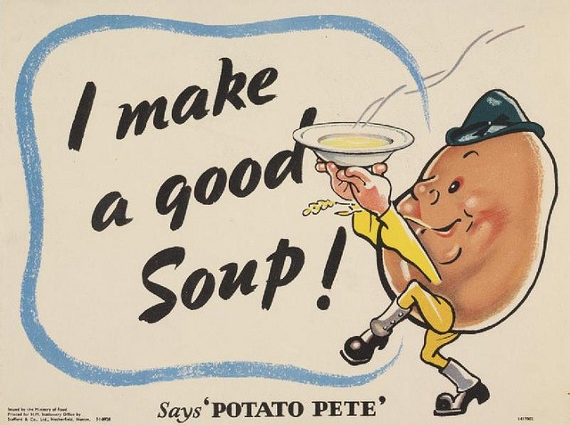

_For a background to this post see [How I Plan to Lose 20 Pounds and Win the Bet](/2014/02/plan-lose-20-pounds-win-bet/)._ Week #9 Weigh-In: \-2. Total Loss: \-10. This was a good week. My plan last week was to journal the number of hours in my eating window. It worked! I was solid on my morning fasting and I lost 2 more pounds.

### Fasting Journal

\[table id=33 /\] My goal was to average 14 hours. I hit 14.85 hours. It got easier later in the week. I will continue with this strategy. Fasting sure beats counting calories and weighing food.  _Photo by marsmet546_ Notes:

1.  I exercised less this week due to a setback with my knee rehab. This turned out to help making morning fasting easier. Fitness "gurus" that dismiss the relationship between activity and appetite are fools.
2.  I had quite a few potatoes this week. Very filling. This is a lesson for all you militant low carbers. Carbs are not inherently fattening. Excess calories are.
3.  As far as I know I am now in the lead on the bet. Competitor #3 slipped and is back to 7#. Competitor #2 is at 5#. and Competitor #4 is still missing in action.

---

## Comments

### Pauline
*April 27 at 2014 at 10:32 AM*

I find this fascinating.  A shorter eating window also worked for me in the past.  Probably up to 12-14 hours is best for me.  Going to look into this again.  I found longer fasts made me hyper alert during the day and wired/fatigued at bedtime, so I couldn't sleep.  A later eating window at night and later in the morning may work better.   Lots to think about.

---

### Big
*April 27 at 2014 at 5:29 PM*

Honey before bed!

---

### Txomin
*April 27 at 2014 at 5:32 PM*

The number of meals is the deciding factor for me when using IF to cut. Two large meals work great for 18/6 IF but the same amount of food over three meals requires a longer feeding window. Congrats on the progress, my friend.

---

### Big
*April 27 at 2014 at 10:04 PM*

I think your next experiment ought to be to see if you can loose weight why consuming a reasonable amount of beer per week.  Like let your beer be your carbs!   Just meat, beer, and greens....

---

