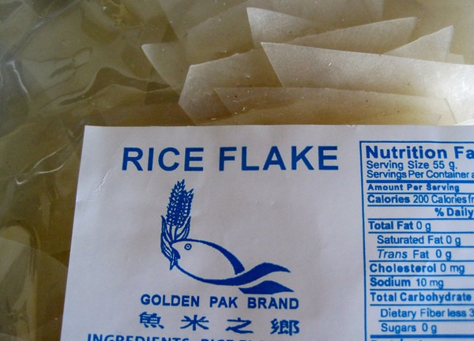

My thoughts on nutrition have changed quite a bit in last few years. I was just going through the archives and I came across the post I did after my December 2011 trip to Ohio. In the post [Paleo in Ohio](/2011/12/paleo-in-ohio-adventures-in-inflammation/), I declared there were **4 toxins** when it came to diet. They were: Gluten, Veggie Oils, Sugar, and Legumes (except long fermented soy). My analysis at the time:

> For me gluten is the worst toxin. I get splitting headaches and skin inflammation. And once you read up on the dangers of veggie oils, you will do everything in your power to remove them. However, they are everywhere and they can take 2 years to get out of your system. Sugar has never been a problem with me, nor has legumes. Plus they are the easiest to spot and avoid.

### My Thoughts Today (2014)

### Legumes

I was dead wrong on legumes, because I listened to Paleo. The reality is legumes are healthy when they are prepared properly. This is something the [WAPF](/2011/02/paleo-vs-weston-price/) people get correct. Beans are nutritious and a staple in many cultures. There are recipes that go back hundreds if not thousands of years that use legumes. The trick with beans is to soak and sprout. This is how traditional cultures prepared beans and if there were any evidence that the legumes were harming them, I'm guessing they would have ceased cooking with them a long time ago. When it comes to soy, I stick to miso soup and [natto](/2013/12/natto/). I still don't trust tofu, but if it happens to land in my Korean stew I'll eat it.  _I soak and sprout lentils when I make [Dal](/2012/05/making-lentil-dal/)._

### Sugar

Boy has my opinion changed on sugar. It is not toxic. It has become the whipping boy of almost every nutritional camp. Sugar is fine and potentially beneficial in limited quantities. Sugar is an anti-stress food. You can use it to [build muscle](/2012/07/why-ice-cream-is-better-than-protein-powder/) or [improve your sleep](/2014/01/amazing-back-sleep-hack/). Defending sugar is a tough sell. If you have an open mind that sugar might have gotten a bad reputation, listen to Evil Sugar Radio Episode 2: The Truth About Carbs & Sugar. Sugar does have a lot of bad friends though. It is often found in foods that have been heavily processed or [engineered to encourage overconsumption](/2012/06/deep-nutrition-perfect-health-diet-and-the-end-of-overeating/). We still want to avoid or minimize those processed foods.  _Ice cream is a healthy food with sugar. Oreo cookies are an unhealthy food with sugar. Sugar isn't bad, but it often hangs out with bad ingredients._

### Veggie **Oils**

My opinion that vegetable oils are toxic is even stronger today than before. Last December I did a 3 part series on the problem with PUFA: [The Common Enemy in Nutrition](/2013/11/common-enemy-nutrition/), [The Problem with PUFA](/2013/11/problem-pufa/) and [Quantifying PUFA, Expert Opinion and My Conclusion](/2013/12/quantifying-pufa-expert-opinion/). Even though I am fully aware that veggie oils are bad news, I also know they can't be avoided if you go out to eat. So I refuse to stress about it. I will pick foods that I believe use none or minimal fats during cooking when I am out. [Pho](/2012/07/pho-photos/) is good, fries are awful.

### Gluten 

I still think gluten is a big problem for society and myself. We may not understand why, but the fact it is unexplained doesn't mean the problem doesn't exist. There is an entire wave of gluten defenders that are peddling the message that abstaining from wheat is orthorexic. They state that 90-91% of the population is fine with wheat, so not eating wheat is based upon fear. I think their logic is flawed. When I see 10% of the population getting sick from a single food in increasing numbers, I want to know why. I cover the "It's Only 10%" argument in the post [Was I Wrong About Gluten? Part 2](/2013/09/wrong-gluten-part-2/). The one thing I have changed my mind about when it comes to gluten/wheat is I now believe it is possible and even desirable to cure your intolerance. Not because wheat is nutritious, but because it makes sense to be resilient. Walling yourself off from the world may help reduce symptoms, but it doesn't address the underlying cause of why certain foods cause you to feel awful. I haven't been able to cure my intolerance, but I can handle trace exposure now (soy sauce, 2-3 oz of beer).  _I use rice flakes to make [gluten free lasagna](/2012/08/gluten-free-lasagna/). I don't miss wheat at all._ 

### New Toxins?

I have no new toxic foods to add to the list. The word toxic gets thrown around too much. All it does is promote unnecessary fear around food, most of it unwarranted.

---

## Comments

### Gloria
*April 23 at 2014 at 8:28 PM*

I have heard you mention being cold several times, over different discussions.Have you ever checked your  blood Iron levels?    I can see on your food logs, lots of cheese, meat but what about IRON from greens and of course the beans?The Iron in your blood cells feed the mitochondria and power-heat the body.   This is why so many women are cold ALL THE TIME.   Younger women tend to be more anemic, as do older people with the high carb- gray hair inducing diet you talked about.  Just an interesting question. What do you know?  This has been what i have found, but have also been warm when fasting!   Just my two cents. Love reading your insights.

---

### MAS
*April 23 at 2014 at 8:56 PM*

@Gloria - My iron levels are fine. I donate blood every 8 weeks and the numbers are in the normal range. Since ditching the nuts (June 2013) and increasing the carbs and salt, my body temperature is a full degree higher. 

Hadn't thought about iron's role in body temperature. Thanks.

---

### Gokhan
*April 23 at 2014 at 11:30 PM*

I've had chronic sinusitis since I was a little kid. Doctors couldn't help, may have even aggravated my CS with whatever medicines they prescribed. 
People often say how amazing medicine will be in the future with advancement in technology and all that, but whatever, if at the moment they can't even figure out why snot is coming out of a nose all day everyday, let's remain skeptical. But I digress.
2 months ago I ditched gluten 100%, the only variable variable I changed. No more CS.

---

### Katie
*April 24 at 2014 at 4:53 PM*

I completely agree with your assessments here.  As to why wheat is bad, have you given much thought to the Wheat Belly argument?  Not the nonsense at the end of the book about not eating carbs.  But the explanation at the beginning about the over hybridization of modern wheat.  I was gluten free for two years and saw some amazing healing.  I also like the WAPF way of thinking about grains.  That removing them from your diet for a time can heal digestion (i.e. the GAPS diet) but that the end goal should be to reintroduce these foods as part of a whole foods traditional diet.

After two years of being a gluten free and full blown wheat hater I heard many people talking about healing the intolerance and I was very intrigued.  I gave it a shot and found that I can digest it again.  I am not sure if this is from gut healing or if I will be sick again in 6 months.  I am never going to go back to processed crackers and commercial loaves but I would love to not have to worry about accidental exposure and be as you say resilient.  I am now trying to bake traditional loaves with Einkorn and have found that it is delicious and doesn't cause me any immediate distress.

---

### MAS
*April 24 at 2014 at 5:00 PM*

@Katie - I have read Wheat Belly and I am sympathetic to the argument, but as of now it is just speculation. It hasn't been proven yet. The hygienic argument makes the most sense to me. That being our use antibiotics and antibacterial soaps have altered our gut flora in a way that makes digesting wheat problematic.

---

### Katie
*April 24 at 2014 at 5:09 PM*

You are right, and I am no antibiotic lover either.  In fact I am a C-section baby who wasn't breastfed, had two many antibiotics and was fed margarine growing up.  Now I take BioKult daily :)

---

### Txomin
*April 27 at 2014 at 5:30 PM*

I can't avoid but still think about the difference between those foodstuffs that are digestible as found and those that are not.

---

### MAS
*April 27 at 2014 at 5:38 PM*

@Txomin - Well said.

---

