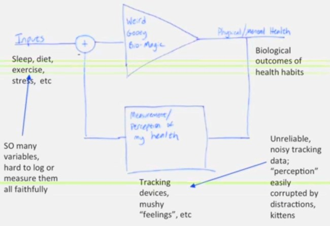

Most of what you read from the Quantified Self movement is celebratory nonsense. Without repeating my opinion and how I arrived at it, I'll direct you to these posts:

-   [What Weight Lifting Should Have Taught Me About Quantified Self](/2014/03/weight-lifting-taught-quantified-self/)
-   [Quantified Self and False Pattern Recognition](/2014/04/quantified-self-false-pattern-recognition/)

I'm not alone. There are other voices of reason emerging from the Quantified Self movement. Besides the excellent blog [The Unquantified Self](https://unquantifiedself.wordpress.com/), I wanted to draw your attention to two other voices of reason.

### [Nancy Dougherty on Quantified/Unquantified](https://quantifiedself.com/blog/nancy-dougherty-unquantified/)

Nancy talks about how she detoxed from QS to get healthy.

> There are so many variables and inputs we are not sure what to care about.

> A lot of the responses are time delayed, they're interdependent, they're non linear.

 _I took a screenshot from the Nancy's presentation. I love the honesty here._  I love the conclusion she reached. The benefit to her health from Quantified Self was not about quantification, but the mindset that we are in control of our health. Being flexible and exploring are far more important than placing numbers on a spreadsheet.

### [THM Show 006 - Laurie Frick](http://web.archive.org/web/20160109212430/http://www.thehackedmind.com:80/thm-show-006-laurie-frick-sleep-tracking-stomach-aches-mindfulness-self-tracking/)

The closing minutes of this 28 minute podcast caught my attention. Up until the end the guest seemed quite enthusiastic about Quantified Self. Jump to 22:57 to hear the wisdom. Laurie tracked via a spreadsheet the following:

-   Fitbit data (2 years)
-   Sleep data using Zeo (3 years)
-   Every city she was in
-   Upset stomach score
-   How many hours she was online
-   How much she talked each day
-   weight data (more than 3 years)

She has looked for correlation and _really hunted_ for meaning.

> I have sat and hunted and looked for patterns. I have done statistical analysis. The real truth is human data is noisy. It is hard to find these big learning \[insights\]. It is hard to correlate. It is really hard to take any single variable and really know these answers. Particularly when dealing with a sample size of one.

And her conclusion after years of tracking data.

> It is hard for me in real truthfulness and say, "Oh I learned these big things about myself."

### The Lesson

The next time you hear a "biohacker" talk confidently about the results of their QS experiment, be skeptical. Human data is messy. Too messy for spreadsheets.

---

## Comments

### Eric
*April 29 at 2014 at 10:28 PM*

True, our bodies and environments are too complex for a bit of superficial data to reveal amazing insights. But it lets us question the conventional wisdom and expert opinions we follow every day. Our brains are easily convinced that a new diet is working and worth the trouble, but after looking at the data we can admit that we were wrong and move on :-)

Also, I wouldn't dismiss QS as a motivational and educational tool.

---

### Christopher
*April 30 at 2014 at 6:49 AM*

I've struggled with finding linear (or any) correlations in my, admittedly short, data set but I have seen clear benefits from the act of tracking and the 'gameification' aspect of QS. In my view, the value of QS is not in achieving a valid statistical understanding of my data (though I am still hoping to get there!) but in the mindfulness and pleasure that the process itself brings. I was privileged to present early findings on this to the London QS Meetup in mid-April this year, reporting significant success in my primary QS goal despite not having a really in depth understanding how that success was achieved. In short, I believe a negative view of QS is neither helpful or positive but a realistic expectation of our efforts is healthy.

---

### MAS
*April 30 at 2014 at 1:51 PM*

@Eric - Diets never needed QS. A scale and a tape measure is all you need. 

Also you don't need QS to question conventional wisdom. In an earlier post I mentioned the skill we need to be developing is intuition. Trust yourself. Spend your time focusing on responding better to the world instead of tracking those responses. 

QS was educational. Doing it for 2.5 years taught me it was a waste of time. I'm here to share that lesson.  

 @Christopher - I see the opposite. Using data to draw conclusions from things that can not be validated with statistics is not be mindful. 

Looks at this definition of mindfulness.
http://greatergood.berkeley.edu/topic/mindfulness/definition

<blockquote>Mindfulness also involves acceptance, meaning that we pay attention to our thoughts and feelings without judging them...</blockquote>

With QS you are always judging and never accepting. That to me is unhealthy.

---

### Al
*April 30 at 2014 at 3:40 PM*

I couldn't agree more about the obsession being anything *but* mindful. Without boring you with details, I have had an OCD relationship with logs, spreadsheets, databases, etc for years. It is a running joke among a couple of my training buddies. You would not believe the time I spent trying to create these elaborate tools to track *everything*. An example would be (back in my database period), trying to build queries to factor in my most recent weight to be able to factor the pounds lifted in a bodyweight exercise in order to add them to my weekly tonnage.

I learned a lot about queries, but boy what a bunch of useless info, lol.

I used to track *EVERYTHING*, and the log was dictating my training, not the other way around. This created a lot of stress and circular thinking that got me nowhere.

Interestingly, I got in what I consider my best condition a few years ago when I stopped tracking things, or even keeping a diary. Just lots of walking and bodyweight work/yoga  combined with IF.

These days, I weigh myself once a month, and keep track of my cycling mileage. That's it.

---

### MAS
*April 30 at 2014 at 3:47 PM*

@Al - Thanks for sharing your experience. 

@Eric - After I posted "A scale and a tape measure is all you need", I realized I made a mistake. You don't even need those to determine if a diet is working. All you need is a mirror.

---

### Eric
*April 30 at 2014 at 4:00 PM*

Sure, if you go on a diet and lose 20lb in short order, there's no need to look at any data. But when doing a small change to your diet, it's easy to think that you are seeing a meaningful difference when there is none (and vice versa).

Just because we can't build a model that predicts how every variable affects your weight does not mean there is no value in expressing weight changes in terms of normal fluctuations, and making use of additional data (e.g. how much exercise did you get?) to ensure we are comparing apples to apples.

It's certainly possible to develop an unhealthy obsession with numbers and badges and leaderboards, but that's not an inherent characteristic of QS.

---

### MAS
*April 30 at 2014 at 5:17 PM*

@Eric - With QS we are trying to direct an outcome via data that may have nothing to do with the data itself. This to me is unhealthy behavior.

---

### Eric
*April 30 at 2014 at 6:06 PM*

Our intuition (or conventional wisdom, or expert opinion) tells us that one variable affects another variable. The purpose of a typical QS experiment is to establish if this appears to be true (for you). Often the answer is "no", but that's a valuable insight, too. Not sure what you are suggesting we do instead?

---

### MAS
*April 30 at 2014 at 6:51 PM*

@Eric - It is something I am pondering. I am a huge fan of data and I think it has the potential to provide insights to health and performance, but the scope and volume of data needed is beyond that which the "self" can manage. What makes a QS experiment manageable for the individual also makes the results suspect. 

Some initial thoughts I have in order for my confidence in QS to improve:
1- We need a lot more data. (more quantification)
2- That data needs to passively collected and aggregated. (less self)
3- A 3rd party or service needs to analyze the data and make recommendations. (less self, more quantification)
4- Although it is a "self" movement, looking for patterns across individuals makes more sense. (go from n=1 to n=x and back to n=1)

I did this post 2 years ago, which touches on my optimism in using data to improve health and performance. 
https://criticalmas.org/2012/08/the-healthy-optimist/

But that is the future.

---

### Eric
*April 30 at 2014 at 7:32 PM*

Pooling data and having it analyzed by a 3rd party seems problematic, given how inconsistent and incomplete the data is bound to be.

It's easier to see the value in sharing methods and results: What's suspect about someone reporting how certain changes to their diet helped them lose weight, whereas other changes had no significant impact?

There could also be value in aggregating results in order to e.g. recommend a diet that is most likely to work for you, based on your genetics and other factors. The Institute of Systems Biology <a href="http://www.nature.com/news/medicine-gets-up-close-and-personal-1.14702" rel="nofollow">is starting an interesting project in this space</a>, we'll see how that goes...

---

### Stephan
*April 30 at 2014 at 7:57 PM*

My most favourite blog post you have written in a while. You have an astute ability to analyse more technical topics (such as the QS movement) and making pointing out the inherent flaws. 

As an engineer myself, I have also seen too many people in the engineering field trying to view the human body as a machine. A machine that responds linearly to any impulse you feed it with virtually no time delay and a replicable result.

I see many people trying to take this linear model and apply to the non-linear body. Non-sense like e.g. a decrease of your carb intake will automatically result in a linear decrease of body weight (yes but only to a certain extent with a caloric deficit being the driving factor).

---

### glenn
*April 30 at 2014 at 9:51 PM*

Yes - absolutely! Also, Seth Roberts, RIP

---

### MAS
*May 1 at 2014 at 12:22 AM*

@Eric - Thanks for that link. It looks like a step in the right direction.  

@Stephan - Thanks and well said.

---

### Al
*May 7 at 2014 at 2:20 PM*

Check out this week's Evil Sugar podcast on this subject.

---

### MAS
*May 7 at 2014 at 2:26 PM*

@Al - Listened to it yesterday. Loved it, especially the 1st half. 

https://web.archive.org/web/[phone removed]2626/http://www.evilsugarradio.com/podcasts/episode44.mp3

---

