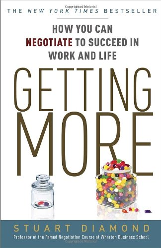

Very shortly after my neighbors and I learned the new owners were going to [evict all the tenants](/2013/10/evicted/), a group was formed to fight the new developers. I wasn't sure what the group was going to do. We were renters. The new owners wanted to make capital improvements to their property. In order for those improvements to take place, we had to leave. They owned the property. Most of the tenants were no longer on a lease and instead were on month-to-month options. And they are under no obligation to continue leasing units forever. This is a risk a renter takes. To learn more about what this group was thinking, I went to an early meeting with a large number of my neighbors. From the start, it was clear that their approach to the displacement would be conflict. They would be a thorn in the side of the new owners and maybe just maybe we could save our apartments from the developer upgrades. I disliked the tone of what I heard. They were anti-development and pro-rent control. I see the developers that are coming to Ballard to either build new construction or upgrade existing structures as responding to market pressure. That isn't greed. That is business. Our apartment complex is over 60 years old. At some point, it will need capital improvements made. I believe in property rights. They encourage investment. I'm grateful there are developers out there building places I can rent. Rent control is an awful economic idea that discourages investment because it weakens property rights. The problem with the high rents in Ballard isn't caused by the developers. It is due to high demand. Developers are part of the solution. We have a rental shortage. This action will absolutely inconvenience me, but such is the risk of renting. When I was a homeowner, I had different risks.

### This is Negotiating?

From afar I've monitored how the group "negotiated" with the developer. They used techniques such as picketing, marching, insults, and personal attacks. At one point they even posted wanted signs with photos of the developers around the neighborhood. I wonder what the leaders thought this would accomplish? Did they think the developers were going to stop the project after they were insulted?

### Negotiation 101

Being hostile and emotional even when you feel you are morally right is not an effective way to negotiate. From the outstanding book _Getting More: How You Can Negotiate to Succeed in Work and Life_ by Stuart Diamond:

> Emotion is the enemy of effective negotiations and effective negotiators. People who are emotional stop listening. They often become unpredictable and rarely are able to focus on their goals. Because of that, they often hurt themselves and don't meet their goals.

With negotiation, you need to be aware of the needs of the other party. The developers had needs, but no one asked that question. More on that later.  _Getting More: How You Can Negotiate to Succeed in Work and Life by Stuart Diamond is an outstanding book. Life is a negotiation. Learn how to do it effectively._

### Economics, The Law and Reality

Before I outline how I would have negotiated with the developers, I first want to empathize with those tenants that feel they were wronged. Ballard in recent years has become a very desirable neighborhood. A lot of people want to move here. Many of those people who want to move here are willing to pay more than they would have in recent years. This demand has created a shortage of rentals, which has pushed rental costs up. New construction will almost always demand a rental premium. It is the high rents that pay for development. An industry report that I mentioned in the post [Ballard Rents - Don't Believe the Hype!](/2014/03/ballard-rents-dont-believe-hype/) states that new construction typically gets a rent premium of 40%. The flipside to this equation is that as buildings age they lose that premium. And since buildings do not last forever, there must be a steady supply of construction to not only keep up with population demands but the wear and tear of construction itself. Nobel prize-winning economist Robert Shiller touched on this in his book [Irrational Exuberance](/2010/07/vindication/). The timing sucks for the tenants of my apartment complex, including myself. We are being displaced at a time when supply has not caught up with demand. It absolutely will cost more to stay in Ballard. The good news is I do think the builders will overshoot at some point and rents will come down, but not in time for us. Some have stated or implied that the developers have broken the law. If that is the case, then go to court. Although legal mistakes were made early on by the developer, I don't see evidence that their current plans are illegal. You may not like the laws, but one would assume that a successful corporation has a talented legal staff on hand to guide them through development projects. It probably isn't too likely that a handful of tenants will know the law better. The reality is the tenants are being displaced so the developers can make capital improvements to the property. They will raise rents, not because they are evil, but because that is what the market wants at this time. You can argue with economics and the law, but the development will continue.

### Negotiation Reboot

How could both parties have benefited from this situation? I have an idea. When the plans for eviction were announced in October 2013, almost all the tenants were off lease. They were paying month to month. This means they could leave with 20 days' notice. Once the eviction was announced, the owners couldn't write any new leases, because a tenant under lease can't be evicted to make way for the new construction. The worst financial case for the developer would have been had every tenant given 20 days notice in early October. There lies the point of potential negotiation. We can't stop the development, but we could have tried to collectively negotiate a lower rent to stay until the construction comes for our building. And before someone says you can't negotiate rent, that isn't true. I have [lowered my rent](/2011/04/how-to-get-lower-rent/) and the rent of friends several times. I heard a few months ago that half the tenants left on the news and the current vacancy rate is 57%. My rent is $875 a month and there are 138 units. Let us assume for easy math that everyone is paying the same rent. I don't have a building schedule in front of me, so I'll use 8 months as the average time a tenant had to leave. Some are sooner, some are longer.

-   $875 \* 8 months \* 138 units = $966,000 (maximum revenue to developer)
-   $875 \* 0 months \* 138 units = $0 (minimum revenue to developer)
-   $875 \* 8 months \*  69 units = $483,000 (50% vacancy revenue, which ended up happening)

For even math, I'll use a 50% vacancy rate. This means the developers lost $483,000 in potential rent when tenants bolted. That also assumes the development has no delays. If delays happen the number will be higher. What if collectively we would have negotiated for a $200 a month rent reduction to stay? We could run a spreadsheet on the scenarios, but the net benefit to the average renter would have been $1,600 (8 months \* $200). What about the builder? Let us say 20% of the tenants took off leaving an occupancy rate of 80%.

-   $675 \* 8 months \* 138 units \* 80% = $596,160

In that case, the builder comes out $113,160 greater assuming the project has no delays. For every month the project is delayed, they would collect $74,520 in rent. These are all back of napkin calculations. I don't have all the data about rents, building schedules, and vacancy rates. The $200 was the first number that came to mind. It is a starting point to a conversation.

### Last Words

I believe there was a path that could have benefited both parties. But it wasn't taken. I probably should have asserted myself early on, but my pro-development, anti-rent control opinions would not have been accepted. They were angry and they wanted their voice heard. They talked about negotiation, but in the end, they got nothing. Once again, I highly recommend the book Getting More. I only wish I had read it sooner in life.

---

## Comments

### David
*May 24 at 2014 at 2:39 PM*

Not surprised about your neighbor's desire for rent control,  Very pervasive idea here in the Bay area too.  Some people have this idea that they're just entitled to stuff.  Even if that stuff is someone else's property.

---

### Bill
*May 24 at 2014 at 4:19 PM*

Most people have no idea how to negotiate and they treat it as a win/lose instead of a win/win.  Then, when things aren't going their way they get emotional, and that emotion is often anger.  When you couple that with what is likely in this case a strong anti developer attitude, there is very little chance for a good outcome.  It's all so self centered.  They want rent control but you can be damn sure if they owned a home they would not be in favor of price appreciation control!

---

### MAS
*May 24 at 2014 at 4:37 PM*

@David - I actually understand an individual fighting for their own economic self interest, even if it means stepping on the rights of others. It isn't right. I wouldn't do it, but I can at least understand their motivation. 

What puzzles me are organizations that claim they are fighting for affordable housing that think rent control is the path to get there. The costs don't go away they just get pushed elsewhere, which ends up mostly being on the low income people who wish to move to that region. 

Developers respond to areas favorable to rent control by building less or building just for wealthy. And why should a property owner make capital improvements to a property they can't get market rate rents for? I could go on and on. Rent control ends up making rents higher for the very people these groups claim to represent. 

@Bill - Absolutely correct. I think the greatest negotiation method is when you can get the other party to offer what you want while thinking it is their idea to begin with.

---

### Geoff
*May 24 at 2014 at 7:08 PM*

Speaking as a former professional negotiator, I agree entirely with the point about emotion having no place in effective negotiation.  Of course there were times in my negotiations where it was to my advantage to <i>project</i> emotion, but projecting emotion as part of an act is different than becoming emotional about an issue.  I will suggest, though, that the developer may have based their business model on a projection of zero rental revenue for the entire development phase.  In fact, they might have been hoping to take a loss on the project during that time to offset against future income down the road.  Offering them more revenue in that situation could have been counter-productive. Point being, as you said, you need to learn what the other party actually wants.  Without a dialogue, it's impossible to know what their motives truly are.  Unfortunately the actions of your neighbors likely foreclosed that possibility.

---

### MAS
*May 24 at 2014 at 11:12 PM*

@Geoff - Good point. Other than Getting More, so you have any other recommended reading when it comes to negotiating?

---

### Geoff
*May 25 at 2014 at 7:22 PM*

MAS - Since my career change I've not kept up on books about negotiation.  So I do not have any recent titles to offer.  Personally I found that the skill of negotiation is something that you really learn by doing (or seeing done) not from books.  You have to be true to yourself and your style.  When you venture "out of your lane" in a negotiation people sense that you are being inauthentic and get concerned.

That being said, the negotiation book that was most influential to me I discovered when I was young - "Getting to Yes" by Fischer and Uri.  That was where I first learned about BATNA and many of the other ideas you discussed (focus on interests, separate people from problems, etc.).

I will also say that "The Art of War" was also a popular business read around that time, and I also found it helpful to me.  You might need to focus on interests to get a deal done, but you never want all of your cards on the table.

Sorry I can't offer you any more current or interesting titles.

---

### MAS
*May 26 at 2014 at 2:43 PM*

@Geoff - Thanks. I just added Getting To Yes to my reading list.

---

### JM
*May 27 at 2014 at 12:39 AM*

Do I understand this correctly?
If I agree to stay in exchange  a rent reduction, do I sign a lease?
Not sure I want to be hitting the market at the same time as all my neighbors.
Especially if lots of people have a desire to stay in the area.

---

### MAS
*May 27 at 2014 at 2:31 AM*

@JM - No. All the tenants are off-lease and going month-to-month. 

And the buildings are being done over separate months. So you wouldn't be competing with all the neighbors regardless. For example, my building will be renovated in July. Several happened before and a few will happen later. This is being spread out over a year.

---

### MikeK
*May 27 at 2014 at 4:21 AM*

You guys need to offer something of value to them.  Just an idea, like offering general maintenance of the building.  Changing light bulbs on stair way, halls, sweeping, vacuuming etc.  This would reduce staff needed.  It is  a win/win situation.  Let's say on the average each tenant spends one to two hours on the average time on maintenance.  Let's say you agree $100 rental reduction per month. Maybe there won't be a rental reduction but no rental increase either.  

Try brain storming ideas, write them own good or bad, after you come with ideas you guy can decide which ideas to use.

---

