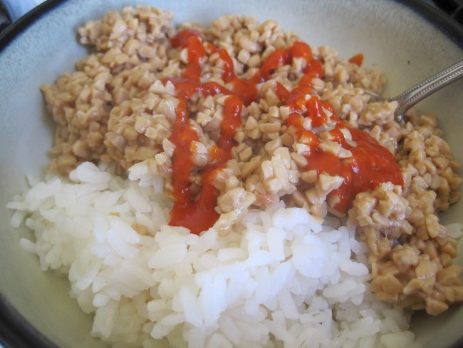

Oh nooz carbs, legumes and fermentation!

The Paleo and Peat godz are weeping. I can feel the diabeteez and super bug mycotoxins killing me. Lordy lordy this inflammation is eating me up!

Ahh!!! Must do a Hole30 DETOX for my purity.

My lunch was great.

---

## Comments

### Gman
*May 13 at 2014 at 12:17 AM*

Putting Rooster sauce on it killed nasty carbs!

---

### dhammy
*May 13 at 2014 at 1:51 AM*

I prefer natto plus Gochujang.  Thanks for introducing me to natto :)

---

### garymar
*May 13 at 2014 at 3:30 AM*

What is this, The Critical MAS Asylum? (ha!)

I  must say, after 40 years of turning up my nose at it, I have gone crazy over natto since the start of this year. Been eating it every day. I may have to start making it myself.

---

### MAS
*May 13 at 2014 at 3:35 AM*

@Gman - YES! And the Mycotoxins too! Bulls**tProof Natto!

@dhammy - Great idea. I think that would work even better.  

@Garymar - Yep. I am a fan of Carbsane and even enjoy reading her enemy ItsTheWoo, who is either brilliant, insane or likely both.

---

### Stephan
*May 14 at 2014 at 1:29 PM*

Mycotoxin-infested Natto. Let us know how long the ensuing brain fog lasted for :)

---

