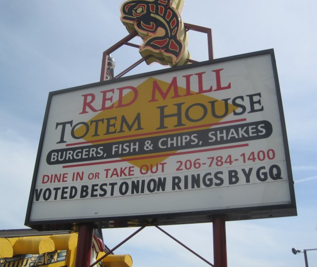

There are two signs in my Seattle neighborhood of Ballard that are puzzling to me.

### #1 Bop Street Records

This record store proudly displays a sign in the front window stating "One of the five best music stores in America" as proclaimed by The Wall Street Journal. The WSJ? What does the Wall Street Journal know about music? It is is business newspaper. If the WSJ ranked municipal bond debt offerings, that would make sense. But music stores? And aren't record stores suppose to be cool and hip? Is there anything less cool that saying Rupert Murdoch likes us a lot? 

### #2 Red Mill Totem House

For what seems like forever the Red Mill has proudly been displaying the endorsement they got from GQ magazine that they were voted Best Onion Rings. What is GQ doing reviewing onion rings? It is a fashion magazine. I haven't ate an onion ring since the 1990s, but I don't recall much difference between the ones I did try. You slice onions into rings and then deep fry them in toxic vegetable oil. If you eat them too fast, you burn the hell out of your mouth. If you let them cool too much, they taste gross. Stupid food if you ask me. This sign isn't as bad as the record store endorsement, because it is at least advertising a menu item.  But why is a local fast food place advertising GQ magazine on their signage? They aren't GQ customers. A better sign would simply read: OUR ONION RINGS ARE AWESOME!!! Do you think a single person would question that? "I don't know, they say their onion rings are awesome, but I'm skeptical. What does GQ Magazine think?" 

---

## Comments

### thomas
*May 7 at 2014 at 12:19 AM*

You should go in that record store with a serious face and ask all kinds of weird finance/music crossover questions like "do you have "The Derivatives" first album?", "When is the next Warren Buffett spoken-word CD coming out?" or "Where are your index-fund soundtracks?"...and then act all perturbed when they seem confused and point to the WSJ sign.  Maybe they will take down the sign.  Maybe they will call the police.

---

### Brock
*May 7 at 2014 at 12:48 AM*

Just because it doesn't seem congruous to you doesn't mean it doesn't work for the goals of the business.  In both cases, these messages would attract additional customers who might not otherwise be intrested in the product offering of these businesses.  This increases their revenues and profits.  

Hope you had a good chuckle.

---

### MAS
*May 7 at 2014 at 12:53 AM*

@thomas - Funny stuff. Thanks.

---

### thomas
*May 7 at 2014 at 7:49 PM*

I guess the more salient point is what business does the WSJ have reviewing record stores? LoL.  My guess is that their "lifestyles" sections are more of a grab for market-share than having people dispose of their paper after reading their business section maybe it is to keep interest.  

Similar to how "entertainment news" is reported by all media.  Gossip is the most seductive-type of news and especially if it involves the rich &amp; the beautiful, so all news outlets turn into an offshoot of TMZ.  Sometimes, I read that stuff and become aware that I am reading about what type of car someone bought and immediately feel ashamed...maybe an Illuminati conspiracy to distract the masses from noticing the wealth disparity increasing???

---

### Geoff
*May 8 at 2014 at 2:13 PM*

I tried to fight it, but couldn't resist.  I did some research.

Looks like the WSJ's review is over 3 years old now. It was at total of one paragraph, most of which was talking about the store's (then) recent move.  Not only is it from a dubious source, but the review itself is worthless.

From what I could find, the GQ article appears to be from 2006 - also very dated.  However, it also appears that one of Red Mill's burgers was included on GQ's list of "20 hamburgers you must eat before you die".  Now for the funny part: from what I can see the GQ recommendations were featured on...wait for it...The Oprah Winfrey Show!  Adam Richman of the show "Man vs. Food" also enjoyed a burger there.  So why don't they tout the Oprah and Richman reviews instead of GQ?  I'd wager both of them would know a good burger and onion rings better than a fashion magazine.

Truth be told, I am skeptical of all reviews that do not come from people I know and who know what they are talking about.  If, for instance, Rolling Stone magazine had rated Bop Street one of the best record stores in America I'd assume there was payola or a kickback or another conflict of interest involved.  Same thing for me if the WSJ did a rating of the best muni bonds in America.

---

### Bill
*May 8 at 2014 at 2:45 PM*

I wonder if anyone has ever gone in and bought something from that record store simply because they saw that endorsement sign.  I'm guessing no.

---

### MAS
*May 8 at 2014 at 3:32 PM*

@Geoff - Thanks for the research. The reviews aren't even recent! Makes them even more suspect.  And I agree that Oprah holds more weight than GQ (no pun intended). 

@Bill - Maybe the onion rings sing, but not the other one.

---

